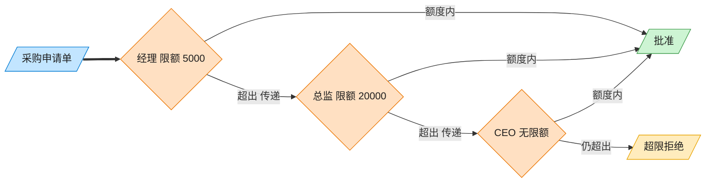

# Chain of Responsibility 责任链模式（JavaScript）

## 意图
使多个对象都有机会处理请求，从而避免请求的发送者与接收者之间的耦合关系。将这些对象连成
一条链，并沿着这条链传递请求，直到有对象处理它为止。

<!-- gof-architecture-diagram -->
## 架构图

> **生活类比**：采购单沿公章接力：经理能批 5000 就盖章，否则递给总监，再递给 CEO。提交人只把单子交给第一环，从不管最终谁批。



| 图中角色 | 本仓库示例 |
|---------|-----------|
| 采购单 | PurchaseRequest |
| 审批链 | Manager → Director → CEO |
| 提交人 | 只调用链头 handle |

23 张图的完整图鉴见 [`docs/README.md`](../../docs/README.md#chain-of-responsibility-责任链)。

## 适用场景
- 有多个对象可以处理同一个请求，具体由哪个对象处理在运行时才能确定。
- 想在不明确指定接收者的情况下，向多个对象中的一个提交请求。
- 可以处理请求的对象集合应该被动态指定（审批链的层级可以配置、调整）。

## 实现方式
抽象类 `Approver` 持有 `#next` 引用及 `setNext()`/`handle()`。`handle()` 中先判断自己能否
处理（`canApprove()`），能处理就 `approve()`，否则转交给下一节点；如果没有下一节点则流程
终止。`Manager`（限额 1000）、`Director`（限额 10000）、`CEO`（无限额）分别实现
`canApprove()`：

```js
class Approver {
  #next = null;
  setNext(approver) { this.#next = approver; return approver; }
  handle(request) {
    if (this.canApprove(request)) return this.approve(request);
    if (this.#next) return this.#next.handle(request);
    return `无人可以审批此金额，流程终止`;
  }
}

manager.setNext(director).setNext(ceo); // 组装责任链
```

## 文件说明
| 文件 | 说明 |
|------|------|
| `main.mjs` | 责任链模式完整示例：`Manager`/`Director`/`CEO` 三级审批链，按采购金额逐级转交 |

## 编译与运行
```bash
node main.mjs
```

## 输出示例
```
=== 责任链模式：采购审批链 ===

提交申请: 《办公文具》 金额 ¥500
[采购申请 "办公文具" ¥500] 由 经理 批准

提交申请: 《部门团建》 金额 ¥8000
  经理 无权审批（超出 ¥1000），转交下一级...
[采购申请 "部门团建" ¥8000] 由 总监 批准

提交申请: 《新服务器采购》 金额 ¥150000
  经理 无权审批（超出 ¥1000），转交下一级...
  总监 无权审批（超出 ¥10000），转交下一级...
[采购申请 "新服务器采购" ¥150000] 由 CEO 批准
```

## 要点
1. 发起请求的客户端代码只需持有链的头节点（`manager`），完全不知道链上有多少节点、由谁
   最终处理，发送者与接收者被彻底解耦。
2. 链的组装（`setNext` 的调用顺序）与链的使用是分离的，可以在运行时根据配置动态调整审批
   层级（例如插入一个“副总裁”节点）而不影响客户端代码。
3. `setNext()` 返回传入的下一节点，从而支持 `a.setNext(b).setNext(c)` 这种链式写法一次性
   组装整条链。
4. 若请求超出链上所有节点的处理能力（本例中不会发生，因为 CEO 限额是 `Infinity`），责任
   链模式要求显式处理“无人能处理”的情况，避免请求被静默丢弃。
