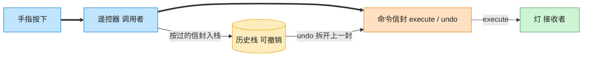

# Command 命令模式（JavaScript）

## 意图
将请求封装成对象，从而可以用不同的请求对客户进行参数化，并支持请求的排队、记录日志、以
及可撤销的操作。命令把“做什么”（调用者）和“怎么做”（接收者）解耦。

<!-- gof-architecture-diagram -->
## 架构图

> **生活类比**：遥控器按钮里装的不是电线，是一封命令信封。按下就把信封交给灯去执行；撤销则打开上一封信封做反操作。按钮不用知道灯怎么开。



| 图中角色 | 本仓库示例 |
|---------|-----------|
| 遥控器 | RemoteControl 调用者 |
| 命令信封 | LightOnCommand / LightOffCommand |
| 灯 | Light 接收者 |

23 张图的完整图鉴见 [`docs/README.md`](../../docs/README.md#command-命令)。

## 适用场景
- 需要将发出请求的对象与执行请求的对象解耦（如遥控器按钮与具体家电逻辑）。
- 需要在不同的时刻指定、排列和执行请求（如任务队列、宏命令）。
- 需要支持撤销/重做操作，把每一次操作的“反操作”封装在命令对象中。

## 实现方式
`Light` 是接收者，真正执行 `turnOn()`/`turnOff()`。`Command` 抽象类约定
`execute()`/`undo()`；`LightOnCommand`、`LightOffCommand` 是具体命令，各自的 `undo()` 就是
对方的操作。`RemoteControl` 是调用者，只依赖 `Command` 接口，并用栈记录历史以支持撤销：

```js
class LightOnCommand extends Command {
  execute() { this.#light.turnOn(); }
  undo() { this.#light.turnOff(); } // 反操作被封装在命令对象内部
}

class RemoteControl {
  #history = [];
  pressButton(command) { command.execute(); this.#history.push(command); }
  pressUndo() { this.#history.pop()?.undo(); }
}
```

## 文件说明
| 文件 | 说明 |
|------|------|
| `main.mjs` | 命令模式完整示例：`Light` 接收者，`LightOnCommand`/`LightOffCommand`/`DimLightCommand` 具体命令，`RemoteControl` 调用者及撤销栈 |

## 编译与运行
```bash
node main.mjs
```

## 输出示例
```
=== 命令模式：遥控器控制灯光，支持撤销 ===

-- 依次按下：开客厅灯、开卧室灯、关客厅灯 --
  [客厅的灯] 已打开
  [卧室的灯] 已打开
  [客厅的灯] 已关闭

-- 按下撤销键 3 次，逆序撤销刚才的操作 --
  执行撤销:
  [客厅的灯] 已打开
  执行撤销:
  [卧室的灯] 已关闭
  执行撤销:
  [客厅的灯] 已关闭

-- 再次撤销：历史记录已空 --
  没有可撤销的操作了

-- 调光命令示例 --
  [客厅的灯] 亮度调整为 40%
  执行撤销:
  [客厅的灯] 亮度恢复为 100%
```

## 要点
1. `RemoteControl`（调用者）自始至终不知道 `Light`（接收者）的存在，它只认识
   `Command.execute()`/`undo()`，两者之间完全解耦。
2. 撤销栈是命令模式支持 undo/redo 的典型实现：每执行一条命令就入栈，撤销时出栈并调用
   `undo()`，天然形成“后进先出”的撤销顺序，与示例输出的逆序一致。
3. `DimLightCommand` 展示了命令对象可以携带额外状态（调节前的亮度值），使 `undo()` 能恢复
   到执行前的具体数值，而不仅仅是简单的“反义操作”。
4. 命令对象也可以组合成“宏命令”（一个命令内部持有多个子命令依次执行），本例未展开但结构
   上很容易扩展。
