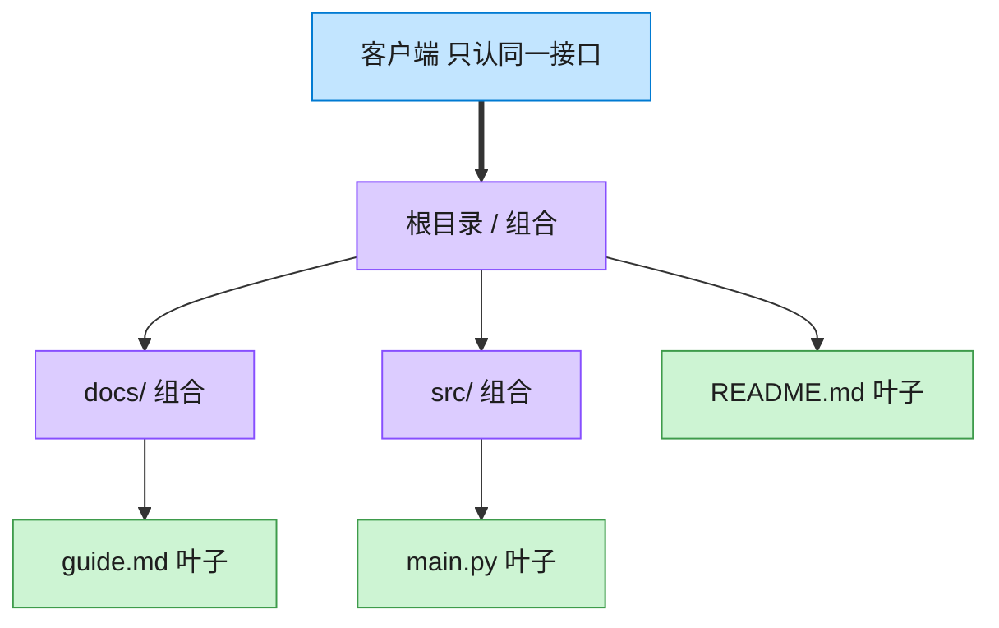

# Composite 组合模式（JavaScript）

## 意图
将对象组合成树形结构以表示“部分-整体”的层次关系，使客户端对单个对象和组合对象的使用具
有一致性——调用者无需区分自己面对的是一个叶子节点还是一整棵子树。

<!-- gof-architecture-diagram -->
## 架构图

> **生活类比**：文件夹套娃：根目录装着子目录和文件。问「有多大」时，文件报自己的字节，目录把孩子们的大小加起来。客户端从不写 if 是文件还是目录。



| 图中角色 | 本仓库示例 |
|---------|-----------|
| 统一接口 | FileSystemNode.size / display |
| 叶子 | File |
| 容器 | Directory，递归包含子节点 |

23 张图的完整图鉴见 [`docs/README.md`](../../docs/README.md#composite-组合)。

## 适用场景
- 需要表示对象的部分-整体层次结构（如文件系统、UI 组件树、组织架构）。
- 希望客户端忽略组合对象与单个对象之间的差异，用同一套接口统一处理。
- 需要对整棵树做递归聚合运算（求和、统计、查找）而不想在客户端写递归判断类型的代码。

## 实现方式
`FileSystemEntry` 是组件抽象，声明 `getSize()`/`print()`。`FileEntry` 是叶子节点，直接返回
自身大小；`DirectoryEntry` 是组合节点，内部持有子节点数组，`getSize()` 递归累加所有子节点
（无论子节点是文件还是目录），`print()` 递归打印整棵树：

```js
class DirectoryEntry extends FileSystemEntry {
  #children = [];
  add(entry) { this.#children.push(entry); return this; }
  getSize() {
    return this.#children.reduce((total, child) => total + child.getSize(), 0);
  }
}
```

## 文件说明
| 文件 | 说明 |
|------|------|
| `main.mjs` | 组合模式完整示例：`FileEntry` 叶子节点、`DirectoryEntry` 组合节点，构建多层目录树并统一计算大小、打印结构 |

## 编译与运行
```bash
node main.mjs
```

## 输出示例
```
=== 组合模式：文件系统树形结构 ===

-- 打印整个目录树（大小为该节点下所有内容的总和）--
+ project/ (780 KB)
  + src/ (20 KB)
    - index.js (12 KB)
    - utils.js (8 KB)
  + tests/ (5 KB)
    - index.test.js (5 KB)
  + assets/ (752 KB)
    + images/ (752 KB)
      - logo.png (240 KB)
      - banner.png (512 KB)
  - README.md (3 KB)

项目总大小: 780 KB
仅 assets 目录大小: 752 KB

-- 统一处理：无论是文件还是目录，调用方式完全一致 --
src 的大小 = 20 KB
LICENSE 的大小 = 1 KB
images 的大小 = 752 KB
```

## 要点
1. `DirectoryEntry.getSize()` 对子节点的调用完全不关心子节点是 `FileEntry` 还是嵌套的
   `DirectoryEntry`，这正是组合模式“一致性”的核心体现。
2. 树可以任意深度嵌套（`assets/images/*.png`），`getSize()`/`print()` 的递归天然支持，无需
   为每一层单独写处理逻辑。
3. 示例末尾的 `items` 数组混合放入目录与文件，遍历时统一调用 `getSize()`，进一步说明调用
   方无需 `instanceof` 判断类型分支。
4. 组合模式的代价：`FileSystemEntry` 基类的接口必须同时适用于叶子和容器，有时会让叶子节点
   被迫实现一些对它无意义的方法（本例中 `add`/`remove` 只在 `DirectoryEntry` 上提供，未强
   行下推到基类，是一种更保守但更类型安全的取舍）。
