# Decorator 装饰器模式（JavaScript）

## 意图
动态地给一个对象添加额外的职责，是继承的一种灵活替代方案。装饰器与被装饰对象实现同一个
接口，因此可以层层叠加，每层只负责增加一点点行为，组合出丰富的变体而不需要为每种组合都
定义一个子类。

<!-- gof-architecture-diagram -->
## 架构图

> **生活类比**：咖啡加料：浓缩是内核，外面一层牛奶、一层糖、一层奶油。每一层都还是「一杯咖啡」，点单时问 cost，层层转发并加价。

```mermaid
flowchart LR
    classDef client fill:#C2E5FF,stroke:#007AD2,color:#1E1E1E
    classDef abs fill:#DCCCFF,stroke:#874FFF,color:#1E1E1E
    classDef concrete fill:#CDF4D3,stroke:#3E9B4B,color:#1E1E1E
    classDef extra fill:#FFE0C2,stroke:#EB7500,color:#1E1E1E
    classDef shared fill:#FFECBD,stroke:#E8A302,color:#1E1E1E
    classDef hub fill:#C6FAF6,stroke:#5AD8CC,color:#1E1E1E
    guest["顾客 只认 Coffee"]
    whip["奶油包装 +6"]
    sugar["糖包装 +2"]
    milk["牛奶包装 +4"]
    espresso["浓缩 Espresso 12"]
    guest ==> whip
    whip -->|"转发并加价"| sugar
    sugar -->|"转发并加价"| milk
    milk -->|"转发并加价"| espresso
    class guest client
    class whip,sugar,milk extra
    class espresso concrete
```



| 图中角色 | 本仓库示例 |
|---------|-----------|
| 内核 | Espresso / Americano 具体构件 |
| 加料包装 | Milk / Sugar / WhippedCream 装饰器 |
| 统一接口 | Coffee.cost / description |

23 张图的完整图鉴见 [`docs/README.md`](../../docs/README.md#decorator-装饰器)。

## 适用场景
- 需要在不影响其他对象的前提下，动态地、透明地给单个对象添加职责。
- 需要添加的职责可以撤销，或者需要以任意顺序自由组合多种职责。
- 用继承来扩展功能会导致子类数量爆炸（例如“加奶咖啡”“加糖咖啡”“加奶加糖咖啡”……）。

## 实现方式
`Beverage` 是抽象组件，声明 `cost()`/`describe()`。`Espresso`、`Americano` 是具体组件。
`BeverageDecorator` 是抽象装饰器，本身也是一个 `Beverage`，并持有被装饰的 `Beverage`；
`MilkDecorator`、`SugarDecorator`、`WhippedCreamDecorator` 是具体装饰器，各自在调用被装饰
对象的基础上叠加一点点价格与描述，可以任意嵌套组合：

```js
class BeverageDecorator extends Beverage {
  constructor(beverage) { super(); this.beverage = beverage; }
  cost() { return this.beverage.cost(); }
}

class MilkDecorator extends BeverageDecorator {
  cost() { return this.beverage.cost() + 4; }        // 层层叠加
  describe() { return `${this.beverage.describe()} + 牛奶`; }
}

const sweetLatte = new SugarDecorator(new MilkDecorator(new Espresso()));
```

## 文件说明
| 文件 | 说明 |
|------|------|
| `main.mjs` | 装饰器模式完整示例：`Espresso`/`Americano` 基础饮品，`Milk`/`Sugar`/`WhippedCream` 三种可叠加装饰器 |

## 编译与运行
```bash
node main.mjs
```

## 输出示例
```
=== 装饰器模式：咖啡加料计价 ===

-- 原味浓缩咖啡 --
浓缩咖啡 —— 总价: ¥18

-- 浓缩咖啡 + 牛奶 --
浓缩咖啡 + 牛奶 —— 总价: ¥22

-- 浓缩咖啡 + 牛奶 + 糖浆（动态叠加两层装饰）--
浓缩咖啡 + 牛奶 + 糖浆 —— 总价: ¥24

-- 美式咖啡 + 糖浆 + 奶泡 + 牛奶（三层装饰，顺序不同结果不同）--
美式咖啡 + 糖浆 + 奶泡 + 牛奶 —— 总价: ¥27

-- 验证被装饰对象本身不受影响 --
浓缩咖啡 —— 总价: ¥18
```

## 要点
1. 装饰器与被装饰对象实现同一抽象类型（都是 `Beverage`），因此可以无限层层嵌套，客户端
   拿到最终对象后仍统一调用 `cost()`/`describe()`，无需关心叠了几层。
2. 每个装饰器只做一件小事（加牛奶/加糖/加奶泡），符合单一职责原则；相比“加奶咖啡类”
   “加糖咖啡类”这种继承式扩展，装饰器组合的种类是指数级的而类的数量是线性的。
3. 原始对象 `plainEspresso` 在被其他实例包装装饰后完全不受影响，因为装饰是“包一层新对
   象”，不是原地修改。
4. `new.target` 检查用于防止 `BeverageDecorator` 这个抽象装饰器被直接实例化，模拟其他语言
   中的抽象类约束。
