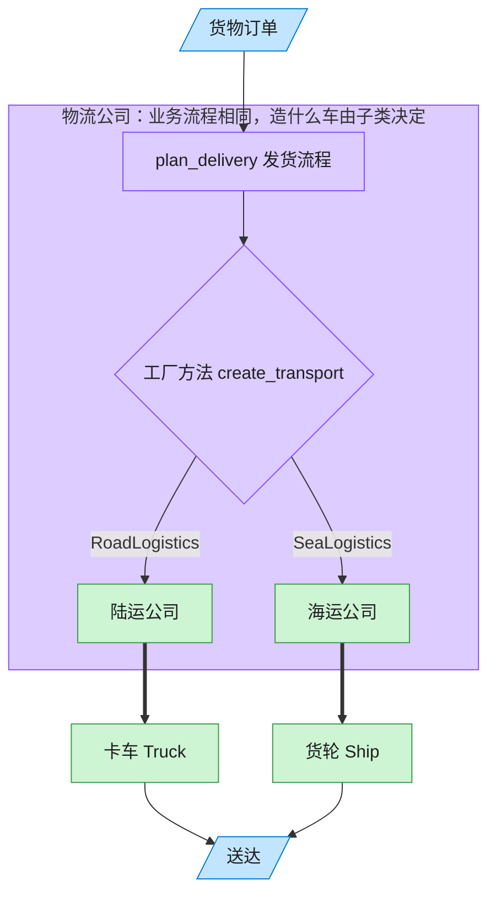

# Factory Method 工厂方法模式（JavaScript）

## 意图
定义一个用于创建对象的接口，但让子类决定实例化哪一个类。工厂方法把对象的实例化延迟到子
类，使父类中封装的业务流程可以在不修改自身代码的前提下，搭配不同的具体产品运行。

<!-- gof-architecture-diagram -->
## 架构图

> **生活类比**：客户只说「把货送走」。陆运公司决定造卡车，海运公司决定造货轮 —— 子类决定实例化哪一个产品。



| 图中角色 | 本仓库示例 |
|---------|-----------|
| 客户下单 | 调用 plan_delivery 的客户端 |
| 物流公司 | Logistics 抽象创建者及其子类 |
| 运输工具 | Truck / Ship 具体产品 |

23 张图的完整图鉴见 [`docs/README.md`](../../docs/README.md#factory-method-工厂方法)。

## 适用场景
- 一个类无法预知它必须创建的对象的具体类型（由子类决定）。
- 一个类希望由其子类来指定它所创建的产品对象。
- 需要把创建逻辑集中到一处，同时保留通过继承扩展新产品类型的灵活性。

## 实现方式
抽象类 `Logistics` 定义业务流程 `planDelivery()`，其中调用了工厂方法 `createTransport()`
获取运输工具；`createTransport()` 本身不做具体实现，交由子类 `RoadLogistics` /
`SeaLogistics` 分别返回 `Truck` / `Ship`。`planDelivery()` 全程不知道具体是哪种运输工具：

```js
class Logistics {
  planDelivery(cargoName) {
    const transport = this.createTransport(); // 调用工厂方法，具体类型由子类决定
    return `[发货计划] 货物《${cargoName}》 -> ${transport.deliver()}`;
  }
  createTransport() { throw new Error('子类必须实现 createTransport()'); }
}

class SeaLogistics extends Logistics {
  createTransport() { return new Ship(); }
}
```

## 文件说明
| 文件 | 说明 |
|------|------|
| `main.mjs` | 工厂方法模式完整示例：`Logistics` 抽象创建者、`RoadLogistics`/`SeaLogistics` 具体创建者、`Truck`/`Ship` 产品 |

## 编译与运行
```bash
node main.mjs
```

## 输出示例
```
=== 工厂方法模式：物流运输 ===

-- 陆运物流 --
[发货计划] 货物《一批家具》 -> 卡车：沿公路运输货物到门口

-- 海运物流 --
[发货计划] 货物《一批集装箱货物》 -> 货轮：沿海路运输货物到港口

-- 根据配置动态选择物流方式 --
[发货计划] 货物《跨境电商包裹》 -> 货轮：沿海路运输货物到港口
```

## 要点
1. 与简单工厂不同，工厂方法把“选择具体产品”这件事交给子类通过继承来决定，符合开闭原则。
2. 父类 `Logistics.planDelivery()` 封装的是不变的业务流程，只有 `createTransport()` 这一
   个“变化点”被下放给子类，体现了模板方法与工厂方法的常见配合。
3. 新增一种运输方式（如 `AirLogistics` + `Plane`）无需修改现有代码，只需新增一对类。
4. 示例末尾展示了如何在运行时根据配置字符串选择具体的 `Logistics` 子类，贴近实际项目中
   "按配置动态选实现" 的用法。
