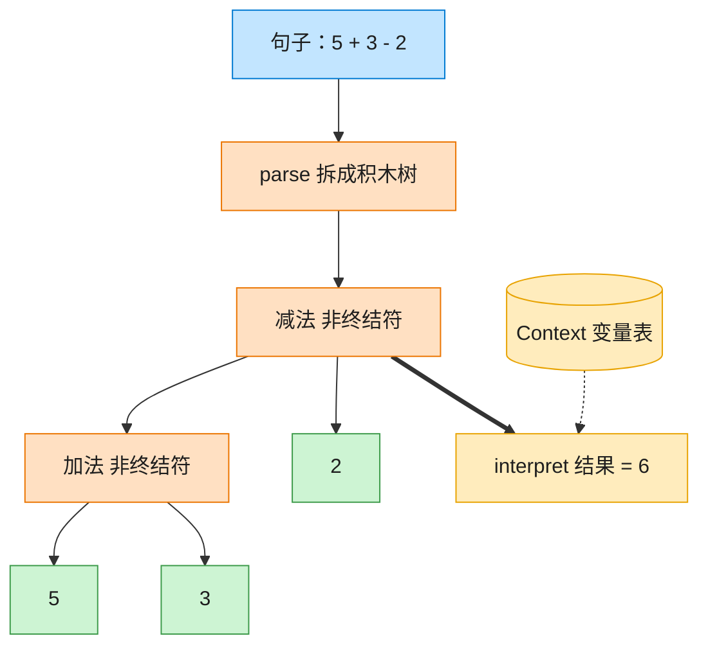

# Interpreter 解释器模式（JavaScript）

## 意图
给定一门语言，定义它的文法的一种表示，并定义一个解释器，该解释器使用该表示来解释语言中
的句子。适用于需要反复解释执行某种简单语言/表达式的场景，如规则引擎、算术表达式求值。

<!-- gof-architecture-diagram -->
## 架构图

> **生活类比**：把「5 + 3 - 2」拆成积木树：加减是组合积木，数字和变量是末端积木。对着变量表走一遍 interpret，树就算出结果。



| 图中角色 | 本仓库示例 |
|---------|-----------|
| 句子 | 中缀表达式字符串 |
| 积木树 | Add / Subtract / Number / Variable |
| 词典 | Context 变量表 |

23 张图的完整图鉴见 [`docs/README.md`](../../docs/README.md#interpreter-解释器)。

## 适用场景
- 存在一个可以表示为抽象语法树的简单语言，且该文法相对简单、规则不多。
- 效率不是关键考量（解释器模式通常不是执行效率最优的方案，但表达力强、易扩展文法）。
- 需要频繁解释执行结构相似的语句（如批量计算多条表达式）。

## 实现方式
`Expression` 是抽象表达式，`NumberExpression`/`VariableExpression` 是终结符表达式（分别
代表字面量和变量），`AddExpression`/`SubtractExpression` 是非终结符表达式（分别组合左右两
个子表达式）。`ExpressionParser` 按简单文法 `expression := term (('+'|'-') term)*` 把词法
单元数组解析为一棵表达式树，最终对树调用 `interpret(context)` 递归求值：

```js
class AddExpression extends Expression {
  interpret(context) {
    return this.left.interpret(context) + this.right.interpret(context);
  }
}

class VariableExpression extends Expression {
  interpret(context) { return context.getVariable(this.name); } // 从上下文取变量值
}
```

## 文件说明
| 文件 | 说明 |
|------|------|
| `main.mjs` | 解释器模式完整示例：`NumberExpression`/`VariableExpression`/`AddExpression`/`SubtractExpression`，`ExpressionParser` 词法解析，`Context` 变量上下文 |

## 编译与运行
```bash
node main.mjs
```

## 输出示例
```
=== 解释器模式：算术表达式求值 ===

-- 纯数字表达式 --
表达式 "5 + 3 - 2"  =>  语法树 ((5 + 3) - 2)  =>  结果 = 6

-- 含变量的表达式（上下文提供变量值）--
表达式 "x + y - 3"  =>  语法树 ((x + y) - 3)  =>  结果 = 11

-- 同一上下文，变量值变化后重新求值 --
表达式 "x - y + 1"  =>  语法树 ((x - y) + 1)  =>  结果 = 97

-- 未定义变量会抛出异常 --
捕获到异常: 未定义的变量: z
```

## 要点
1. 语法树一旦构建完成即可反复求值：同一棵树在 `Context` 中的变量值变化后，重新调用
   `interpret(context)` 就能得到新结果，无需重新解析表达式字符串。
2. 每种文法规则对应一个表达式类（`NumberExpression`/`AddExpression`/…），新增运算符（如乘
   法）只需新增一个 `MultiplyExpression` 类并在解析器里识别对应符号，符合开闭原则。
3. `toString()` 递归拼出带括号的中缀表达式（如 `((5 + 3) - 2)`），直观展示了解析器按“从左
   到右、左结合”的方式构建出的树形结构。
4. 解释器模式和组合模式结构相似（都是递归的树形结构），区别在于解释器的每个节点还定义了
   语义解释规则（`interpret`），而组合模式关注的是统一处理部分与整体。
