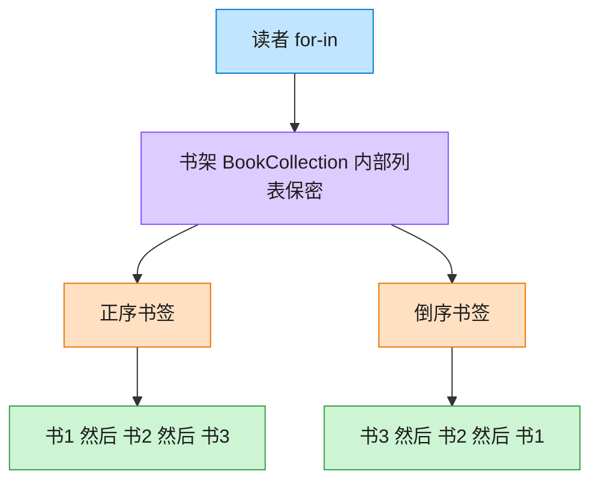

# Iterator 迭代器模式（JavaScript）

## 意图
提供一种方法来顺序访问一个聚合对象中的各个元素，而又不暴露该对象的内部表示（数组？链
表？树？）。JavaScript 将这一模式内建为语言级协议（`Symbol.iterator`），是学习“语言原生
就是设计模式实现”的最佳示例之一。

<!-- gof-architecture-diagram -->
## 架构图

> **生活类比**：书架抽屉怎么排，读者看不见。正序书签从左往右滑，倒序书签从右往左滑。两种书签各记各的位置，互不干扰。



| 图中角色 | 本仓库示例 |
|---------|-----------|
| 书架 | BookCollection，内部列表不外露 |
| 正序书签 | BookIterator |
| 倒序书签 | ReverseBookIterator |

23 张图的完整图鉴见 [`docs/README.md`](../../docs/README.md#iterator-迭代器)。

## 适用场景
- 需要访问一个聚合对象的内容而无需暴露它的内部结构（数组、Map、还是自定义存储）。
- 需要支持对同一个聚合对象的多种遍历方式（正序、倒序、过滤后遍历）。
- 希望为遍历不同的聚合结构提供一个统一的接口（多态迭代），如本例的 `for...of`。

## 实现方式
`BookCollection` 内部用私有数组 `#books` 存储数据，通过实现 `[Symbol.iterator]()` 方法暴
露标准迭代器协议（`{ next(): { value, done } }`），从而让 `for...of`、展开运算符等原生语
法都能直接使用。另外用生成器函数 `*reverseIterator()` 提供反序遍历——生成器是 JS 中实现
迭代器协议最简洁的方式：

```js
class BookCollection {
  #books = [];
  [Symbol.iterator]() {
    let index = 0;
    const books = this.#books;
    return { next: () => index < books.length
      ? { value: books[index++], done: false }
      : { value: undefined, done: true } };
  }
  *reverseIterator() {
    for (let i = this.#books.length - 1; i >= 0; i--) yield this.#books[i];
  }
}
```

## 文件说明
| 文件 | 说明 |
|------|------|
| `main.mjs` | 迭代器模式完整示例：`BookCollection` 实现 `Symbol.iterator` 正序迭代器，以及生成器实现的反序迭代器 |

## 编译与运行
```bash
node main.mjs
```

## 输出示例
```
=== 迭代器模式：自定义图书集合的遍历 ===

-- 使用 for...of 正序遍历（共 3 本）--
  《设计模式》— GoF
  《重构》— Martin Fowler
  《代码整洁之道》— Robert C. Martin

-- 使用生成器提供的反序迭代器遍历 --
  《代码整洁之道》— Robert C. Martin
  《重构》— Martin Fowler
  《设计模式》— GoF

-- 因为实现了迭代器协议，天然支持展开运算符 --
所有书名: 设计模式、重构、代码整洁之道

-- 手动调用迭代器（不借助 for...of），演示协议本身 --
  手动 next() 取得: 《设计模式》— GoF
  手动 next() 取得: 《重构》— Martin Fowler
  手动 next() 取得: 《代码整洁之道》— Robert C. Martin
  迭代结束, done = true
```

## 要点
1. 客户端全程不知道 `BookCollection` 内部用数组存储——即使换成链表或树，只要
   `[Symbol.iterator]()` 保持不变，`for...of` 的调用方式完全不受影响。
2. 一旦实现了 `Symbol.iterator`，就自动获得 `for...of`、数组展开 `[...collection]`、
   `Array.from(collection)`、解构赋值等一整套原生语法的支持，这是 JS/TS 相比 Java/C++
   在实现该模式时最大的语言优势。
3. 生成器函数（`function*`/`yield`）是实现自定义迭代逻辑最简洁的手段，编译器自动帮你维护
   遍历状态机，不需要像手写迭代器那样自己管理 `index` 游标。
4. 示例末尾手动调用 `[Symbol.iterator]()` 并逐次 `next()`，展示了 `for...of` 语法糖背后的
   真实协议，帮助理解“迭代器模式”与“JS 迭代器协议”的对应关系。
