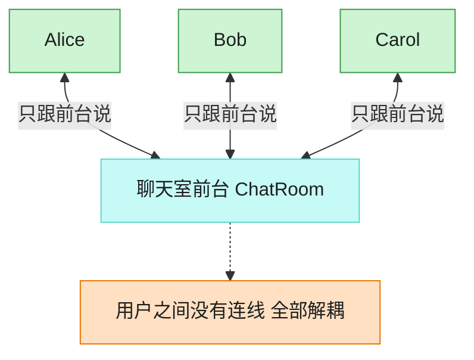

# Mediator 中介者模式（JavaScript）

## 意图
用一个中介对象来封装一系列对象之间的交互，使各对象不需要显式地相互引用，从而使其耦合松
散，且可以独立地改变它们之间的交互。

<!-- gof-architecture-diagram -->
## 架构图

> **生活类比**：聊天室前台：Alice、Bob、Carol 彼此不留电话，所有群消息和私信都交给前台转发。加人、禁言、改规则只改前台一处。



| 图中角色 | 本仓库示例 |
|---------|-----------|
| 前台 | ChatRoom 中介者 |
| 同事 | User，只持有中介引用 |
| 交互 | 广播 / 私信都经中介 |

23 张图的完整图鉴见 [`docs/README.md`](../../docs/README.md#mediator-中介者)。

## 适用场景
- 一组对象以复杂但明确定义的方式进行通信，导致相互依赖关系混乱且难以理解（多对多通信）。
- 一个对象引用了很多其他对象，直接与它们通信导致难以复用该对象。
- 想定制一个分布在多个类中的行为，又不想生成太多子类。

## 实现方式
`ChatRoom` 是具体中介者，内部用 `Map` 保存所有注册的 `User`，提供点对点 `send()` 和广播
`broadcast()` 两种转发方式。`User`（同事类）不持有其他 `User` 的引用，只持有中介者引用，
发消息时都通过 `this.mediator` 转发：

```js
class User {
  sendTo(message, toName) {
    this.mediator.send(message, this, toName); // 不直接引用目标 User，通过中介者转发
  }
}

class ChatRoom extends ChatMediator {
  send(message, from, toName) {
    this.#users.get(toName)?.receive(message, from);
  }
}
```

## 文件说明
| 文件 | 说明 |
|------|------|
| `main.mjs` | 中介者模式完整示例：`ChatRoom` 中介者实现私聊/群发转发，`User` 同事类只依赖中介者 |

## 编译与运行
```bash
node main.mjs
```

## 输出示例
```
=== 中介者模式：聊天室转发消息 ===

  [聊天室] Alice 加入了聊天室
  [聊天室] Bob 加入了聊天室
  [聊天室] Carol 加入了聊天室

-- 私聊：Alice 只对 Bob 说话 --
Alice 对 Bob 悄悄说: "晚上一起吃饭吗？"
  [私聊] Bob 收到来自 Alice 的消息: "晚上一起吃饭吗？"

-- 群发：Bob 对所有人广播 --
Bob 在群里说: "大家好，我是新来的 Bob！"
  [群聊] Alice 收到来自 Bob 的消息: "大家好，我是新来的 Bob！"
  [群聊] Carol 收到来自 Bob 的消息: "大家好，我是新来的 Bob！"

-- 私聊一个不存在的用户 --
Carol 对 Dave 悄悄说: "你好？"
  [聊天室] 用户 Dave 不存在，消息发送失败

（注意：User 之间从未互相持有引用，全部通过 ChatRoom 转发，彼此解耦）
```

## 要点
1. `User` 类之间没有任何直接引用，新增/移除用户、修改转发规则都只需要改动 `ChatRoom`，符
   合“把多对多的交互收敛到一个中介者”的设计初衷。
2. 私聊与群发是同一个中介者暴露的两种不同转发策略，体现了中介者可以承载比“单纯转发”更
   丰富的协调逻辑（如权限校验、消息过滤，本例中还处理了“用户不存在”的边界情况）。
3. 与观察者模式的区别：观察者是单向的“一对多”通知（Subject -> Observers），中介者是多向
   的“多对多”协调（任意 User 都可能是发送方也可能是接收方）。
4. 中介者自身可能演变成“上帝对象”（承担过多逻辑），实践中需要评估中介者的职责边界，必要
   时进一步拆分（如把权限校验拆到独立的策略对象）。
