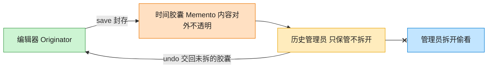

# Memento 备忘录模式（JavaScript）

## 意图
在不破坏封装性的前提下，捕获一个对象的内部状态，并在该对象之外保存这个状态，以便之后可
以将该对象恢复到原先保存的状态（典型应用：撤销/重做）。

<!-- gof-architecture-diagram -->
## 架构图

> **生活类比**：编辑器把这一刻的正文和光标封进时间胶囊。历史管理员只负责把胶囊堆起来、按撤销交回去，从不拆开偷看 —— 封装不被破坏。



| 图中角色 | 本仓库示例 |
|---------|-----------|
| 编辑器 | TextEditor 发起人，唯二能读写胶囊 |
| 时间胶囊 | EditorMemento 不可变快照 |
| 历史管理员 | History，只压栈出栈 |

23 张图的完整图鉴见 [`docs/README.md`](../../docs/README.md#memento-备忘录)。

## 适用场景
- 必须保存一个对象在某一时刻的（部分）状态，以便之后恢复到该状态。
- 如果用接口暴露这些状态的做法会破坏对象的封装性，应改用备忘录隔离状态的保存与恢复逻辑。
- 需要支持多级撤销（保存历史上多个快照，逐级回退）。

## 实现方式
`TextEditor`（发起人/Originator）持有真正的状态（`#content`、`#cursorPosition`），
`save()` 创建一个 `EditorMemento` 快照，`restore(memento)` 从快照恢复状态。
`EditorMemento` 用私有字段保存状态，只暴露一个约定的 `_restore()` 方法供 `Originator` 读
取，外部代码拿到 memento 也无法随意篡改其内容。`History`（管理者/Caretaker）只负责用栈保
存/取出 memento，从不检查或修改其内容：

```js
class TextEditor {
  #content = '';
  save() { return new EditorMemento(this.#content, this.#cursorPosition); }
  restore(memento) {
    const { content } = memento._restore();
    this.#content = content;
  }
}

class History {
  #stack = [];
  push(memento) { this.#stack.push(memento); }
  pop() { return this.#stack.pop(); }
}
```

## 文件说明
| 文件 | 说明 |
|------|------|
| `main.mjs` | 备忘录模式完整示例：`TextEditor` 发起人、`EditorMemento` 备忘录、`History` 管理者，演示多级撤销 |

## 编译与运行
```bash
node main.mjs
```

## 输出示例
```
=== 备忘录模式：文本编辑器撤销 ===

-- 逐步输入内容，每步之前先保存快照 --
  [快照] 保存当前状态: ""
  输入 "Hello" -> 当前内容: "Hello"
  [快照] 保存当前状态: "Hello"
  输入 ", World" -> 当前内容: "Hello, World"
  [快照] 保存当前状态: "Hello, World"
  输入 "!!!" -> 当前内容: "Hello, World!!!"

当前最终内容: "Hello, World!!!"

-- 执行两次撤销 --
  [恢复] 内容还原为: "Hello, World"
  [恢复] 内容还原为: "Hello"

撤销后内容: "Hello"

-- 继续撤销直到历史耗尽 --
  [恢复] 内容还原为: ""
最终内容: ""
是否还能撤销: false
```

## 要点
1. `History`（管理者）只负责“存”和“取”备忘录，全程不查看、不解析其内部内容，状态的读
   写权完全留给 `TextEditor` 自己，这是备忘录模式“不破坏封装”的核心体现。
2. `EditorMemento` 用私有字段 `#content`/`#cursorPosition` 加上仅供 Originator 使用的
   `_restore()`，模拟“只有创建者能读取内容”的访问控制（JS 没有 C++/Java 那样的
   `friend`/包私有机制，这里用命名约定 + 私有字段折衷实现）。
3. 多次 `push()` 形成一个栈，`pop()` 天然按“后进先出”的顺序回退，即可实现多级撤销，这与
   命令模式的撤销栈思路相通，但备忘录关注的是“整体状态快照”而非“单步反操作”。
4. 若要支持“重做”（redo），只需在 `restore` 之前把当前状态也 push 到另一个“重做栈”中，
   结构上很容易扩展。
