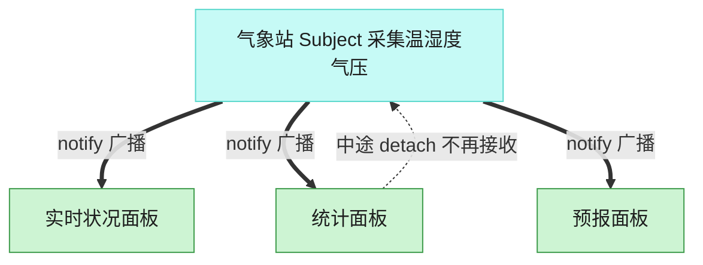

# Observer 观察者模式（JavaScript）

## 意图
定义对象间一对多的依赖关系，当一个对象（主题）的状态发生改变时，所有依赖它的对象（观察
者）都会自动收到通知并更新，而主题不需要知道观察者的具体类型。

<!-- gof-architecture-diagram -->
## 架构图

> **生活类比**：气象站一更新读数，所有挂着的面板自动刷新。统计面板中途拔掉天线，后面的广播就不再找它，其余面板不受影响。



| 图中角色 | 本仓库示例 |
|---------|-----------|
| 气象站 | WeatherStation 主题 |
| 面板 | 实时 / 统计 / 预报 观察者 |
| 订阅关系 | attach / detach / notify |

23 张图的完整图鉴见 [`docs/README.md`](../../docs/README.md#observer-观察者)。

## 适用场景
- 一个抽象模型有两个方面，其中一个方面依赖于另一个方面（数据与多个视图/展示）。
- 改变一个对象需要同时改变其他对象，但不知道具体有多少对象需要改变。
- 一个对象必须通知其他对象，但又不希望这些对象是紧密耦合的（不知道彼此的具体类）。

## 实现方式
`Subject` 基类维护观察者数组，提供 `subscribe()`/`unsubscribe()`/`notify()`。
`WeatherStation` 继承 `Subject`，数据变化时调用 `notify()` 推送给所有订阅者。
`CurrentConditionsDisplay`、`StatisticsDisplay`、`AlertDisplay` 都实现 `update()`，各自决
定收到通知后如何响应（甚至可以像 `AlertDisplay` 一样只在满足条件时才输出）：

```js
class Subject {
  #observers = [];
  subscribe(observer) { this.#observers.push(observer); }
  notify(data) { for (const o of this.#observers) o.update(data); }
}

class WeatherStation extends Subject {
  setMeasurements(temperature, humidity) {
    this.notify({ temperature, humidity }); // 状态变化后自动通知所有观察者
  }
}
```

## 文件说明
| 文件 | 说明 |
|------|------|
| `main.mjs` | 观察者模式完整示例：`WeatherStation` 主题，`CurrentConditionsDisplay`/`StatisticsDisplay`/`AlertDisplay` 三种观察者，及取消订阅演示 |

## 编译与运行
```bash
node main.mjs
```

## 输出示例
```
=== 观察者模式：气象站通知多个显示面板 ===

[气象站] 采集到新数据: 温度=26°C, 湿度=65%
  [实时状况显示板] 当前温度 26°C, 湿度 65%
  [统计显示板] 最高=26°C, 最低=26°C, 平均=26.0°C

[气象站] 采集到新数据: 温度=31°C, 湿度=55%
  [实时状况显示板] 当前温度 31°C, 湿度 55%
  [统计显示板] 最高=31°C, 最低=26°C, 平均=28.5°C

[气象站] 采集到新数据: 温度=36°C, 湿度=40%
  [实时状况显示板] 当前温度 36°C, 湿度 40%
  [统计显示板] 最高=36°C, 最低=26°C, 平均=31.0°C
  [高温预警] 当前温度 36°C，请注意防暑！

-- 取消订阅统计显示板后再更新一次 --
[气象站] 采集到新数据: 温度=22°C, 湿度=70%
  [实时状况显示板] 当前温度 22°C, 湿度 70%
```

## 要点
1. `WeatherStation` 只依赖抽象的 `WeatherObserver.update()`，完全不知道订阅者的具体类型和
   数量，新增一种展示面板（如历史趋势图）无需修改 `WeatherStation` 任何代码。
2. `AlertDisplay` 展示了观察者可以自行决定“是否响应”——同样收到通知，只有满足高温条件时
   才输出预警，主题不需要关心这种差异化逻辑。
3. 取消订阅 `unsubscribe(statisticsDisplay)` 后，该观察者不再收到后续通知，验证了订阅关系
   是可以动态调整的。
4. Node.js 内置的 `EventEmitter`（以及浏览器的 `EventTarget`/`addEventListener`）本质上就
   是观察者模式的工程化实现，本例用显式的类结构展现其背后的原理。
