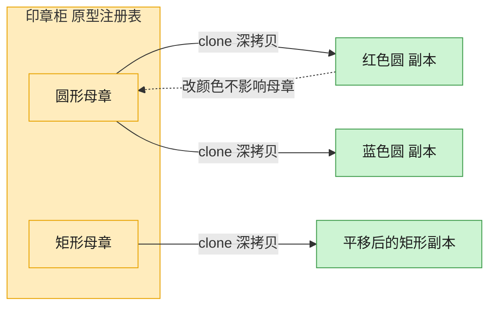

# Prototype 原型模式（JavaScript）

## 意图
用原型实例指定创建对象的种类，并通过拷贝这个原型来创建新对象，而无需知道具体类或重新走
一遍复杂的构造流程。适合创建成本较高或结构复杂、但可以基于已有实例“复制并微调”的对象。

<!-- gof-architecture-diagram -->
## 架构图

> **生活类比**：印章柜里放着圆形、矩形两枚母章。要新图时不从零雕刻，盖一下（clone）就得到互不干扰的副本，改颜色也不脏了母章。



| 图中角色 | 本仓库示例 |
|---------|-----------|
| 母章 / 原型 | Shape.clone，默认 deepcopy |
| 印章柜 | 按名字取模板的原型注册表 |
| 盖出的副本 | 改颜色、位置、标签，不影响原件 |

23 张图的完整图鉴见 [`docs/README.md`](../../docs/README.md#prototype-原型)。

## 适用场景
- 需要复制的对象与直接实例化相比，创建成本更高或更复杂（如预设了大量属性）。
- 系统需要独立于其产品的创建、构成和表示来复制对象。
- 需要避免创建与产品类层次平行的工厂类层次。
- 需要保存对象的多个不同状态快照，随时克隆某一版本继续修改。

## 实现方式
抽象类 `Shape` 声明 `clone()` 接口，具体子类 `Circle`、`Rectangle` 各自实现 `clone()`：
用当前实例的字段值构造一个全新对象，而不是复制引用，从而保证克隆体与原型互不影响。额外
提供 `ShapeRegistry` 原型注册表，按名称缓存一批预设原型，按需克隆：

```js
class Circle extends Shape {
  clone() {
    return new Circle(this.x, this.y, this.color, this.radius);
  }
}

class ShapeRegistry {
  #prototypes = new Map();
  create(key) {
    return this.#prototypes.get(key).clone();
  }
}
```

## 文件说明
| 文件 | 说明 |
|------|------|
| `main.mjs` | 原型模式完整示例：`Shape`/`Circle`/`Rectangle` 的 `clone()` 实现，以及 `ShapeRegistry` 原型注册表 |

## 编译与运行
```bash
node main.mjs
```

## 输出示例
```
=== 原型模式：克隆图形对象 ===

原始圆形     : 圆形 [位置=(10, 10), 颜色=红色, 半径=5]
克隆并修改后 : 圆形 [位置=(50, 50), 颜色=蓝色, 半径=5]
原始圆形不变 : 圆形 [位置=(10, 10), 颜色=红色, 半径=5]

原始矩形     : 矩形 [位置=(0, 0), 颜色=绿色, 宽=100, 高=40]
克隆并修改后 : 矩形 [位置=(0, 0), 颜色=绿色, 宽=200, 高=40]
原始矩形不变 : 矩形 [位置=(0, 0), 颜色=绿色, 宽=100, 高=40]

-- 使用原型注册表按需克隆 --
两次克隆结果是否为同一对象: false
shapeA: 圆形 [位置=(0, 0), 颜色=红色, 半径=2]
shapeB: 圆形 [位置=(0, 0), 颜色=红色, 半径=2]
```

## 要点
1. `clone()` 手写字段拷贝比 `Object.assign` 浅拷贝更可控，尤其当字段中包含嵌套对象需要
   深拷贝时（本例字段均为基本类型，浅拷贝即等价于深拷贝）。
2. 也可以使用全局 `structuredClone()`（Node 17+ / 现代浏览器）做通用深拷贝，但会丢失类的
   原型链（克隆结果是普通对象，不再是 `Circle` 实例），因此结构化克隆和“原型模式的 clone()”
   并不完全等价，需按场景选择。
3. 原型注册表把“创建谁的克隆”与“如何克隆”解耦，客户端只需按名称索取，无需了解具体类。
4. 每次 `clone()` 返回的都是独立对象（`shapeA === shapeB` 为 `false`），修改互不影响。
