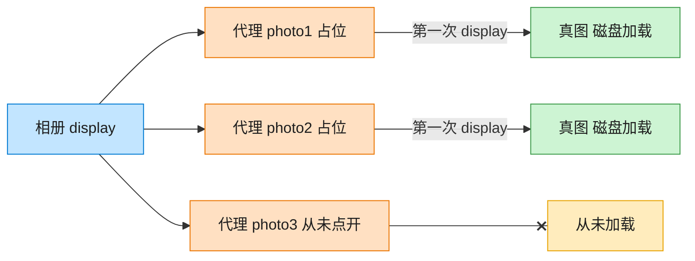

# Proxy 代理模式（JavaScript）

## 意图
为其他对象提供一种代理以控制对这个对象的访问。代理与真实对象实现同一接口，客户端察觉不
到中间多了一层代理，代理可以在转发请求前后添加额外逻辑（如延迟加载、权限校验、缓存）。

<!-- gof-architecture-diagram -->
## 架构图

> **生活类比**：相册先摆三张空相框。点开才从仓库搬出真照片；没点开的那张，磁盘加载一次都不会发生。



| 图中角色 | 本仓库示例 |
|---------|-----------|
| 相册 | 客户端，只认 Image.display |
| 空相框 | ImageProxy 虚拟代理 |
| 仓库真图 | RealImage，构造时才加载 |

23 张图的完整图鉴见 [`docs/README.md`](../../docs/README.md#proxy-代理)。

## 适用场景
- 远程代理：为一个位于不同地址空间的对象提供本地代表。
- 虚拟代理：根据需要创建开销很大的对象（本例的懒加载正属于此类）。
- 保护代理：控制对原始对象的访问权限。
- 缓存代理：为开销大的运算结果提供临时缓存，避免重复计算/加载。

## 实现方式
`Image` 是抽象主题，声明 `display()`。`RealImage` 是真实主题，构造时就会立即从磁盘加载
（模拟开销较大的操作）。`ImageProxy` 也实现 `Image`，但构造时只记录文件名，不创建
`RealImage`；只有第一次调用 `display()` 时才真正实例化并缓存 `RealImage`，之后的调用直接
复用：

```js
class ImageProxy extends Image {
  #realImage = null;
  display() {
    if (!this.#realImage) {
      this.#realImage = new RealImage(this.#filename); // 首次才真正加载
    }
    this.#realImage.display();
  }
}
```

## 文件说明
| 文件 | 说明 |
|------|------|
| `main.mjs` | 代理模式完整示例：`RealImage` 真实主题（构造即加载）、`ImageProxy` 懒加载代理 |

## 编译与运行
```bash
node main.mjs
```

## 输出示例
```
=== 代理模式：图片懒加载 ===

-- 创建一批图片代理（此时不会真正加载任何图片）--
[ImageProxy] 创建代理对象: photo1.jpg（此时尚未真正加载）
[ImageProxy] 创建代理对象: photo2.jpg（此时尚未真正加载）
[ImageProxy] 创建代理对象: photo3.jpg（此时尚未真正加载）

-- 用户只浏览到 photo1，只有它会被真正加载 --
[ImageProxy] 首次调用 display()，触发真实加载...
  [RealImage] 正在从磁盘加载高清图片: photo1.jpg ...（耗时较长）
  [RealImage] 显示图片: photo1.jpg

-- 再次显示 photo1，直接复用已加载的图片，不会重复加载 --
[ImageProxy] 已加载过，直接复用缓存的 RealImage
  [RealImage] 显示图片: photo1.jpg

-- 用户滚动到 photo2，此时才触发它的加载 --
[ImageProxy] 首次调用 display()，触发真实加载...
  [RealImage] 正在从磁盘加载高清图片: photo2.jpg ...（耗时较长）
  [RealImage] 显示图片: photo2.jpg

（photo3.jpg 全程未被访问，因此从未被加载，节省了资源）
```

## 要点
1. 三张图片对应的代理全部创建完成后，只有真正调用过 `display()` 的两张（photo1、photo2）
   触发了昂贵的加载动作，`photo3.jpg` 全程未被访问，验证了“按需加载”。
2. 代理与真实对象实现同一抽象接口 `Image`，客户端 `gallery[i].display()` 的调用方式完全
   不受影响，感知不到背后是代理还是真实对象。
3. 与装饰器模式的区别：装饰器关注“动态增加职责”，通常允许多层叠加；代理关注“控制访问”
   （是否创建、是否有权限、是否走缓存），通常只包一层，且代理与真实对象的接口严格一致。
4. JS 原生的 `Proxy` 全局对象可以实现更通用的拦截（拦截任意属性读写），但本例采用 GoF 经
   典的“同接口包装类”写法，更直观地对应设计模式教材中的结构。
