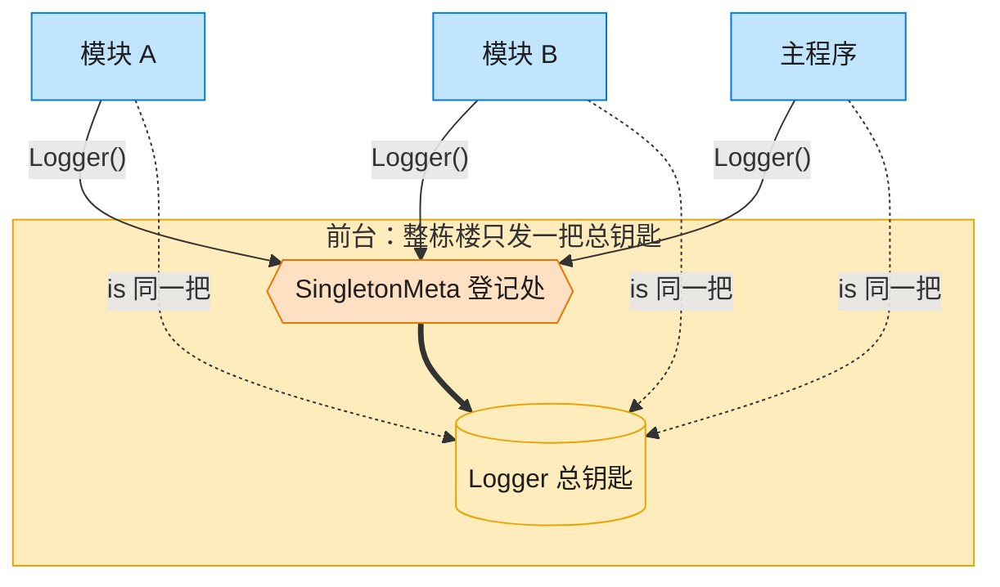

# Singleton 单例模式（JavaScript）

## 意图
保证一个类只有一个实例，并提供一个全局访问点。常用于日志器、配置中心、连接池等“全局唯一
且需要跨模块共享状态”的对象。

<!-- gof-architecture-diagram -->
## 架构图

> **生活类比**：整栋大楼只发一把总钥匙。模块 A、模块 B、主程序去前台领取，拿到的永远是同一把 —— 这就是单例。



| 图中角色 | 本仓库示例 |
|---------|-----------|
| 前台 / 总钥匙 | SingletonMeta + Logger 全局唯一实例 |
| 来领钥匙的部门 | ModuleA / ModuleB / 主程序 |

23 张图的完整图鉴见 [`docs/README.md`](../../docs/README.md#singleton-单例)。

## 适用场景
- 系统中某个类只能有一个实例，且该实例需要被广泛访问（如全局 Logger、全局配置）。
- 唯一实例应该通过子类化扩展，且客户端无需修改代码就能使用扩展后的实例。
- 需要惰性初始化：直到第一次被用到时才创建实例，避免不必要的启动开销。

## 实现方式
`Logger` 用私有静态字段 `#instance` 保存唯一实例，`static getInstance()` 是唯一的公开访问
点：首次调用才真正创建对象；构造函数内部会检测 `#instance` 是否已存在，若存在则直接抛出
异常，防止绕过 `getInstance()` 用 `new Logger()` 创建出第二个实例：

```js
class Logger {
  static #instance = null;

  constructor() {
    if (Logger.#instance) {
      throw new Error('Logger 是单例，请使用 Logger.getInstance() 获取实例');
    }
  }

  static getInstance() {
    if (!Logger.#instance) {
      Logger.#instance = new Logger();
    }
    return Logger.#instance;
  }
}
```

## 文件说明
| 文件 | 说明 |
|------|------|
| `main.mjs` | 单例模式完整示例：带日志级别过滤的全局 `Logger`，以及跨“模块”复用同一实例的演示 |

## 编译与运行
```bash
node main.mjs
```

## 输出示例
```
=== 单例模式：全局 Logger ===

-- 模块 A 中获取 Logger --
[Logger] 创建了唯一实例
[INFO] 模块 A 初始化完成

-- 模块 B 中获取 Logger（应复用同一实例，不再打印“创建了唯一实例”）--
[DEBUG] 模块 B 的调试信息（因为已调整级别为 DEBUG，所以能显示）

-- 验证两处获取的是同一个对象 --
loggerInModuleA === loggerInModuleB : true
累计日志条数（含被过滤前后）: 2

-- 尝试绕过 getInstance() 直接 new，应抛出异常 --
捕获到异常: Logger 是单例，请使用 Logger.getInstance() 获取实例
```

## 要点
1. ES 模块本身默认就是“单例”的（同一路径的模块无论被 `import` 多少次都只会执行一次、
   共享同一份导出），因此最地道的 JS 写法往往是直接 `export default new Logger()`；本例为
   了对照其他语言，展示了更贴近传统 GoF 的“类 + 静态方法”写法。
2. 私有静态字段 `#instance` 保证外部无法从类外直接篡改单例引用。
3. 构造函数中的二次创建检测，避免了“忘记调用 getInstance() 而是直接 new”导致的隐蔽 bug。
4. 单例模式在测试中容易造成状态泄漏（多个用例共享同一全局状态），实际项目中需要提供重置
   或依赖注入的手段。
