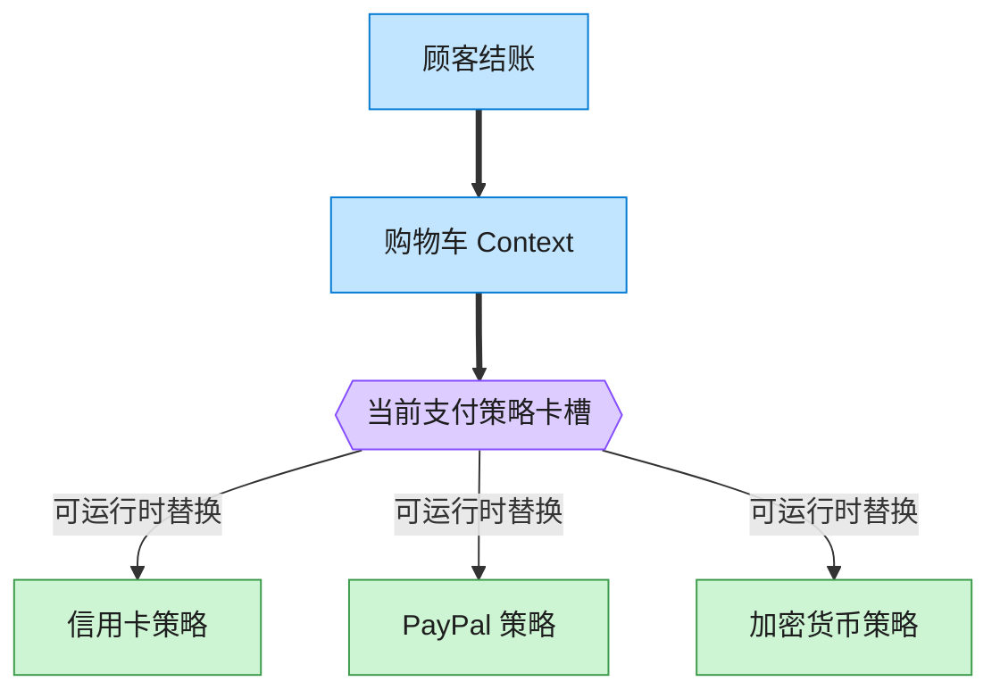

# Strategy 策略模式（JavaScript）

## 意图
定义一系列算法，把它们各自封装起来，并使它们可以互相替换。策略模式让算法的变化独立于使
用算法的客户端，客户端只需在运行时选择/切换具体策略，无需修改自身代码。

<!-- gof-architecture-diagram -->
## 架构图

> **生活类比**：收银台插卡：购物车不关心怎么扣款，结账时插入信用卡、PayPal 或加密货币策略卡。用户在结算页改选，算法当场替换。



| 图中角色 | 本仓库示例 |
|---------|-----------|
| 购物车 | ShoppingCart 上下文 |
| 卡槽 | PaymentStrategy 可替换算法 |
| 策略卡 | CreditCard / PayPal / Crypto |

23 张图的完整图鉴见 [`docs/README.md`](../../docs/README.md#strategy-策略)。

## 适用场景
- 许多相关的类仅仅是行为有异，可以用策略动态选择其中一种行为。
- 需要使用一个算法的不同变体（不同的支付方式、不同的排序规则、不同的折扣计算）。
- 算法用到了客户端不该知道的数据，或想避免暴露复杂的、与算法相关的数据结构。
- 一个类定义了大量行为，且这些行为在其操作中以多个条件语句的形式出现，应该用策略取代。

## 实现方式
`PaymentStrategy` 抽象类声明 `pay(amount)`。`CreditCardStrategy`、`PayPalStrategy`、
`CryptoStrategy` 是三种可互换的具体策略。`ShoppingCart`（上下文）持有一个策略引用，通过
`setPaymentStrategy()` 在运行时切换，`checkout()` 全程只调用 `this.#strategy.pay()`：

```js
class ShoppingCart {
  setPaymentStrategy(strategy) { this.#strategy = strategy; return this; }
  checkout() { console.log(this.#strategy.pay(this.total)); } // 不关心具体是哪种策略
}

cart.setPaymentStrategy(new CreditCardStrategy('4111111111111234'));
cart.checkout();
cart.setPaymentStrategy(new PayPalStrategy('buyer@example.com')); // 运行时切换
```

## 文件说明
| 文件 | 说明 |
|------|------|
| `main.mjs` | 策略模式完整示例：`CreditCardStrategy`/`PayPalStrategy`/`CryptoStrategy` 三种支付策略，`ShoppingCart` 上下文，以及函数式策略写法对照 |

## 编译与运行
```bash
node main.mjs
```

## 输出示例
```
=== 策略模式：可互换的支付方式 ===

-- 使用信用卡支付 --
结算清单: 机械键盘(¥399), 鼠标垫(¥59)
使用信用卡(************1234) 支付 ¥458

-- 切换为 PayPal 支付（同一个购物车，运行时切换策略）--
结算清单: 机械键盘(¥399), 鼠标垫(¥59)
使用 PayPal 账户(buyer@example.com) 支付 ¥458

-- 切换为加密货币支付 --
结算清单: 机械键盘(¥399), 鼠标垫(¥59)
使用加密钱包(0xA1B2C3D4E5F6) 支付约 63.6111 USDT（折合 ¥458）

-- 现代 JS 的等价写法：策略也可以直接是一个函数（一等公民）--
[函数策略] 信用卡支付 ¥100
[函数策略] PayPal 支付 ¥100
```

## 要点
1. `ShoppingCart` 从未出现 `if (type === 'creditcard') ... else if (type === 'paypal')`
   这样的分支，切换支付方式就是替换 `#strategy` 引用，符合开闭原则。
2. JS 函数是一等公民，很多场景下无需定义一整套类层次，直接传入函数作为策略即可（示例末
   尾的 `strategies` 对象），这是比传统 GoF 类实现更轻量的等价写法。
3. 策略模式与状态模式结构相似，区别在于策略之间通常互不知晓、由外部（客户端）主动选择并
   注入；状态则由状态对象自身根据转换规则决定何时切换到另一个状态。
4. 每种支付策略内部可以有完全不同的数据结构和计算逻辑（如加密货币策略里的汇率换算），这
   些细节被良好地封装在各自的策略类内，不会污染 `ShoppingCart`。
