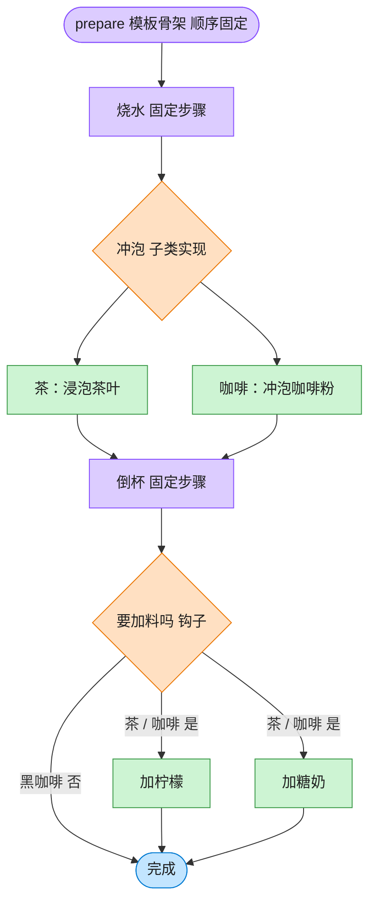

# Template Method 模板方法模式（JavaScript）

## 意图
在一个方法中定义一个算法的骨架，将某些步骤延迟到子类中实现。模板方法使得子类可以在不改
变算法整体结构的前提下，重新定义算法中的某些特定步骤。

<!-- gof-architecture-diagram -->
## 架构图

> **生活类比**：冲泡饮料的菜谱骨架写死：烧水 → 冲泡 → 倒杯 → 是否加料。茶放茶叶加柠檬，咖啡放咖啡粉加糖奶，黑咖啡用钩子跳过加料。流程顺序谁也不能改。



| 图中角色 | 本仓库示例 |
|---------|-----------|
| 菜谱骨架 | Beverage.prepare 模板方法 |
| 可变步骤 | _brew / _add_condiments |
| 钩子 | _wants_condiments，黑咖啡返回否 |

23 张图的完整图鉴见 [`docs/README.md`](../../docs/README.md#template-method-模板方法)。

## 适用场景
- 一次性实现一个算法的不变部分，将可变的行为留给子类实现。
- 各子类中公共的行为应被提取出来并集中到一个公共父类中，避免代码重复。
- 需要控制子类的扩展点：只允许在特定的“钩子”处扩展，防止子类过度定制流程本身。

## 实现方式
`Beverage` 定义模板方法 `prepare()`，固定了“烧水 -> 冲泡 -> 倒杯 -> (可选)加调料”的步骤顺
序；`brew()`/`addCondiments()` 是必须由子类实现的抽象步骤，`wantsCondiments()` 是提供默
认实现的钩子方法，子类可选择性覆盖以改变流程分支：

```js
class Beverage {
  prepare() { // 模板方法：固定算法骨架
    this.boilWater();
    this.brew();               // 子类实现
    this.pourInCup();
    if (this.wantsCondiments()) this.addCondiments(); // 钩子方法控制分支
  }
  wantsCondiments() { return true; } // 钩子的默认实现
}

class BlackCoffee extends Coffee {
  wantsCondiments() { return false; } // 覆盖钩子，跳过加调料步骤
}
```

## 文件说明
| 文件 | 说明 |
|------|------|
| `main.mjs` | 模板方法模式完整示例：`Beverage` 定义骨架，`Tea`/`Coffee` 实现具体步骤，`BlackCoffee` 通过钩子方法改变流程 |

## 编译与运行
```bash
node main.mjs
```

## 输出示例
```
=== 模板方法模式：冲泡饮料 ===

-- 冲泡茶 --
  烧开水
  用沸水浸泡茶叶
  倒入杯中
  加入柠檬

-- 冲泡咖啡（默认加糖和牛奶）--
  烧开水
  用沸水冲泡咖啡粉
  倒入杯中
  加入糖和牛奶

-- 冲泡黑咖啡（通过钩子方法跳过加调料步骤）--
  烧开水
  用沸水冲泡咖啡粉
  倒入杯中
  客户不需要调料，跳过

（三者都复用了 Beverage.prepare() 中固定的“烧水->冲泡->倒杯->加料”骨架）
```

## 要点
1. `prepare()` 中步骤的调用顺序是固定不变的，`Tea`/`Coffee`/`BlackCoffee` 都无法（也不需
   要）修改这个顺序，只能实现或覆盖被留出的扩展点，这就是“好莱坞原则”——“别调用我们，我
   们会调用你”。
2. 钩子方法 `wantsCondiments()` 与抽象步骤 `brew()`/`addCondiments()` 的区别：前者提供默
   认实现，子类覆盖与否都合法；后者没有默认实现，子类必须提供，否则调用时抛出异常。
3. `BlackCoffee` 只通过覆盖一个钩子方法就改变了整个流程的分支走向，而不需要重写
   `prepare()` 本身，体现了模板方法对“扩展点”的精确控制。
4. 相比工厂方法模式（子类决定创建哪个对象），模板方法关注子类决定“某个步骤怎么做”，两者
   经常配合使用（工厂方法本身也可以看作模板方法中的一种特殊钩子）。
