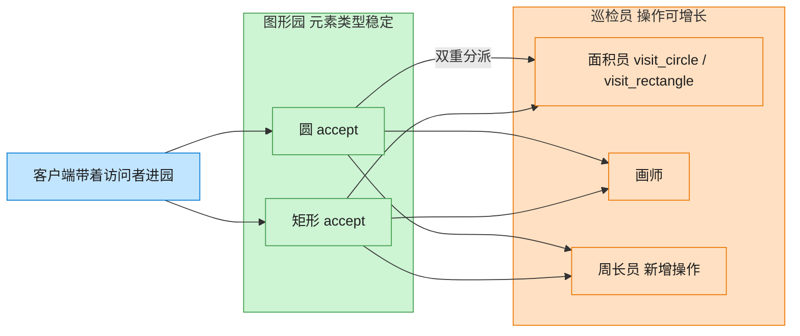

# Visitor 访问者模式（JavaScript）

## 意图
表示一个作用于某对象结构中各元素的操作，使得可以在不改变各元素的类的前提下定义作用于这
些元素的新操作。通过“双重分派”把“数据结构”和“作用于数据结构上的操作”彻底分离。

<!-- gof-architecture-diagram -->
## 架构图

> **生活类比**：图形园的种类很少变（圆、矩形），但巡检工作经常加：今天来面积员，明天来画师，后天新增周长员。图形只负责开门（accept），工具箱在访问者身上 —— 双重分派。



| 图中角色 | 本仓库示例 |
|---------|-----------|
| 图形园 | Circle / Rectangle，元素稳定 |
| 开门 | accept 第一次分派 |
| 巡检员 | Area / Draw / Perimeter，操作可增长 |

23 张图的完整图鉴见 [`docs/README.md`](../../docs/README.md#visitor-访问者)。

## 适用场景
- 一个对象结构（如一批不同类型的图形）包含很多类，且希望对这些对象实施一些依赖于其具体
  类的、不相关的操作，同时不希望这些操作“污染”这些类本身。
- 对象结构很少变化（新增图形类型的频率低），但经常需要在此结构上定义新操作（新增运算）。
- 相关操作分散在多个不相关的类中，希望把它们集中到一个访问者类中管理。

## 实现方式
`Shape` 抽象类声明 `accept(visitor)`。`Circle`/`Rectangle`/`Triangle` 各自实现
`accept()`，方法体内调用访问者对应的 `visitXxx(this)`——具体调用哪个方法由元素自己的类型
决定，这就是“双重分派”。`ShapeVisitor` 声明 `visitCircle`/`visitRectangle`/
`visitTriangle`，`AreaVisitor`、`DrawVisitor` 是两个具体访问者，各自实现一整套“新操作”：

```js
class Circle extends Shape {
  accept(visitor) { return visitor.visitCircle(this); } // 双重分派：由 Circle 决定调用哪个 visit 方法
}

class AreaVisitor extends ShapeVisitor {
  visitCircle(circle) { return Math.PI * circle.radius ** 2; }
}

shapes.map(shape => shape.accept(areaVisitor)); // 同一批对象，切换 visitor 即可切换操作
```

## 文件说明
| 文件 | 说明 |
|------|------|
| `main.mjs` | 访问者模式完整示例：`Circle`/`Rectangle`/`Triangle` 元素，`AreaVisitor`（求面积）/`DrawVisitor`（渲染描述）两种访问者 |

## 编译与运行
```bash
node main.mjs
```

## 输出示例
```
=== 访问者模式：对图形施加不同操作 ===

-- 使用 AreaVisitor 计算所有图形的面积 --
  圆形(半径=3) 面积 = 28.27
  矩形(4x5) 面积 = 20.00
  三角形(底=6, 高=4) 面积 = 12.00

-- 使用 DrawVisitor 渲染所有图形（同一批对象，切换新操作无需修改 Shape 类）--
  画一个半径为 3 的 ○
  画一个 4x5 的 □
  画一个底 6、高 4 的 △
```

## 要点
1. 新增一种操作（如 `PerimeterVisitor` 计算周长）只需新增一个访问者类，完全不需要触碰
   `Circle`/`Rectangle`/`Triangle` 的代码，体现了“对新增操作开放”。
2. 反过来，新增一种图形（如 `Triangle`）则需要修改 `ShapeVisitor` 接口以及所有已有的具体
   访问者，这是访问者模式的固有代价——它适合“元素类型稳定、操作类型经常变化”的场景，与
   工厂方法/桥接等模式适合的场景正好相反。
3. `accept(visitor) { return visitor.visitCircle(this); }` 是理解本模式的关键：如果直接在
   访问者里写 `if (shape instanceof Circle)`，就退化成了普通的类型判断，失去了双重分派的
   意义（每次新增元素类型都要去改所有 if-else 分支）。
4. 访问者模式常用于对语法树、文档对象模型等稳定结构做多种遍历操作（求值、格式化、静态检
   查等），与解释器模式常搭配出现。
