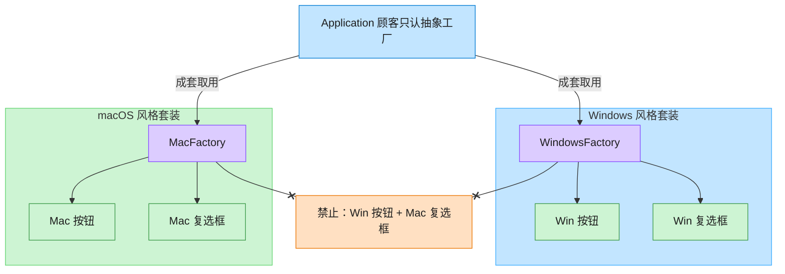

# Abstract Factory 抽象工厂模式（Objective-C）

## 意图

提供一个创建一系列相关或相互依赖对象的接口，而无需指定它们的具体类。客户端只面向抽象工厂与抽象产品编程，同一族产品（同一平台风格的 Button + Checkbox）总是被一起创建，不会出现风格混搭。

<!-- gof-architecture-diagram -->
## 架构图

> **生活类比**：家具店一次卖「成套风格」。Windows 工厂成套出 Win 按钮+Win 复选框，Mac 工厂成套出 Mac 风格 —— 绝不混搭。



| 图中角色 | 本仓库示例 |
|---------|-----------|
| 顾客 / 应用 | Application，只依赖 GUIFactory |
| 成套工厂 | WindowsFactory / MacFactory |
| 成套产品 | Button + Checkbox 必须同一家族 |

23 张图的完整图鉴见 [`docs/README.md`](../../docs/README.md#abstract-factory-抽象工厂)。

## 适用场景

- 系统需要独立于其产品的创建、组合和表示方式
- 需要保证同一族中的产品被配套使用（如同一平台风格的一整套控件）
- 希望通过切换具体工厂来切换整族产品，而不必修改客户端代码

## 实现方式

用 `@protocol` 定义抽象产品 `Button`/`Checkbox` 与抽象工厂 `GUIFactory`（ObjC 没有强制的抽象类机制，协议是表达"接口"的惯用方式）；`WindowsFactory`/`MacFactory` 各自实现该协议，产出风格一致的具体产品。客户端 `Application` 只持有 `id<GUIFactory>`、`id<Button>`、`id<Checkbox>`，完全不知道具体平台类：

```objc
@protocol GUIFactory <NSObject>
- (id<Button>)createButton;
- (id<Checkbox>)createCheckbox;
@end

@implementation WindowsFactory
- (id<Button>)createButton   { return [[WindowsButton alloc] init]; }
- (id<Checkbox>)createCheckbox { return [[WindowsCheckbox alloc] init]; }
@end
```

## 文件说明

| 文件 | 说明 |
|------|------|
| `AbstractFactory.h` | 抽象产品协议（Button/Checkbox）、具体产品类、抽象工厂协议、具体工厂类、客户端 `Application` 声明 |
| `AbstractFactory.m` | 上述各类型的实现 |
| `main.m` | 依次用 Windows / macOS 工厂渲染一整套 UI，验证同族风格一致 |
| `Makefile` | 编译与运行 |

## 编译与运行

```bash
make run    # 编译并运行
make        # 仅编译
make clean  # 清理
```

## 输出示例

```
=== 当前平台: windows ===
[Windows 按钮：矩形边框，扁平风格]
[Windows 复选框：方形勾选]
Windows 按钮播放系统点击音效
Windows 复选框状态切换（方形勾选动画）
=== 当前平台: mac ===
[macOS 按钮：圆角边框，毛玻璃风格]
[macOS 复选框：圆角勾选]
macOS 按钮播放轻柔点击反馈
macOS 复选框状态切换（圆角勾选动画）
```

（预期输出 —— 本机未安装 ObjC 工具链，未实机运行）

## 要点

1. **协议即抽象产品/抽象工厂** —— ObjC 没有抽象类强制机制，`@protocol` 是表达"接口"的惯用方式。
2. **同族一致性** —— 具体工厂保证产出的产品互相匹配，不会出现 Windows 按钮配 macOS 复选框。
3. **易扩展新族，难扩展新产品** —— 新增 `LinuxFactory` 很简单；但要给 `Button`/`Checkbox` 协议新增方法时，所有具体产品都要跟着改。
