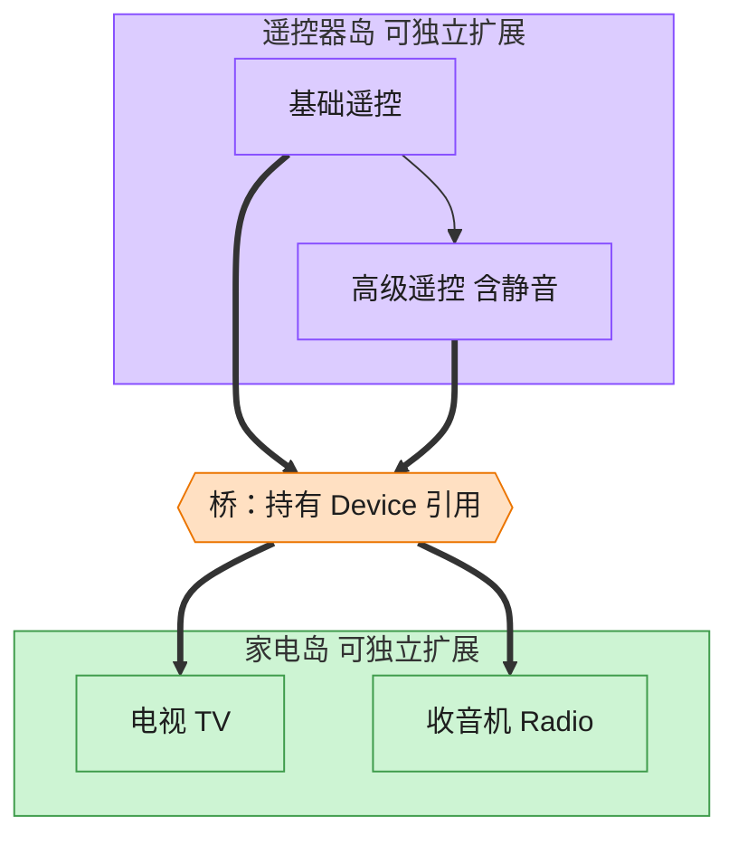

# Bridge 桥接模式（Objective-C）

## 意图

将抽象部分与实现部分分离，使二者可以独立变化。避免"遥控器种类 x 设备种类"的组合在继承体系里以 N×M 的子类数量爆炸式增长。

<!-- gof-architecture-diagram -->
## 架构图

> **生活类比**：遥控器和家电是两座岛。基础遥控 / 高级遥控是一座岛，电视 / 收音机是另一座岛。中间一座桥（组合引用）把它们连上，不必为每种组合造一个新类。



| 图中角色 | 本仓库示例 |
|---------|-----------|
| 遥控器岛 | RemoteControl / AdvancedRemoteControl 抽象 |
| 桥 | 抽象持有的 Device 引用 |
| 家电岛 | TV / Radio 实现 |

23 张图的完整图鉴见 [`docs/README.md`](../../docs/README.md#bridge-桥接)。

## 适用场景

- 一个类存在两个（或多个）独立变化的维度（如"遥控器功能"与"设备类型"）
- 想在运行时切换实现部分（把同一个遥控器换到另一台设备上）
- 希望通过组合替代继承，避免类爆炸

## 实现方式

`Device` 协议是实现部，`TV`/`Radio` 是具体实现；`RemoteControl` 是抽象部，内部持有一个 `id<Device>` —— 这个引用就是"桥"。`AdvancedRemoteControl` 继承自 `RemoteControl` 扩展出新功能，但仍然只依赖 `Device` 协议：

```objc
@interface RemoteControl : NSObject
@property (nonatomic, strong, readonly) id<Device> device; // 桥
- (void)togglePower;
@end

@implementation RemoteControl
- (void)togglePower {
    if ([self.device isOn]) { [self.device turnOff]; }
    else                     { [self.device turnOn]; }
}
@end
```

遥控器维度（basic/advanced）与设备维度（TV/Radio）可以自由交叉组合，互不影响。

## 文件说明

| 文件 | 说明 |
|------|------|
| `Bridge.h` | `Device` 实现部协议、`TV`/`Radio` 具体实现、`RemoteControl` 抽象部、`AdvancedRemoteControl` 扩展抽象声明 |
| `Bridge.m` | 上述类型的实现 |
| `main.m` | 演示基础/高级遥控器分别搭配电视机/收音机的四种组合 |
| `Makefile` | 编译与运行 |

## 编译与运行

```bash
make run    # 编译并运行
make        # 仅编译
make clean  # 清理
```

## 输出示例

```
=== 基础遥控器 x 电视机 ===
电视机 已开机
电视机 音量提升至 10
电视机 音量提升至 20

=== 高级遥控器 x 收音机 ===
收音机 已开机
收音机 音量提升至 10
收音机 已静音

=== 高级遥控器同样可以控制电视机（两个维度自由组合） ===
电视机 已开机
电视机 已静音
```

（预期输出 —— 本机未安装 ObjC 工具链，未实机运行）

## 要点

1. **组合优于继承** —— `RemoteControl` 不去继承 `TV`/`Radio`，而是持有一个 `id<Device>` 引用，这就是"桥"。
2. **两个维度独立扩展** —— 新增 `Projector` 设备或 `VoiceRemoteControl` 遥控器都互不影响，不必修改已有类。
3. **协议表达实现部接口** —— `Device` 用 `@protocol` 声明，`RemoteControl` 面向协议编程，具体是 `TV` 还是 `Radio` 在运行时通过初始化时传入的对象决定。
