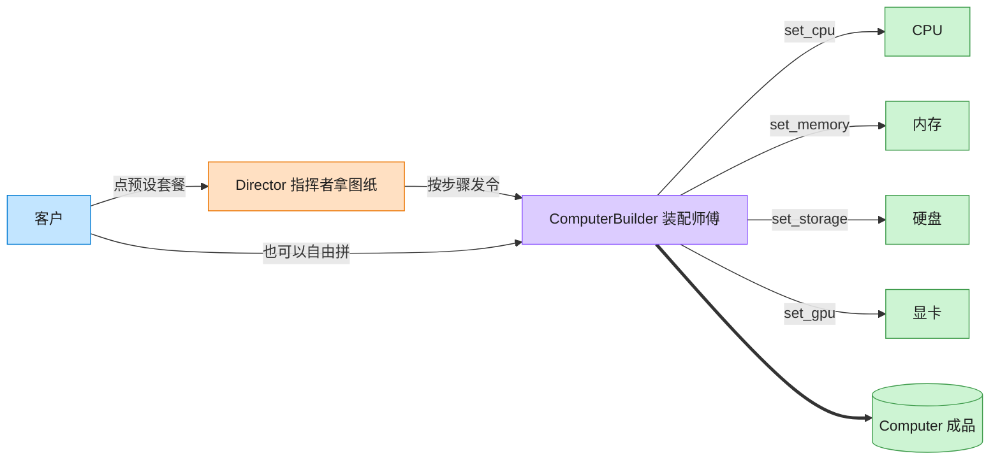

# Builder 建造者模式（Objective-C）

## 意图

将一个复杂对象的构建过程与其表示分离，使同样的构建过程可以创建不同的表示。客户端不必了解组装的具体步骤和顺序，即可分步骤、可选地设置各个部件，最终得到一个完整对象。

<!-- gof-architecture-diagram -->
## 架构图

> **生活类比**：装机店流水线：指挥者拿「办公机 / 游戏主机 / 工作站」图纸发令，装配师傅一步步装 CPU、内存、硬盘、显卡，最后交出一台电脑。客户也可以绕过图纸自由拼。



| 图中角色 | 本仓库示例 |
|---------|-----------|
| 指挥者 | ComputerDirector 预设装配顺序 |
| 装配师傅 | ComputerBuilder 链式分步接口 |
| 成品 | Computer |

23 张图的完整图鉴见 [`docs/README.md`](../../docs/README.md#builder-建造者)。

## 适用场景

- 对象的构建过程复杂，包含多个可选/必需部件（如本例的 CPU/内存/存储/显卡）
- 希望用同一套构建步骤产出不同配置的产品（办公机 vs 游戏机）
- 需要避免"重叠构造函数"（多个参数各种组合的 init 方法爆炸式增长）

## 实现方式

`ComputerBuilder` 提供 `setCPU:`/`setMemory:`/`setStorage:`/`setGPU:` 等分步设置方法，每个方法返回 `instancetype`（即 `self`），因此支持链式调用；最终调用 `build` 产出不可变的 `Computer`。`ComputerDirector` 封装了"办公机"“游戏机"两种预设组装顺序：

```objc
- (Computer *)buildGamingPCWithBuilder:(ComputerBuilder *)builder {
    [builder setCPU:@"Intel i9"];
    [builder setMemory:@"32GB"];
    [builder setStorage:@"2TB SSD"];
    [builder setGPU:@"NVIDIA RTX 4090"];
    return [builder build];
}
```

客户端也可以绕开 Director，直接对 builder 链式调用来自定义组装。

## 文件说明

| 文件 | 说明 |
|------|------|
| `Builder.h` | `Computer` 产品、`ComputerBuilder` 建造者、`ComputerDirector` 指挥者声明 |
| `Builder.m` | 上述类型的实现 |
| `main.m` | 分别用 Director 预设与客户端自定义两种方式组装电脑 |
| `Makefile` | 编译与运行 |

## 编译与运行

```bash
make run    # 编译并运行
make        # 仅编译
make clean  # 清理
```

## 输出示例

```
=== 使用 Director 预设：办公电脑 ===
CPU: Intel i5 | 内存: 16GB | 存储: 512GB SSD
=== 使用 Director 预设：游戏电脑 ===
CPU: Intel i9 | 内存: 32GB | 存储: 2TB SSD | 显卡: NVIDIA RTX 4090
=== 客户端跳过 Director，自行组装（体现链式 Builder 的灵活性）===
CPU: AMD Ryzen 9 | 内存: 64GB | 存储: 4TB NVMe | 显卡: AMD Radeon RX 7900
```

（预期输出 —— 本机未安装 ObjC 工具链，未实机运行）

## 要点

1. **分步构建** —— 复杂对象的组装过程被拆成多个独立、可读的步骤。
2. **链式调用（Fluent Interface）** —— `set` 方法返回 `instancetype`，是 ObjC/Cocoa 中常见的建造者写法（类似 `NSMutableURLRequest` 的用法习惯）。
3. **Director 可选** —— Director 负责"怎么组装出常见配置"，但客户端始终可以直接操纵 Builder 做定制化组装。
