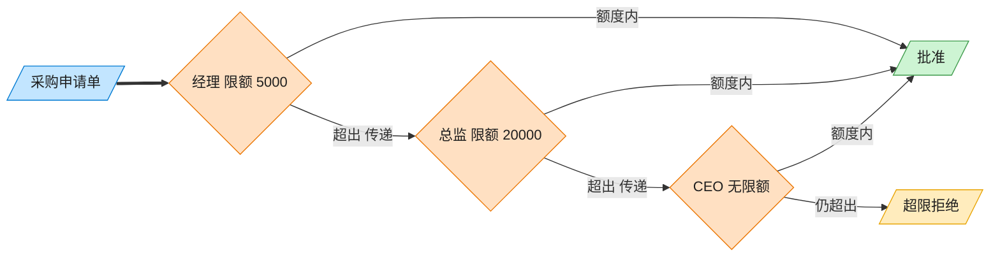

# Chain of Responsibility 责任链模式（Objective-C）

## 意图

让多个对象都有机会处理同一个请求，从而避免请求发送者与具体处理者之间的耦合。把这些对象连成一条链，请求沿链传递，直到有对象处理它为止。

<!-- gof-architecture-diagram -->
## 架构图

> **生活类比**：采购单沿公章接力：经理能批 5000 就盖章，否则递给总监，再递给 CEO。提交人只把单子交给第一环，从不管最终谁批。



| 图中角色 | 本仓库示例 |
|---------|-----------|
| 采购单 | PurchaseRequest |
| 审批链 | Manager → Director → CEO |
| 提交人 | 只调用链头 handle |

23 张图的完整图鉴见 [`docs/README.md`](../../docs/README.md#chain-of-responsibility-责任链)。

## 适用场景

- 有多个对象可以处理同一请求，具体由谁处理在运行时才能确定
- 希望在不明确指定接收者的情况下，向多个对象中的一个提交请求
- 处理者集合及其顺序需要动态调整（不希望调用方硬编码判断逻辑）

## 实现方式

`Approver` 是抽象处理者，持有 `next` 引用；`approvalLimit` 是每个具体处理者必须重写的"权限上限"。`processRequest:amount:` 是模板逻辑：金额在权限内就处理，否则转交下一环：

```objc
- (void)processRequest:(NSString *)item amount:(double)amount {
    if (amount <= [self approvalLimit]) {
        NSLog(@"  【%@】批准了采购申请「%@」，金额 %.0f 元", self.title, item, amount);
    } else if (self.next != nil) {
        [self.next processRequest:item amount:amount]; // 转交下一环
    } else {
        NSLog(@"  申请被拒绝：金额 %.0f 元超出所有审批人的权限上限", amount);
    }
}
```

`Manager`(5000)/`Director`(20000)/`CEO`(100000) 只需重写 `approvalLimit` 并给自己起名，链的组装通过 `setNext:` 完成，且返回值支持链式拼接。

## 文件说明

| 文件 | 说明 |
|------|------|
| `ChainOfResponsibility.h` | 抽象处理者 `Approver`、具体处理者 `Manager`/`Director`/`CEO` 声明 |
| `ChainOfResponsibility.m` | 上述类型的实现 |
| `main.m` | 组装审批链，提交 4 笔不同金额的采购申请 |
| `Makefile` | 编译与运行 |

## 编译与运行

```bash
make run    # 编译并运行
make        # 仅编译
make clean  # 清理
```

## 输出示例

```
提交申请: 「办公文具」金额 800 元
  【经理】批准了采购申请「办公文具」，金额 800 元
 
提交申请: 「部门团建」金额 8000 元
  经理 权限不足（限额 5000 元），转交下一级...
  【总监】批准了采购申请「部门团建」，金额 8000 元
 
提交申请: 「服务器采购」金额 45000 元
  经理 权限不足（限额 5000 元），转交下一级...
  总监 权限不足（限额 20000 元），转交下一级...
  【CEO】批准了采购申请「服务器采购」，金额 45000 元
 
提交申请: 「公司年会」金额 150000 元
  经理 权限不足（限额 5000 元），转交下一级...
  总监 权限不足（限额 20000 元），转交下一级...
  CEO 权限不足（限额 100000 元），转交下一级...
  申请被拒绝：金额 150000 元超出所有审批人的权限上限
```

（预期输出 —— 本机未安装 ObjC 工具链，未实机运行）

## 要点

1. **发送者与处理者解耦** —— 调用方永远只找链的第一环 `manager`，不必知道最终由谁处理。
2. **链的组装与处理逻辑分离** —— `setNext:` 只负责搭链，`processRequest:amount:` 只负责判断与转发，职责单一。
3. **易于调整链的结构** —— 增删审批级别、调整顺序，只需修改 `main.m` 里 `setNext:` 的组装方式，`Approver` 内部逻辑无需改动。
