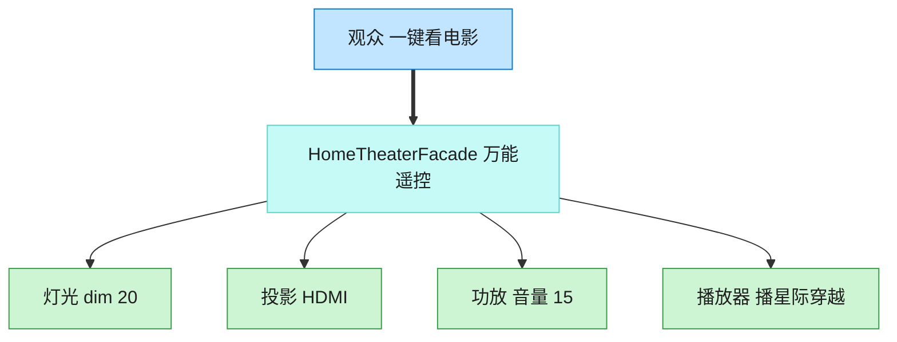

# Facade 外观模式（Objective-C）

## 意图

为子系统中的一组接口提供一个统一的高层接口，使子系统更容易使用。客户端不需要了解各子系统内部的协调细节。

<!-- gof-architecture-diagram -->
## 架构图

> **生活类比**：家庭影院一键观影：观众只按「看电影」。外观对象按顺序关灯、开投影、调功放、按播放。高级玩家仍可绕过外观直接拨弄每个设备。



| 图中角色 | 本仓库示例 |
|---------|-----------|
| 观众 | 客户端，只调 watch_movie |
| 万能遥控 | HomeTheaterFacade |
| 子系统 | Lights / Projector / Amplifier / Player |

23 张图的完整图鉴见 [`docs/README.md`](../../docs/README.md#facade-外观)。

## 适用场景

- 子系统复杂，包含多个类，且它们之间有固定的调用顺序
- 希望为复杂子系统提供一个简单的入口，降低客户端与子系统的耦合
- 需要分层设计时，外观可以作为某一层的统一入口

## 实现方式

`Projector`/`Amplifier`/`Lights`/`StreamingPlayer` 是互相独立的子系统类。`HomeTheaterFacade` 持有它们的实例，把"开灯光、开投影仪、开功放、开播放器"这一整套固定顺序封装成一个方法：

```objc
- (void)watchMovie:(NSString *)title {
    [_lights dimTo:20];
    [_projector on];
    [_projector setInputSource:@"HDMI 1"];
    [_amplifier on];
    [_amplifier setVolume:60];
    [_player on];
    [_player play:title];
}
```

客户端只需要调用 `[homeTheater watchMovie:@"星际穿越"]`，无需关心背后四个子系统的存在和调用顺序。

## 文件说明

| 文件 | 说明 |
|------|------|
| `Facade.h` | 子系统类 `Projector`/`Amplifier`/`Lights`/`StreamingPlayer`、外观类 `HomeTheaterFacade` 声明 |
| `Facade.m` | 上述类型的实现 |
| `main.m` | 一键 `watchMovie:` 开始观影，再 `endMovie` 收尾 |
| `Makefile` | 编译与运行 |

## 编译与运行

```bash
make run    # 编译并运行
make        # 仅编译
make clean  # 清理
```

## 输出示例

```
=== 准备观影：《星际穿越》===
灯光：调暗至 20%
投影仪：开启
投影仪：切换输入源为 HDMI 1
功放：开启
功放：音量设置为 60
流媒体播放器：开启
流媒体播放器：播放《星际穿越》
一切就绪，请享用！
 
=== 结束观影，恢复现场 ===
流媒体播放器：关闭
功放：关闭
投影仪：关闭
灯光：调暗至 100%
```

（预期输出 —— 本机未安装 ObjC 工具链，未实机运行）

## 要点

1. **简化接口，不隐藏能力** —— 客户端仍可以绕过外观直接使用 `Projector` 等子系统类，外观只是提供了一个更方便的入口。
2. **封装子系统间的协作顺序** —— "先调暗灯光、再开投影仪、最后播放"这类固定流程被封装在 `HomeTheaterFacade` 内部，避免客户端出错。
3. **降低耦合** —— 客户端只依赖 `HomeTheaterFacade` 一个类，子系统内部如何重构、拆分都不会影响客户端代码。
