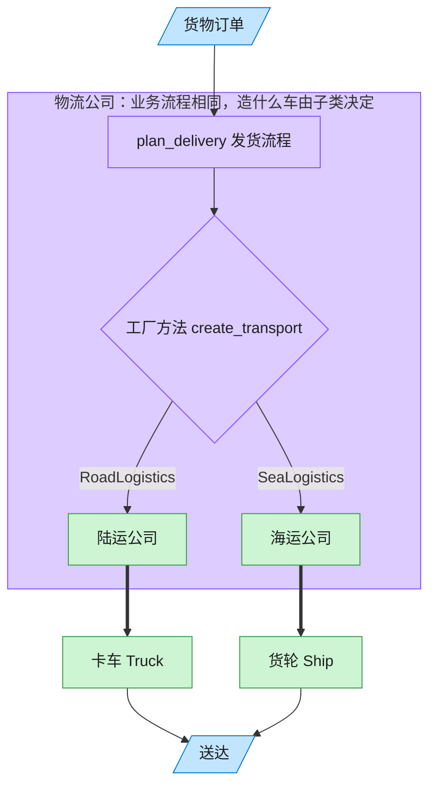

# Factory Method 工厂方法模式（Objective-C）

## 意图

定义一个用于创建对象的接口，但让子类决定实例化哪一个类。工厂方法使一个类的实例化延迟到其子类，客户端只面向抽象创建者与抽象产品编程。

<!-- gof-architecture-diagram -->
## 架构图

> **生活类比**：客户只说「把货送走」。陆运公司决定造卡车，海运公司决定造货轮 —— 子类决定实例化哪一个产品。



| 图中角色 | 本仓库示例 |
|---------|-----------|
| 客户下单 | 调用 plan_delivery 的客户端 |
| 物流公司 | Logistics 抽象创建者及其子类 |
| 运输工具 | Truck / Ship 具体产品 |

23 张图的完整图鉴见 [`docs/README.md`](../../docs/README.md#factory-method-工厂方法)。

## 适用场景

- 一个类无法预知它必须创建的对象的具体类型
- 希望将"产品的创建"延迟到子类，父类只定义流程骨架
- 需要给客户端提供一个统一入口，隐藏具体产品的选择逻辑

## 实现方式

`Logistics` 是抽象创建者，声明工厂方法 `createTransport`（基类不实现，交给子类），并提供依赖该工厂方法的业务逻辑 `planDelivery`。`RoadLogistics`/`SeaLogistics` 分别重写工厂方法返回 `Truck`/`Ship`：

```objc
@implementation Logistics
- (NSString *)planDelivery {
    id<Transport> transport = [self createTransport]; // 不关心具体类型
    return [NSString stringWithFormat:@"调度完成 -> %@", [transport deliver]];
}
@end

@implementation RoadLogistics
- (id<Transport>)createTransport { return [[Truck alloc] init]; }
@end
```

## 文件说明

| 文件 | 说明 |
|------|------|
| `FactoryMethod.h` | `Transport` 抽象产品协议、`Truck`/`Ship` 具体产品、`Logistics` 抽象创建者、`RoadLogistics`/`SeaLogistics` 具体创建者声明 |
| `FactoryMethod.m` | 上述类型的实现 |
| `main.m` | 分别用两种物流调度一次配送 |
| `Makefile` | 编译与运行 |

## 编译与运行

```bash
make run    # 编译并运行
make        # 仅编译
make clean  # 清理
```

## 输出示例

```
RoadLogistics: 调度完成 -> 卡车走陆路运输货物
SeaLogistics: 调度完成 -> 轮船走海路运输货物
```

（预期输出 —— 本机未安装 ObjC 工具链，未实机运行）

## 要点

1. **延迟实例化到子类** —— 基类 `Logistics` 完全不知道 `Truck`/`Ship` 的存在。
2. **与模板方法呼应** —— `planDelivery` 是一个小型模板方法，其中一步（创建产品）被抽取为工厂方法。
3. **开闭原则** —— 新增一种物流方式（如 `AirLogistics`）只需新增子类，无需修改已有代码。
