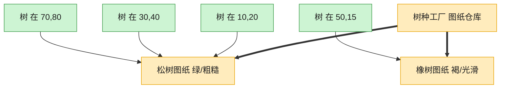

# Flyweight 享元模式（Objective-C）

## 意图

通过共享技术支持大量细粒度对象的高效复用，把对象状态拆分为可共享的"内在状态"与不可共享的"外在状态"，避免为每个对象都存一份重复数据。

<!-- gof-architecture-diagram -->
## 架构图

> **生活类比**：种一片森林：每棵树只要记住自己的坐标，树种、颜色、纹理是共享图纸。一千棵松树只印一张松树图纸，内存不再按棵数爆炸。



| 图中角色 | 本仓库示例 |
|---------|-----------|
| 图纸仓库 | TreeTypeFactory 按键缓存 |
| 共享图纸 | TreeType 内在状态 |
| 一棵树 | Tree 只存坐标外在状态 |

23 张图的完整图鉴见 [`docs/README.md`](../../docs/README.md#flyweight-享元)。

## 适用场景

- 系统中存在大量相似对象，创建/存储成本高（如森林里成千上万棵树）
- 对象的大部分状态可以抽取为共享的"内在状态"（树种、颜色、纹理）
- 少量"外在状态"（坐标）可以在使用时由外部传入，无需存进共享对象

## 实现方式

`TreeType` 保存内在状态（名称/颜色/纹理），由 `TreeTypeFactory` 以 `(name, color, texture)` 为键缓存，相同参数只创建一次。`Tree` 只保存外在状态（坐标）和对共享 `TreeType` 的引用：

```objc
- (TreeType *)treeTypeForName:(NSString *)name color:(NSString *)color texture:(NSString *)texture {
    NSString *key = [NSString stringWithFormat:@"%@-%@-%@", name, color, texture];
    TreeType *type = _cache[key];
    if (type == nil) {
        type = [[TreeType alloc] initWithName:name color:color texture:texture];
        _cache[key] = type;   // 缓存后，相同种类的树共享同一个 TreeType 实例
    }
    return type;
}
```

## 文件说明

| 文件 | 说明 |
|------|------|
| `Flyweight.h` | 享元 `TreeType`、享元工厂 `TreeTypeFactory`、上下文 `Tree`/`Forest` 声明 |
| `Flyweight.m` | 上述类型的实现 |
| `main.m` | 种下 6 棵树（只有 2 种类型），验证 `TreeType` 只被创建 2 次 |
| `Makefile` | 编译与运行 |

## 编译与运行

```bash
make run    # 编译并运行
make        # 仅编译
make clean  # 清理
```

## 输出示例

```
[工厂] 缓存未命中，创建新的 TreeType: 松树-深绿色-粗糙树皮纹理
[工厂] 缓存未命中，创建新的 TreeType: 枫树-红色-光滑树皮纹理
=== 渲染森林 ===
  在 (10, 20) 绘制一棵【松树】(颜色: 深绿色, 纹理: 粗糙树皮纹理)
  在 (15, 25) 绘制一棵【松树】(颜色: 深绿色, 纹理: 粗糙树皮纹理)
  在 (20, 30) 绘制一棵【枫树】(颜色: 红色, 纹理: 光滑树皮纹理)
  在 (22, 31) 绘制一棵【松树】(颜色: 深绿色, 纹理: 粗糙树皮纹理)
  在 (40, 12) 绘制一棵【枫树】(颜色: 红色, 纹理: 光滑树皮纹理)
  在 (41, 13) 绘制一棵【枫树】(颜色: 红色, 纹理: 光滑树皮纹理)
 
树木总数: 6 棵
实际创建的 TreeType（享元）数量: 2 个
```

（预期输出 —— 本机未安装 ObjC 工具链，未实机运行）

## 要点

1. **内在状态 vs 外在状态** —— `TreeType`（可共享）与坐标（不可共享）被明确拆分，是享元模式的核心。
2. **工厂负责去重** —— `TreeTypeFactory` 用字典缓存已创建的享元，相同参数直接复用，避免重复创建。
3. **`Tree` 本身很轻** —— 每棵树只存坐标和一个指针引用，6 棵树、6000 棵树，`TreeType` 的份数只取决于"有多少种"，与"有多少棵"无关。
