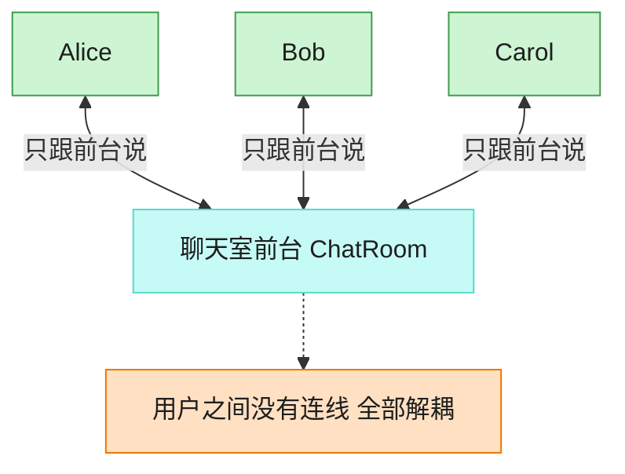

# Mediator 中介者模式（Objective-C）

## 意图

用一个中介对象封装一系列对象之间的交互，使各对象不需要显式地相互引用，从而使其可以独立地变化。

<!-- gof-architecture-diagram -->
## 架构图

> **生活类比**：聊天室前台：Alice、Bob、Carol 彼此不留电话，所有群消息和私信都交给前台转发。加人、禁言、改规则只改前台一处。



| 图中角色 | 本仓库示例 |
|---------|-----------|
| 前台 | ChatRoom 中介者 |
| 同事 | User，只持有中介引用 |
| 交互 | 广播 / 私信都经中介 |

23 张图的完整图鉴见 [`docs/README.md`](../../docs/README.md#mediator-中介者)。

## 适用场景

- 一组对象之间存在复杂的多对多通信，导致彼此紧密耦合
- 希望复用某个对象，但它与其他对象之间的引用关系让复用变得困难
- 需要一个集中的地方管理对象间的交互规则（如聊天室的转发规则）

## 实现方式

`User` 只持有中介者 `id<ChatMediator>` 的弱引用，彼此之间没有任何直接引用。发消息时交给中介者转发，中介者 `ChatRoom` 负责把消息广播给除发送者外的所有用户：

```objc
@implementation User
- (void)send:(NSString *)message {
    [_mediator sendMessage:message from:self]; // 不直接发给其他 User
}
@end

@implementation ChatRoom
- (void)sendMessage:(NSString *)message from:(User *)sender {
    for (User *user in _users) {
        if (user != sender) { [user receive:message from:sender.name]; }
    }
}
@end
```

## 文件说明

| 文件 | 说明 |
|------|------|
| `Mediator.h` | 中介者协议 `ChatMediator`、同事类 `User`、具体中介者 `ChatRoom` 声明 |
| `Mediator.m` | 上述类型的实现 |
| `main.m` | 三个用户加入聊天室，分别发送消息，观察广播效果 |
| `Makefile` | 编译与运行 |

## 编译与运行

```bash
make run    # 编译并运行
make        # 仅编译
make clean  # 清理
```

## 输出示例

```
=== Alice 发送消息 ===
[Alice] 发送: 大家好！
  [Bob] 收到来自 Alice 的消息: 大家好！
  [Carol] 收到来自 Alice 的消息: 大家好！
 
=== Bob 发送消息 ===
[Bob] 发送: 你好 Alice，我是 Bob
  [Alice] 收到来自 Bob 的消息: 你好 Alice，我是 Bob
  [Carol] 收到来自 Bob 的消息: 你好 Alice，我是 Bob
```

（预期输出 —— 本机未安装 ObjC 工具链，未实机运行）

## 要点

1. **多对多变成多对一** —— 没有中介者时每个 `User` 都要持有其他所有 `User` 的引用；引入 `ChatRoom` 后，`User` 只需认识中介者一个对象。
2. **弱引用打破循环引用** —— `ChatRoom` 强引用 `User` 列表，`User` 只用 `__weak` 持有中介者，避免 ARC 下的循环引用导致内存泄漏。
3. **交互逻辑集中管理** —— "广播给除发送者外的所有人"这条规则只写在 `ChatRoom` 一处；未来要改成"仅私聊"之类的规则，也只需修改中介者。
