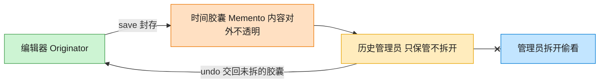

# Memento 备忘录模式（Objective-C）

## 意图

在不破坏封装性的前提下，捕获并保存一个对象的内部状态，以便之后可以将该对象恢复到原先保存的状态（撤销/回滚）。

<!-- gof-architecture-diagram -->
## 架构图

> **生活类比**：编辑器把这一刻的正文和光标封进时间胶囊。历史管理员只负责把胶囊堆起来、按撤销交回去，从不拆开偷看 —— 封装不被破坏。



| 图中角色 | 本仓库示例 |
|---------|-----------|
| 编辑器 | TextEditor 发起人，唯二能读写胶囊 |
| 时间胶囊 | EditorMemento 不可变快照 |
| 历史管理员 | History，只压栈出栈 |

23 张图的完整图鉴见 [`docs/README.md`](../../docs/README.md#memento-备忘录)。

## 适用场景

- 需要提供撤销/恢复功能（文本编辑器、绘图工具）
- 需要保存对象状态的历史快照，以便随时回滚
- 希望"保存状态"的实现细节不暴露给发起人以外的对象

## 实现方式

`TextEditor` 是发起人，`save` 把当前内容打包成不可变的 `EditorMemento`，`restore:` 用备忘录恢复内容。`History` 是管理者，像栈一样保存/取出备忘录，但从不查看或修改其内容：

```objc
@interface EditorMemento : NSObject
@property (nonatomic, copy, readonly) NSString *content; // 对外只读
@end

- (EditorMemento *)save    { return [[EditorMemento alloc] initWithContent:self.content]; }
- (void)restore:(EditorMemento *)memento { self.content = memento.content; }
```

## 文件说明

| 文件 | 说明 |
|------|------|
| `Memento.h` | 备忘录 `EditorMemento`、发起人 `TextEditor`、管理者 `History` 声明 |
| `Memento.m` | 上述类型的实现 |
| `main.m` | 编辑三次（两次保存快照），连续撤销两次，观察内容变化 |
| `Makefile` | 编译与运行 |

## 编译与运行

```bash
make run    # 编译并运行
make        # 仅编译
make clean  # 清理
```

## 输出示例

```
编辑: 第一版内容
编辑: 第一版内容，追加了一段
编辑: 第一版内容，追加了一段，又手滑写错了一些（未保存）
 
=== 撤销一次：应回到上一次保存的快照 ===
当前内容: 第一版内容，追加了一段
 
=== 再撤销一次：应回到最初的快照 ===
当前内容: 第一版内容
 
历史记录剩余: 0 条
```

（预期输出 —— 本机未安装 ObjC 工具链，未实机运行）

## 要点

1. **不破坏封装** —— `EditorMemento` 只对 `TextEditor` 暴露内容（通过 `content` 只读属性），`History` 只负责存取，不关心也不能修改快照内容。
2. **撤销的是"保存点"而不是"每一次按键"** —— 例子中第三次编辑未调用 `save`，因此第一次撤销直接回到第二次保存的快照，这正是备忘录模式"何时保存"由发起人自己决定的体现。
3. **管理者与发起人职责分离** —— `History` 完全不知道 `content` 的含义，只是把 `EditorMemento` 当作黑盒对象保存，符合单一职责原则。
