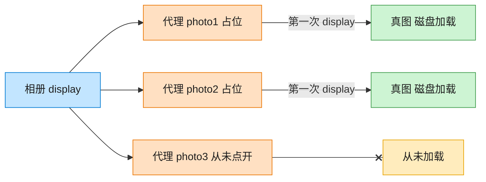

# Proxy 代理模式（Objective-C）

## 意图

为另一个对象提供一个替身或占位符，以控制对它的访问。代理与真实对象实现同一接口，客户端无法区分二者，从而可以在中间插入懒加载、权限校验、缓存等逻辑。

<!-- gof-architecture-diagram -->
## 架构图

> **生活类比**：相册先摆三张空相框。点开才从仓库搬出真照片；没点开的那张，磁盘加载一次都不会发生。



| 图中角色 | 本仓库示例 |
|---------|-----------|
| 相册 | 客户端，只认 Image.display |
| 空相框 | ImageProxy 虚拟代理 |
| 仓库真图 | RealImage，构造时才加载 |

23 张图的完整图鉴见 [`docs/README.md`](../../docs/README.md#proxy-代理)。

## 适用场景

- 真实对象的创建/加载成本很高，希望延迟到真正需要时才创建（虚拟代理/懒加载）
- 需要在访问真实对象前后插入额外逻辑（权限检查、日志、缓存）
- 需要控制对远程对象、敏感对象的访问

## 实现方式

`Image` 协议是抽象主题，`RealImage` 在初始化时就模拟"从磁盘加载"这一昂贵操作。`ImageProxy` 同样遵循 `Image` 协议，但只保存文件名，直到第一次 `display` 才真正创建 `RealImage`：

```objc
- (void)display {
    if (_realImage == nil) {
        _realImage = [[RealImage alloc] initWithFilename:_filename]; // 首次才加载
    }
    [_realImage display];
}
```

客户端全程只持有 `id<Image>`，感知不到"什么时候才真正加载"这一细节。

## 文件说明

| 文件 | 说明 |
|------|------|
| `Proxy.h` | 抽象主题 `Image`、真实主题 `RealImage`、代理 `ImageProxy` 声明 |
| `Proxy.m` | 上述类型的实现 |
| `main.m` | 创建代理后两次调用 `display`，验证只在首次真正加载 |
| `Makefile` | 编译与运行 |

## 编译与运行

```bash
make run    # 编译并运行
make        # 仅编译
make clean  # 清理
```

## 输出示例

```
=== 创建图片代理（此时尚未真正加载图片） ===
代理已创建，注意上面并没有出现加载日志
 
=== 第一次调用 display（触发真正加载） ===
[Proxy] 首次访问 vacation.jpg，创建 RealImage
  [RealImage] 正在从磁盘加载 vacation.jpg ...（耗时操作）
  [RealImage] 显示 vacation.jpg
 
=== 第二次调用 display（直接复用，不再重新加载） ===
[Proxy] vacation.jpg 已加载，直接复用，不再重新读盘
  [RealImage] 显示 vacation.jpg
```

（预期输出 —— 本机未安装 ObjC 工具链，未实机运行）

## 要点

1. **代理与真实对象接口一致** —— 二者都遵循 `Image` 协议，客户端代码无需修改即可从"直接使用 RealImage"切换到"通过代理使用"。
2. **懒加载** —— 只有真正调用 `display` 时才创建 `RealImage`，如果这张图片从未被访问，加载开销就完全不会发生。
3. **可扩展为其他代理类型** —— 同样的结构稍加修改即可实现权限代理（先鉴权再转发）、远程代理（转发网络请求）等。
