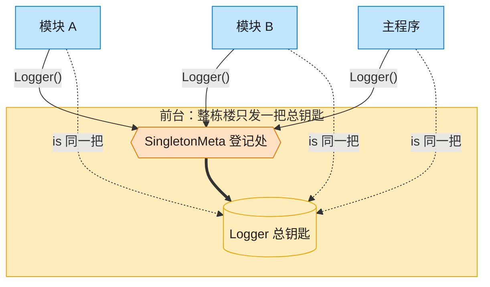

# Singleton 单例模式（Objective-C）

## 意图

确保一个类只有一个实例，并提供一个全局访问点，让程序中任何角落都能拿到同一份共享资源（如日志器、配置中心）。

<!-- gof-architecture-diagram -->
## 架构图

> **生活类比**：整栋大楼只发一把总钥匙。模块 A、模块 B、主程序去前台领取，拿到的永远是同一把 —— 这就是单例。



| 图中角色 | 本仓库示例 |
|---------|-----------|
| 前台 / 总钥匙 | SingletonMeta + Logger 全局唯一实例 |
| 来领钥匙的部门 | ModuleA / ModuleB / 主程序 |

23 张图的完整图鉴见 [`docs/README.md`](../../docs/README.md#singleton-单例)。

## 适用场景

- 日志记录器、配置管理器等全局只需要一份的资源
- 需要严格控制、限制某个类的实例个数
- 需要一个所有模块都能访问的全局状态，且要保证一致性

## 实现方式

`Logger` 通过类方法 `+sharedLogger` 提供全局访问点，用 `dispatch_once` 保证首次创建时的线程安全；同时重写 `+allocWithZone:` 拦截任何 `[[Logger alloc] init]` 式的直接创建，让它们也统一指向单例：

```objc
+ (instancetype)sharedLogger {
    static Logger *instance = nil;
    static dispatch_once_t onceToken;
    dispatch_once(&onceToken, ^{
        instance = [(Logger *)[super allocWithZone:NULL] init];
    });
    return instance;
}

+ (instancetype)allocWithZone:(NSZone *)zone {
    return [self sharedLogger]; // 拦截 alloc，杜绝第二个实例
}
```

## 文件说明

| 文件 | 说明 |
|------|------|
| `Singleton.h` | `LogLevel` 枚举与 `Logger` 单例类声明 |
| `Singleton.m` | `Logger` 的单例实现（`dispatch_once` + `allocWithZone:` 拦截） |
| `main.m` | 模拟多个模块获取 Logger，验证拿到的是同一实例 |
| `Makefile` | 编译与运行 |

## 编译与运行

```bash
make run    # 编译并运行
make        # 仅编译
make clean  # 清理
```

## 输出示例

```
[DEBUG] main: 程序启动
[DEBUG] module_a: 正在初始化
[DEBUG] module_b: 正在处理数据
 
地址验证:
  main 中的 Logger 地址:        0x600001c4c9a0
  再次 sharedLogger 得到的地址: 0x600001c4c9a0
  alloc/init 得到的地址:        0x600001c4c9a0（allocWithZone 被拦截，依然是同一实例）
```

（预期输出 —— 本机未安装 ObjC 工具链，未实机运行；三行地址实际运行时完全相同，证明是同一实例）

## 要点

1. **`dispatch_once`** —— GCD 保证初始化代码块在多线程下也只执行一次，是 ObjC 中创建单例的标准写法。
2. **拦截 `allocWithZone:`** —— 比只提供 `sharedLogger` 更彻底，杜绝了 `[[Logger alloc] init]` 意外产生第二个实例的可能。
3. **全局可变状态需谨慎** —— 单例便于共享，但也会让依赖关系变得隐式；本例的 `level` 属性全局共享，任何模块修改都会影响其他模块看到的日志级别。
