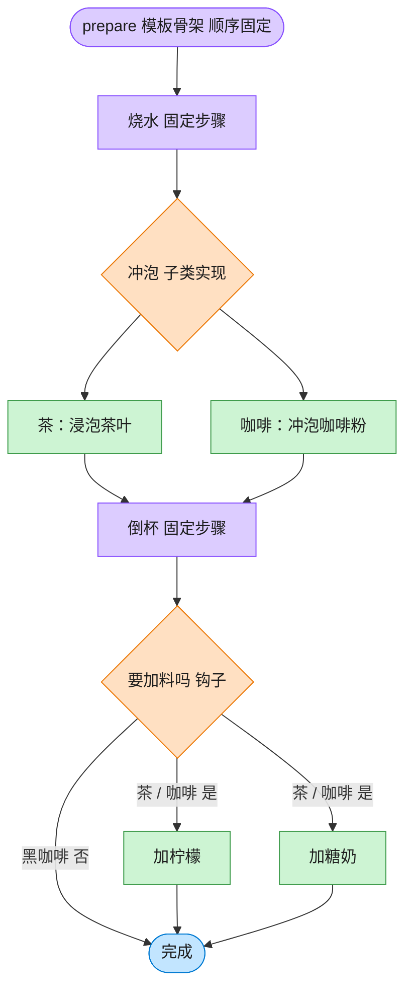

# Template Method 模板方法模式（Objective-C）

## 意图

在一个方法中定义一个算法的骨架，把某些步骤延迟到子类中实现。子类在不改变算法整体结构的前提下，重新定义算法的某些步骤。

<!-- gof-architecture-diagram -->
## 架构图

> **生活类比**：冲泡饮料的菜谱骨架写死：烧水 → 冲泡 → 倒杯 → 是否加料。茶放茶叶加柠檬，咖啡放咖啡粉加糖奶，黑咖啡用钩子跳过加料。流程顺序谁也不能改。



| 图中角色 | 本仓库示例 |
|---------|-----------|
| 菜谱骨架 | Beverage.prepare 模板方法 |
| 可变步骤 | _brew / _add_condiments |
| 钩子 | _wants_condiments，黑咖啡返回否 |

23 张图的完整图鉴见 [`docs/README.md`](../../docs/README.md#template-method-模板方法)。

## 适用场景

- 多个类的算法流程相同，只是个别步骤不同（泡茶、冲咖啡都是"烧水-冲泡-倒杯-加料"）
- 希望通过"钩子方法"让子类可选择性地影响流程，而不必重写整个流程
- 需要控制子类的扩展点，避免子类打乱固定的执行顺序

## 实现方式

`Beverage.prepareRecipe` 是模板方法，固定了步骤顺序；`brew`/`addCondiments` 是子类必须重写的抽象步骤；`customerWantsCondiments` 是钩子方法，默认读取 `wantsCondiments` 属性，子类或客户端都可以影响它：

```objc
- (void)prepareRecipe {
    [self boilWater];
    [self brew];              // 抽象步骤：子类决定"怎么冲泡"
    [self pourInCup];
    if ([self customerWantsCondiments]) { // 钩子：子类/客户端决定"要不要加料"
        [self addCondiments];
    }
}
```

## 文件说明

| 文件 | 说明 |
|------|------|
| `TemplateMethod.h` | 抽象类 `Beverage`（模板方法 + 抽象步骤 + 钩子）、具体类 `Tea`/`Coffee` 声明 |
| `TemplateMethod.m` | 上述类型的实现 |
| `main.m` | 冲泡茶、默认咖啡，以及通过钩子关闭加料的黑咖啡 |
| `Makefile` | 编译与运行 |

## 编译与运行

```bash
make run    # 编译并运行
make        # 仅编译
make clean  # 清理
```

## 输出示例

```
=== 冲泡茶（默认加调料） ===
  烧开水
  用沸水浸泡茶叶
  倒入杯中
  加柠檬
 
=== 冲泡咖啡（默认加调料） ===
  烧开水
  用沸水冲泡咖啡粉
  倒入杯中
  加糖和牛奶
 
=== 冲泡黑咖啡（通过钩子方法关闭加调料这一步） ===
  烧开水
  用沸水冲泡咖啡粉
  倒入杯中
```

（预期输出 —— 本机未安装 ObjC 工具链，未实机运行）

## 要点

1. **好莱坞原则**（"别调用我们，我们会调用你"）—— 子类只实现步骤，由基类的 `prepareRecipe` 决定何时调用它们，控制权始终在基类手中。
2. **抽象步骤 vs 钩子方法** —— `brew`/`addCondiments` 必须重写（基类里用 `NSAssert(NO, ...)` 兜底）；`customerWantsCondiments` 有默认实现，重写与否都合法，这就是"钩子"。
3. **同一算法，行为可插拔** —— `Coffee` 类不用重写就能通过 `wantsCondiments` 属性关闭"加调料"这一步，体现了钩子方法带来的灵活性。
