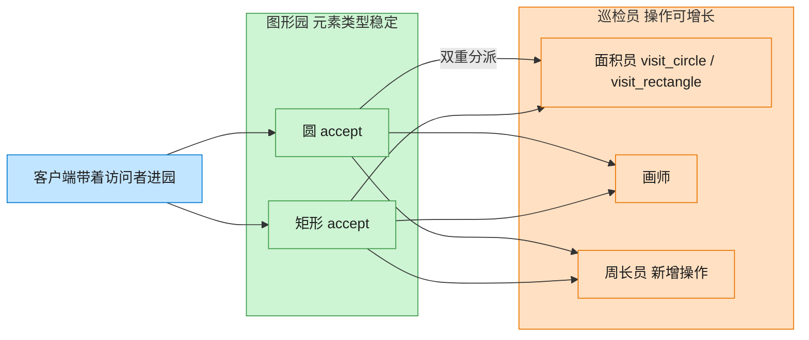

# Visitor 访问者模式（Objective-C）

## 意图

在不改变元素类的前提下，定义作用于这些元素的新操作。把"操作什么"（元素结构）与"做什么操作"（具体逻辑）分离，通过双重分派让每次调用都精确落到正确的元素类型与正确的操作组合上。

<!-- gof-architecture-diagram -->
## 架构图

> **生活类比**：图形园的种类很少变（圆、矩形），但巡检工作经常加：今天来面积员，明天来画师，后天新增周长员。图形只负责开门（accept），工具箱在访问者身上 —— 双重分派。



| 图中角色 | 本仓库示例 |
|---------|-----------|
| 图形园 | Circle / Rectangle，元素稳定 |
| 开门 | accept 第一次分派 |
| 巡检员 | Area / Draw / Perimeter，操作可增长 |

23 张图的完整图鉴见 [`docs/README.md`](../../docs/README.md#visitor-访问者)。

## 适用场景

- 一组稳定的元素类型（Circle/Rectangle），但需要不断新增不同的操作（求面积、渲染、导出…）
- 不希望把所有操作都写成每个元素类的方法，导致类越来越臃肿
- 操作需要区分元素的具体类型才能正确处理

## 实现方式

`Shape` 协议声明 `accept:`，每个具体元素在 `accept:` 里调用访问者对应自己类型的方法，形成"双重分派"：第一跳由元素的 `accept:` 决定该调用访问者的哪个方法，第二跳由访问者内部针对该类型的实现决定具体做什么。

```objc
@implementation Circle
- (void)accept:(id<ShapeVisitor>)visitor {
    [visitor visitCircle:self]; // 第一跳：确定是 Circle
}
@end

@implementation AreaVisitor
- (void)visitCircle:(Circle *)circle {   // 第二跳：Circle 该怎么求面积
    _total += M_PI * circle.radius * circle.radius;
}
@end
```

新增 `AreaVisitor`/`DrawVisitor` 这样的新操作，完全不用修改 `Circle`/`Rectangle`。

## 文件说明

| 文件 | 说明 |
|------|------|
| `Visitor.h` | 访问者协议 `ShapeVisitor`、元素协议 `Shape`、具体元素 `Circle`/`Rectangle`、具体访问者 `AreaVisitor`/`DrawVisitor` 声明 |
| `Visitor.m` | 上述类型的实现 |
| `main.m` | 对同一批图形分别施加 `AreaVisitor` 与 `DrawVisitor` |
| `Makefile` | 编译与运行 |

## 编译与运行

```bash
make run    # 编译并运行
make        # 仅编译
make clean  # 清理
```

## 输出示例

```
=== AreaVisitor：计算每个图形的面积 ===
  圆形(半径 3.0) 面积 = 28.27
  矩形(4.0 x 5.0) 面积 = 20.00
  圆形(半径 1.5) 面积 = 7.07
总面积 = 55.34
 
=== DrawVisitor：渲染每个图形（同一批对象，换一种操作） ===
  绘制圆形: O (半径 3.0)
  绘制矩形: [] (4.0 x 5.0)
  绘制圆形: O (半径 1.5)
```

（预期输出 —— 本机未安装 ObjC 工具链，未实机运行）

## 要点

1. **双重分派** —— `[shape accept:visitor]` 里先确定 `shape` 的真实类型（调用哪个 `accept:` 实现），再由该实现调用 `visitor` 对应类型的方法，两次分派共同决定最终执行的代码。
2. **新增操作不改元素类** —— 新增一个 `PerimeterVisitor`（求周长）只需新增一个遵循 `ShapeVisitor` 的类，`Circle`/`Rectangle` 无需任何改动。
3. **新增元素类型代价较高** —— 这是访问者模式的经典权衡：新增一种 `Shape`（如 `Triangle`）需要修改 `ShapeVisitor` 协议并让所有现有访问者都实现新方法，适合"操作经常变、元素类型很少变"的场景。
