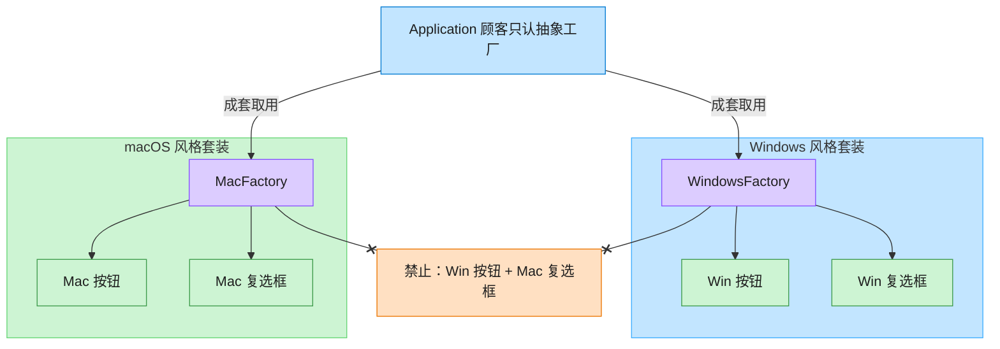

# Abstract Factory 抽象工厂模式（Python）

## 意图

提供一个接口，用于创建一系列**相关或相互依赖的对象族**，而无需指定它们具体的类。
客户端只面向抽象工厂与抽象产品编程，从而保证同一时刻产出的产品彼此兼容（例如不会出现
Windows 按钮配 macOS 复选框这种风格混搭）。

<!-- gof-architecture-diagram -->
## 架构图

> **生活类比**：家具店一次卖「成套风格」。Windows 工厂成套出 Win 按钮+Win 复选框，Mac 工厂成套出 Mac 风格 —— 绝不混搭。



| 图中角色 | 本仓库示例 |
|---------|-----------|
| 顾客 / 应用 | Application，只依赖 GUIFactory |
| 成套工厂 | WindowsFactory / MacFactory |
| 成套产品 | Button + Checkbox 必须同一家族 |

23 张图的完整图鉴见 [`docs/README.md`](../../docs/README.md#abstract-factory-抽象工厂)。

## 适用场景

- 系统需要独立于其产品的创建、组合和表示方式
- 系统需要由多个产品族中的一个来配置（例如按操作系统切换整套 UI 控件）
- 需要强调"一系列相关产品对象"必须一起使用，保持风格/协议一致
- 只想暴露产品的接口，而不暴露具体实现

## 实现方式

用 `abc.ABC` 定义两个抽象产品 `Button`、`Checkbox`，以及抽象工厂 `GUIFactory`；
`WindowsFactory` / `MacFactory` 各自实现工厂方法，成套生产风格一致的控件。
客户端 `Application` 只依赖 `GUIFactory` 接口：

```python
class GUIFactory(ABC):
    """抽象工厂：生产一整套（Button + Checkbox）UI 控件"""

    @abstractmethod
    def create_button(self) -> Button: ...

    @abstractmethod
    def create_checkbox(self) -> Checkbox: ...


class Application:
    """客户端：只依赖抽象工厂，不知道具体平台类型"""

    def __init__(self, factory: GUIFactory) -> None:
        self._button = factory.create_button()
        self._checkbox = factory.create_checkbox()
```

`get_factory(platform)` 模拟根据运行时环境（操作系统）选择具体工厂，客户端代码完全不变。

## 文件说明

| 文件 | 说明 |
|------|------|
| `main.py` | 抽象产品/工厂、Windows/macOS 具体实现、客户端演示，含 `main()` 入口 |

## 编译与运行

```bash
python main.py
```

## 输出示例

```
=== 当前平台: windows ===
[Windows 按钮：矩形边框，扁平风格]
[Windows 复选框：方形勾选]
Windows 按钮播放系统点击音效
Windows 复选框状态切换（方形勾选动画）

=== 当前平台: mac ===
[macOS 按钮：圆角边框，毛玻璃风格]
[macOS 复选框：圆角勾选]
macOS 按钮播放轻柔点击反馈
macOS 复选框状态切换（圆角勾选动画）
```

## 要点

1. **抽象工厂 vs 工厂方法** —— 抽象工厂关注"一族"产品（Button + Checkbox），工厂方法只关注单个产品的创建。
2. **开闭原则** —— 新增一个平台（如 Linux）只需新增一个具体工厂 + 一组具体产品，无需修改客户端代码。
3. **一致性保证** —— 客户端从同一个工厂实例获取的产品天然属于同一族，不会出现风格混用。
4. Python 中类型标注 `dict[str, type[GUIFactory]]` 体现了"工厂的工厂"这种注册表写法，比 if/elif 链更易扩展。
