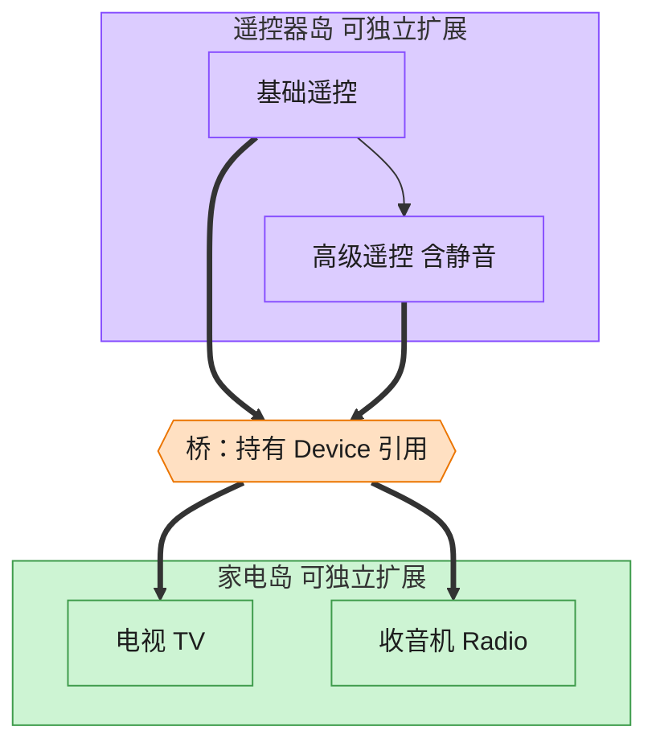

# Bridge 桥接模式（Python）

## 意图

将抽象部分与实现部分分离，使二者可以独立地变化。桥接模式用**组合**代替继承来连接
两个独立变化的维度，避免因为多维度组合而导致类数量呈笛卡尔积式爆炸。

<!-- gof-architecture-diagram -->
## 架构图

> **生活类比**：遥控器和家电是两座岛。基础遥控 / 高级遥控是一座岛，电视 / 收音机是另一座岛。中间一座桥（组合引用）把它们连上，不必为每种组合造一个新类。



| 图中角色 | 本仓库示例 |
|---------|-----------|
| 遥控器岛 | RemoteControl / AdvancedRemoteControl 抽象 |
| 桥 | 抽象持有的 Device 引用 |
| 家电岛 | TV / Radio 实现 |

23 张图的完整图鉴见 [`docs/README.md`](../../docs/README.md#bridge-桥接)。

## 适用场景

- 一个类存在两个（或多个）独立变化的维度，且都需要扩展（如"遥控器种类"与"设备种类"）
- 不希望在抽象和实现之间形成固定的绑定关系（编译期继承），而是希望运行时可自由组合
- 类层次继承会导致子类数量随维度组合数量急剧增长

## 实现方式

`Device` 是实现接口（`TV`、`Radio` 为具体实现）；`RemoteControl` 是抽象部分，内部持有
一个 `Device` 引用作为"桥"；`AdvancedRemoteControl` 是扩展后的抽象，新增静音等能力，
但仍可以搭配任意一种 `Device`：

```python
class RemoteControl:
    """抽象：基础遥控器，只持有一个 Device 引用（桥），委托其完成实际操作"""

    def __init__(self, device: Device) -> None:
        self._device = device  # 桥：指向实现部分


class AdvancedRemoteControl(RemoteControl):
    """扩展抽象：高级遥控器，在基础功能之上新增静音等能力"""
```

`main()` 演示了"高级遥控器 + 收音机"和"高级遥控器 + 电视机"两种组合，同一套抽象代码
无需改动即可搭配不同设备。

## 文件说明

| 文件 | 说明 |
|------|------|
| `main.py` | `Device` 实现接口、`TV`/`Radio`、`RemoteControl`/`AdvancedRemoteControl` 抽象、`main()` 演示 |

## 编译与运行

```bash
python main.py
```

## 输出示例

```
--- 基础遥控器 + 电视机 ---
电视机 已开机
电视机 音量调整为 40
电视机 音量调整为 50
[电视机] 状态=开机, 音量=50

--- 高级遥控器 + 收音机（同一个抽象层级，不同设备实现） ---
收音机 已开机
收音机 音量调整为 80
收音机 音量调整为 0（已静音）
[收音机] 状态=开机, 音量=0
收音机 音量调整为 80（已取消静音）
[收音机] 状态=开机, 音量=80

--- 高级遥控器 + 电视机（同一个抽象也能搭配另一种设备） ---
电视机 音量调整为 0（已静音）
[电视机] 状态=开机, 音量=0
```

## 要点

1. **两个维度独立扩展** —— 新增一种遥控器（抽象）或新增一种设备（实现），都不会影响另一侧的类。
2. **组合优于继承** —— `RemoteControl` 通过持有 `Device` 引用来复用其能力，而不是靠继承 `TV`/`Radio`。
3. **与适配器的区别** —— 适配器通常是事后补救两个已存在但不兼容的接口；桥接是设计之初就主动把两个维度拆开。
4. 属性 `is_on` / `volume` 以只读 `property` 暴露，`RemoteControl` 不直接触碰 `Device` 的私有字段，符合封装原则。
