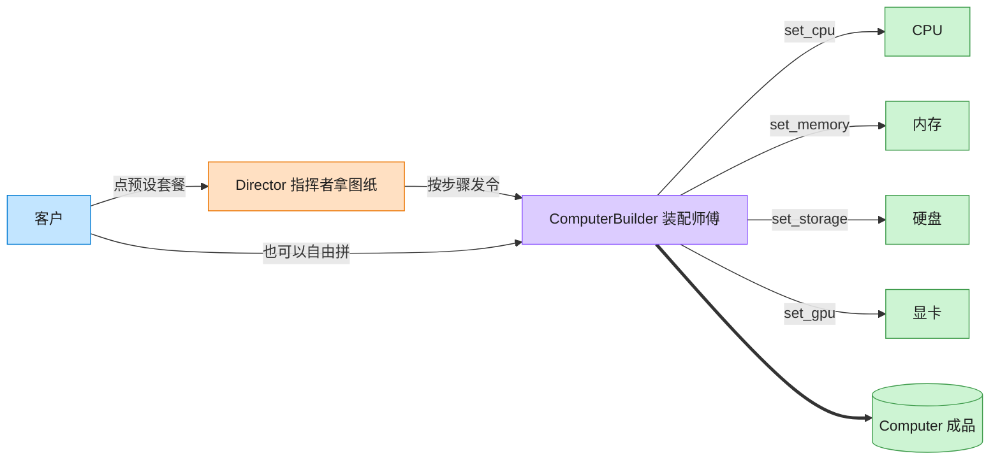

# Builder 建造者模式（Python）

## 意图

将一个复杂对象的构建过程与其最终表示分离，使同样的构建步骤可以创建出不同的表示。
调用者不必了解装配细节，只需通过建造者提供的分步接口（或指挥者的预设流程）即可获得成品。

<!-- gof-architecture-diagram -->
## 架构图

> **生活类比**：装机店流水线：指挥者拿「办公机 / 游戏主机 / 工作站」图纸发令，装配师傅一步步装 CPU、内存、硬盘、显卡，最后交出一台电脑。客户也可以绕过图纸自由拼。



| 图中角色 | 本仓库示例 |
|---------|-----------|
| 指挥者 | ComputerDirector 预设装配顺序 |
| 装配师傅 | ComputerBuilder 链式分步接口 |
| 成品 | Computer |

23 张图的完整图鉴见 [`docs/README.md`](../../docs/README.md#builder-建造者)。

## 适用场景

- 创建复杂对象的算法应独立于该对象的组成部分及其装配方式
- 构造过程必须允许被构造的对象有不同的内部表示（同一 Builder，不同产出）
- 需要链式、分步设置属性，避免构造函数参数过多（"telescoping constructor"）
- 需要对相同的构建过程进行复用，产出多种预设配置

## 实现方式

`Computer` 是产品（`dataclass`），`ComputerBuilder` 提供 `set_cpu` / `set_memory` /
`set_storage` / `set_gpu` / `add_accessory` 等链式方法，`build()` 交付成品并重置内部状态；
`ComputerDirector` 封装了"办公机 / 游戏主机 / 工作站"三种预设装配顺序：

```python
class ComputerDirector:
    """指挥者：封装常见的组装步骤顺序，提供预设配置"""

    def build_gaming_pc(self) -> Computer:
        return (
            self._builder.set_cpu("Intel Core i9-14900K")
            .set_memory(32)
            .set_storage(2000)
            .set_gpu("NVIDIA GeForce RTX 4090")
            .add_accessory("RGB 机箱风扇")
            .add_accessory("水冷散热器")
            .build()
        )
```

调用者也可以绕开 Director，直接使用 Builder 自由拼装个性化配置。

## 文件说明

| 文件 | 说明 |
|------|------|
| `main.py` | `Computer` 产品、`ComputerBuilder` 建造者、`ComputerDirector` 指挥者与演示 `main()` |

## 编译与运行

```bash
python main.py
```

## 输出示例

```
--- 预设 1: 办公用机 ---
电脑配置清单:
  CPU   : Intel Core i3-13100
  内存  : 8 GB
  存储  : 256 GB
  显卡  : 集成显卡

--- 预设 2: 游戏主机 ---
电脑配置清单:
  CPU   : Intel Core i9-14900K
  内存  : 32 GB
  存储  : 2000 GB
  显卡  : NVIDIA GeForce RTX 4090
  配件  : RGB 机箱风扇, 水冷散热器

--- 预设 3: 图形工作站 ---
电脑配置清单:
  CPU   : AMD Threadripper 7970X
  内存  : 128 GB
  存储  : 4000 GB
  显卡  : NVIDIA RTX A6000
  配件  : 专业色彩校准显示器

--- 自定义配置（不经过 Director，直接使用 Builder） ---
电脑配置清单:
  CPU   : Apple M3 Max
  内存  : 64 GB
  存储  : 1000 GB
  显卡  : 集成显卡
  配件  : 雷电 4 扩展坞
```

## 要点

1. **链式调用（fluent interface）** —— 每个 `set_xxx` 返回 `self`，天然契合 Python 的方法链风格。
2. **Director 可选** —— Director 只是"常见装配顺序"的封装，不是必需品；调用者随时可以绕过它直接驱动 Builder。
3. **`build()` 后重置状态** —— 避免同一个 Builder 实例被复用时脏数据串到下一个产品上。
4. 与工厂模式的区别：工厂模式关注"选哪个类实例化"，建造者关注"如何分步拼出一个复杂对象"。
