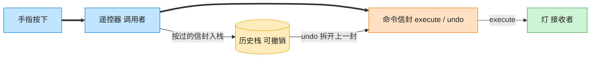

# Command 命令模式（Python）

## 意图

将一个请求封装为一个对象，从而使你可用不同的请求对客户进行参数化，对请求排队
或记录请求日志，以及支持可撤销的操作。调用者与真正执行操作的接收者被完全解耦。

<!-- gof-architecture-diagram -->
## 架构图

> **生活类比**：遥控器按钮里装的不是电线，是一封命令信封。按下就把信封交给灯去执行；撤销则打开上一封信封做反操作。按钮不用知道灯怎么开。



| 图中角色 | 本仓库示例 |
|---------|-----------|
| 遥控器 | RemoteControl 调用者 |
| 命令信封 | LightOnCommand / LightOffCommand |
| 灯 | Light 接收者 |

23 张图的完整图鉴见 [`docs/README.md`](../../docs/README.md#command-命令)。

## 适用场景

- 需要将"操作的发起者"与"操作的具体实现者"解耦（遥控器不需要知道灯是怎么开的）
- 需要支持撤销/重做（undo/redo）
- 需要将请求排队执行、记录日志，或者支持宏命令（组合多个命令）

## 实现方式

`Light` 是接收者，真正知道如何开关灯；`Command` 是抽象命令，声明 `execute`/`undo`；
`LightOnCommand`/`LightOffCommand` 是具体命令，各自持有接收者引用；`RemoteControl`
是调用者，只依赖 `Command` 接口，并用一个历史栈支持撤销：

```python
class RemoteControl:
    """调用者：遥控器，只依赖抽象 Command，不知道具体命令的实现细节"""

    def press_button(self) -> None:
        result = self._slot.execute()
        self._history.append(self._slot)

    def press_undo(self) -> None:
        last_command = self._history.pop()
        result = last_command.undo()
```

`NoCommand` 是一个"空对象"（Null Object），避免遥控器某个按钮未绑定命令时到处判断 `None`。

## 文件说明

| 文件 | 说明 |
|------|------|
| `main.py` | `Light` 接收者、`Command`/`LightOnCommand`/`LightOffCommand`/`NoCommand`、`RemoteControl` 调用者、`main()` 演示 |

## 编译与运行

```bash
python main.py
```

## 输出示例

```
--- 控制客厅灯 ---
[按下按钮] 客厅的灯 打开了
[按下按钮] 客厅的灯 关闭了

--- 撤销上一步操作（关灯 -> 撤销后应重新开灯） ---
[撤销] 客厅的灯 打开了

--- 控制卧室灯，并连续撤销两步 ---
[按下按钮] 卧室的灯 打开了
[按下按钮] 卧室的灯 关闭了
[撤销] 卧室的灯 打开了
[撤销] 卧室的灯 关闭了

--- 继续撤销，直到历史记录清空 ---
[撤销] 客厅的灯 关闭了
[撤销] 没有可撤销的历史操作
```

## 要点

1. **调用者与接收者解耦** —— `RemoteControl` 从未直接调用 `Light` 的方法，一切都通过 `Command` 接口转发。
2. **撤销的对称性** —— 每个具体命令都清楚"自己的反操作是什么"（开灯命令的 undo 就是关灯），这份知识被封装在命令对象内部而非调用者里。
3. **历史栈实现撤销** —— `RemoteControl` 用一个列表当栈，`press_undo()` 每次弹出并撤销最近一次执行的命令，天然支持连续多步撤销。
4. **空对象模式的配合使用** —— `NoCommand` 让"按钮未绑定命令"这一状态也能安全地调用 `execute()`，避免了 `if self._slot is None` 的防御性判断。
