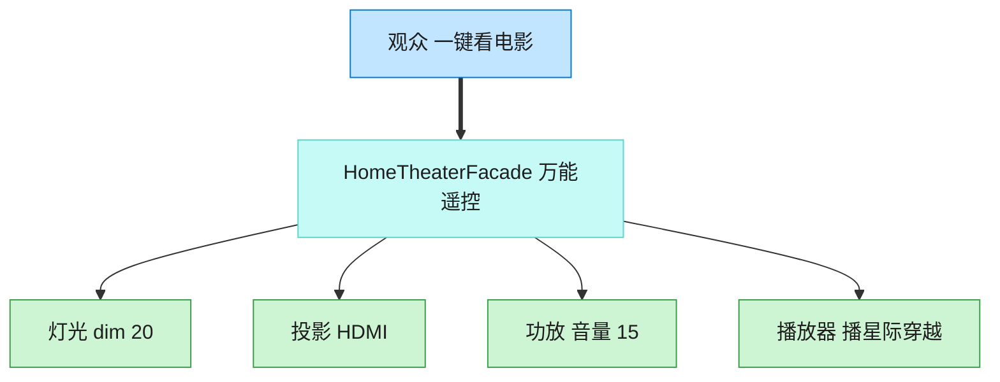

# Facade 外观模式（Python）

## 意图

为子系统中的一组复杂接口提供一个一致的高层接口，使子系统更容易使用。
外观模式并不封闭子系统本身的能力（高级用户仍可绕开外观直接访问子系统），
只是为最常见的使用场景提供一条便捷路径。

<!-- gof-architecture-diagram -->
## 架构图

> **生活类比**：家庭影院一键观影：观众只按「看电影」。外观对象按顺序关灯、开投影、调功放、按播放。高级玩家仍可绕过外观直接拨弄每个设备。



| 图中角色 | 本仓库示例 |
|---------|-----------|
| 观众 | 客户端，只调 watch_movie |
| 万能遥控 | HomeTheaterFacade |
| 子系统 | Lights / Projector / Amplifier / Player |

23 张图的完整图鉴见 [`docs/README.md`](../../docs/README.md#facade-外观)。

## 适用场景

- 子系统随着演化变得越来越复杂，包含大量类，客户端使用成本高
- 需要为一个复杂子系统提供一个简单入口，屏蔽内部依赖关系与调用顺序
- 希望对子系统进行分层：每层通过一个外观对象作为入口，减少层间耦合

## 实现方式

`Projector`、`Amplifier`、`Lights`、`StreamingPlayer` 是家庭影院的各个子系统，各自有
独立的接口和状态；`HomeTheaterFacade` 组合这些子系统，封装"看电影"/"结束观影"的
标准开关顺序：

```python
class HomeTheaterFacade:
    """外观：封装家庭影院各子系统的协调逻辑，对外只暴露简单方法"""

    def watch_movie(self, movie: str) -> None:
        print(self._lights.dim(20))
        print(self._projector.on())
        print(self._projector.set_input("HDMI"))
        print(self._amplifier.on())
        print(self._amplifier.set_volume(15))
        print(self._player.on())
        print(self._player.play(movie))
```

客户端只需要 `home_theater.watch_movie("星际穿越")` 一行代码。

## 文件说明

| 文件 | 说明 |
|------|------|
| `main.py` | 4 个子系统类、`HomeTheaterFacade` 外观、`main()` 演示一键开始/结束观影 |

## 编译与运行

```bash
python main.py
```

## 输出示例

```
准备观看《星际穿越》...
灯光调暗至 20%
投影仪打开
投影仪切换信号源为 HDMI
功放打开
功放音量设置为 15
播放器打开
开始播放《星际穿越》
一切就绪，请欣赏！

正在结束观影...
停止播放
播放器关闭
功放关闭
投影仪关闭
灯光恢复全亮
已恢复到观影前状态。
```

## 要点

1. **降低使用成本** —— 客户端从"需要了解 4 个子系统、记住正确开关顺序"降低为"调用 1 个方法"。
2. **不封锁子系统** —— `Projector`、`Amplifier` 等仍是公开类，高级用户可以绕过外观单独精细控制。
3. **外观是组合而非继承** —— `HomeTheaterFacade` 持有各子系统实例的引用，本身不改变子系统的行为，只是编排调用顺序。
4. 与中介者模式的区别：外观是"单向"简化（客户端→子系统），子系统之间通常不通过外观互相通信；中介者是"多向"协调多个平等对象之间的交互。
