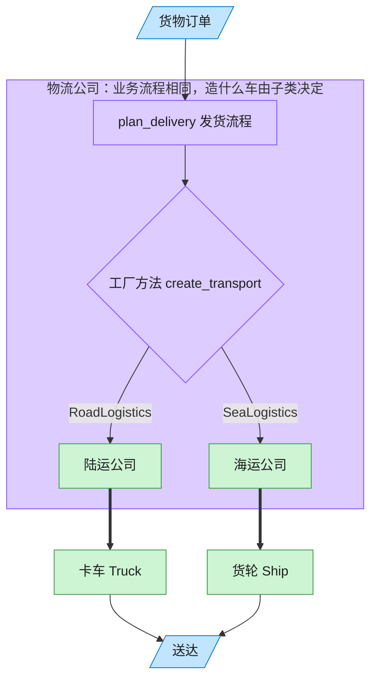

# Factory Method 工厂方法模式（Python）

## 意图

定义一个用于创建对象的接口，但让子类决定实例化哪一个类。工厂方法使一个类的实例化
延迟到其子类，父类中依赖该产品的业务逻辑可以完全面向抽象编程。

<!-- gof-architecture-diagram -->
## 架构图

> **生活类比**：客户只说「把货送走」。陆运公司决定造卡车，海运公司决定造货轮 —— 子类决定实例化哪一个产品。



| 图中角色 | 本仓库示例 |
|---------|-----------|
| 客户下单 | 调用 plan_delivery 的客户端 |
| 物流公司 | Logistics 抽象创建者及其子类 |
| 运输工具 | Truck / Ship 具体产品 |

23 张图的完整图鉴见 [`docs/README.md`](../../docs/README.md#factory-method-工厂方法)。

## 适用场景

- 一个类无法预知它必须创建的对象的具体类
- 一个类希望由其子类来指定它所创建的对象
- 需要将对象创建的职责委托给多个帮助子类中的某一个，并将逻辑局部化

## 实现方式

抽象类 `Logistics` 声明工厂方法 `create_transport()`，并在 `plan_delivery()` 中直接使用
其返回的抽象 `Transport`；`RoadLogistics` / `SeaLogistics` 分别重写工厂方法返回 `Truck` /
`Ship`：

```python
class Logistics(ABC):
    """抽象创建者：定义工厂方法 create_transport，并提供依赖该方法的业务流程"""

    @abstractmethod
    def create_transport(self) -> Transport: ...

    def plan_delivery(self, cargo: str) -> str:
        """业务流程：不关心具体运输方式，只调用工厂方法拿到的抽象产品"""
        transport = self.create_transport()
        return f"[{self.__class__.__name__}] {transport.deliver(cargo)}"


class RoadLogistics(Logistics):
    def create_transport(self) -> Transport:
        return Truck()
```

## 文件说明

| 文件 | 说明 |
|------|------|
| `main.py` | `Transport` 抽象产品、`Truck`/`Ship`、`Logistics` 抽象创建者及其子类、演示 `main()` |

## 编译与运行

```bash
python main.py
```

## 输出示例

```
[RoadLogistics] 卡车沿高速公路运输「一批电子元件」，预计 2 天送达
[SeaLogistics] 货轮沿海运航线运输「200 个集装箱家具」，预计 15 天送达
```

## 要点

1. **依赖倒置** —— `plan_delivery` 只依赖抽象的 `Transport`，新增运输方式不影响已有业务流程。
2. **子类决定产品** —— 每个具体创建者对应一个具体产品，一一映射，职责清晰。
3. 与抽象工厂的区别：工厂方法通常通过**继承**（重写一个方法）实现，抽象工厂通常通过**组合**（持有一个工厂对象）实现一整族产品。
4. Python 里也可以用一个接受可调用对象（工厂函数）的方式替代继承体系，但本例保留经典 GoF 的继承结构以便跨语言对比。
