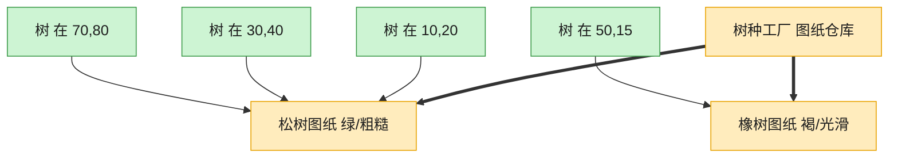

# Flyweight 享元模式（Python）

## 意图

运用共享技术有效地支持大量细粒度对象的复用，将对象状态拆分为可共享的**内在状态**
（Intrinsic State）与不可共享的**外在状态**（Extrinsic State），大幅降低内存占用。

<!-- gof-architecture-diagram -->
## 架构图

> **生活类比**：种一片森林：每棵树只要记住自己的坐标，树种、颜色、纹理是共享图纸。一千棵松树只印一张松树图纸，内存不再按棵数爆炸。



| 图中角色 | 本仓库示例 |
|---------|-----------|
| 图纸仓库 | TreeTypeFactory 按键缓存 |
| 共享图纸 | TreeType 内在状态 |
| 一棵树 | Tree 只存坐标外在状态 |

23 张图的完整图鉴见 [`docs/README.md`](../../docs/README.md#flyweight-享元)。

## 适用场景

- 应用需要创建海量相似对象，导致巨大的内存开销
- 对象的大部分状态都可以抽取为共享的"内在状态"，仅有少量状态因对象而异
- 对象一旦剥离外在状态即可共享使用，且不依赖对象的具体身份（identity）

## 实现方式

`TreeType`（`frozen dataclass`）是享元，只保存名称/颜色/纹理这些可共享的内在状态；
`TreeTypeFactory` 以 `(name, color, texture)` 为键缓存 `TreeType` 实例，重复参数直接
复用已有对象；`Tree` 只保存坐标（外在状态）与一个指向共享 `TreeType` 的引用：

```python
class TreeTypeFactory:
    """享元工厂：以 (名称, 颜色, 纹理) 为键缓存 TreeType，相同参数只创建一次"""

    _pool: dict[tuple[str, str, str], TreeType] = {}

    @classmethod
    def get_tree_type(cls, name: str, color: str, texture: str) -> TreeType:
        key = (name, color, texture)
        if key not in cls._pool:
            cls._pool[key] = TreeType(name, color, texture)
        return cls._pool[key]
```

`main()` 种植 6 棵树但只涉及 3 种真实类型，运行结束后对比"树木总数"与"实际创建的
`TreeType` 数量"，直观体现共享带来的节省。

## 文件说明

| 文件 | 说明 |
|------|------|
| `main.py` | `TreeType` 享元、`TreeTypeFactory` 享元工厂、`Tree`/`Forest`、`main()` 演示与统计 |

## 编译与运行

```bash
python main.py
```

## 输出示例

```
--- 种植 6 棵树（只有 3 种真实类型：松树/枫树/柳树） ---
  [工厂] 创建新的 TreeType 享元: ('松树', '深绿色', '针叶纹理')
  [工厂] 创建新的 TreeType 享元: ('枫树', '橙红色', '掌形叶纹理')
  [工厂] 创建新的 TreeType 享元: ('柳树', '浅绿色', '垂枝纹理')

--- 绘制整片森林 ---
在 (1, 1) 绘制一棵【松树】，颜色=深绿色，纹理=针叶纹理
在 (5, 2) 绘制一棵【枫树】，颜色=橙红色，纹理=掌形叶纹理
在 (3, 8) 绘制一棵【松树】，颜色=深绿色，纹理=针叶纹理
在 (9, 4) 绘制一棵【柳树】，颜色=浅绿色，纹理=垂枝纹理
在 (2, 6) 绘制一棵【枫树】，颜色=橙红色，纹理=掌形叶纹理
在 (7, 7) 绘制一棵【松树】，颜色=深绿色，纹理=针叶纹理

森林中树木总数   : 6
实际 TreeType 数 : 3（享元复用，内存占用与树木总数无关）
```

## 要点

1. **内在/外在状态拆分** —— 颜色、纹理、名称这些"跟树的品种绑定"的数据放进享元；坐标这种"每棵树独有"的数据留在 `Tree` 里。
2. **工厂是享元模式的关键** —— 没有 `TreeTypeFactory` 做缓存查找，就无法保证相同参数返回同一实例，共享就无从谈起。
3. **`frozen=True` 保证安全共享** —— `TreeType` 一旦创建即不可变，避免某处代码意外修改共享对象而影响所有引用它的树。
4. 现实中 Python 解释器对小整数、短字符串的驻留（interning）也是享元思想的体现；本例用显式的森林场景让这一思想更直观。
