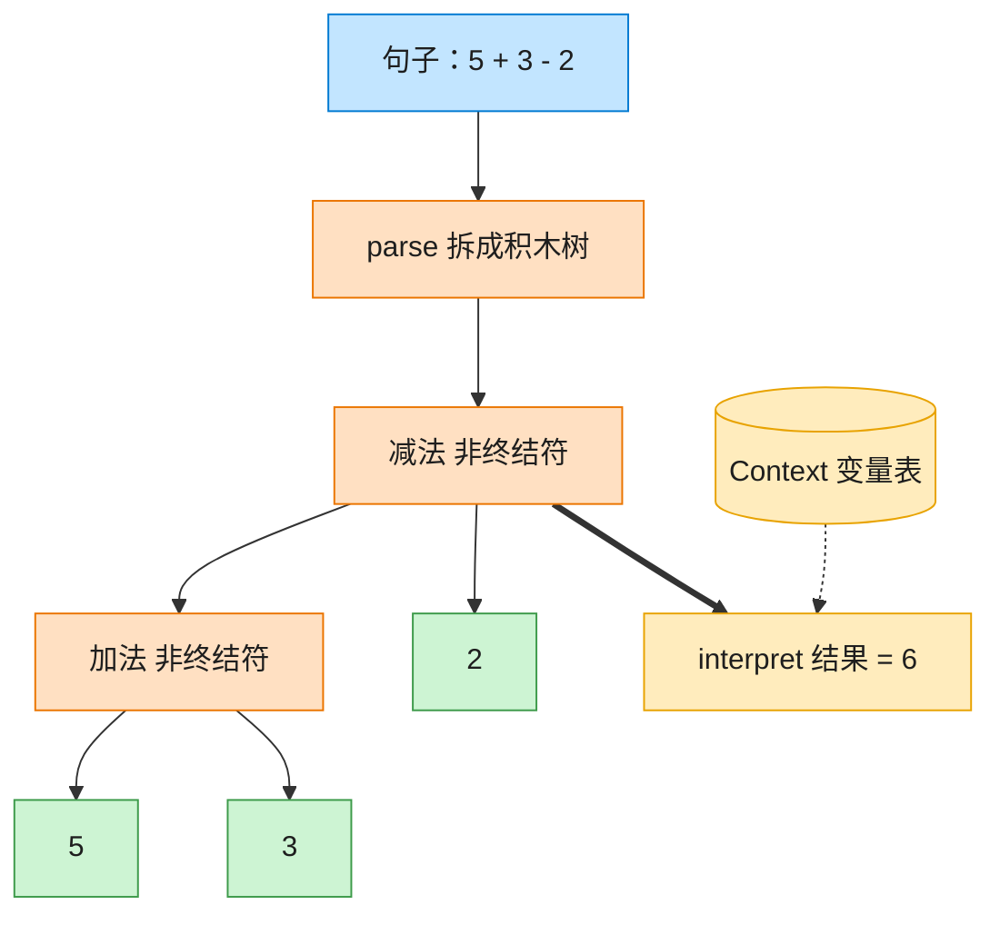

# Interpreter 解释器模式（Python）

## 意图

给定一门语言，定义它的文法的一种表示，并定义一个解释器，这个解释器使用该表示
来解释语言中的句子。本例为一门"只含加减法"的迷你算术语言构建解释器。

<!-- gof-architecture-diagram -->
## 架构图

> **生活类比**：把「5 + 3 - 2」拆成积木树：加减是组合积木，数字和变量是末端积木。对着变量表走一遍 interpret，树就算出结果。



| 图中角色 | 本仓库示例 |
|---------|-----------|
| 句子 | 中缀表达式字符串 |
| 积木树 | Add / Subtract / Number / Variable |
| 词典 | Context 变量表 |

23 张图的完整图鉴见 [`docs/README.md`](../../docs/README.md#interpreter-解释器)。

## 适用场景

- 需要解释执行的语言，其文法相对简单（文法复杂时更适合用专门的解析器生成工具）
- 一些重复出现的问题可以用一种简单语言中的句子来表达（规则引擎、简单查询语言、模板表达式）
- 效率不是关键因素——解释器模式通常不是最快的实现方式，但结构清晰、易扩展新运算

## 实现方式

`Expression` 是抽象表达式，`NumberExpression`/`VariableExpression` 是终结符表达式，
`AddExpression`/`SubtractExpression` 是非终结符表达式，组合左右子表达式；
`Context` 保存变量到数值的映射：

```python
class AddExpression(Expression):
    """非终结符：加法，组合左右两个子表达式"""

    def interpret(self, context: Context) -> float:
        return self._left.interpret(context) + self._right.interpret(context)


def parse(expression: str) -> Expression:
    """将 "5 + 3 - 2" 这样的中缀表达式解析为表达式树（同优先级，从左到右结合）"""
```

`parse()` 把字符串按空格分词，从左到右构建表达式树；`interpret(context)` 对树做一次
求值遍历。同一棵语法树可以反复配合不同的 `Context` 求值。

## 文件说明

| 文件 | 说明 |
|------|------|
| `main.py` | `Context`、`Expression` 抽象表达式及四个具体表达式类、`parse()` 解析器、`main()` 演示 |

## 编译与运行

```bash
python main.py
```

## 输出示例

```
--- 纯数字表达式 ---
表达式: '5 + 3 - 2'          语法树: ((5 + 3) - 2)        结果: 6
表达式: '10 - 4 + 1 - 2'     语法树: (((10 - 4) + 1) - 2) 结果: 5

--- 带变量的表达式（依赖上下文） ---
表达式: 'x + y - z'          语法树: ((x + y) - z)        结果: 11
表达式: 'x - y - z'          语法树: ((x - y) - z)        结果: 3

--- 同一棵语法树，切换上下文即可得到不同结果 ---
x=1, y=2, z=3 -> ((x + y) - z) = 0
x=100, y=50, z=25 -> ((x + y) - z) = 125
```

## 要点

1. **文法与类结构一一对应** —— 每一条文法规则（数字、变量、加法、减法）都对应一个表达式类，新增运算符（如乘法）只需新增一个 `Expression` 子类。
2. **解析与求值分离** —— `parse()` 只负责把字符串变成树，`interpret()` 只负责在给定 `Context` 下求值，树可以被多个上下文反复复用。
3. **Context 隔离可变数据** —— 变量的值放在 `Context` 里而不是表达式节点里，因此同一棵语法树能在不同变量取值下重复求值。
4. 现实工程中很少手写解释器处理复杂语言（更常用 `ast`/`lark`/正则等工具），但理解这一模式有助于读懂编译原理、规则引擎、SQL/正则表达式引擎的设计思想。
