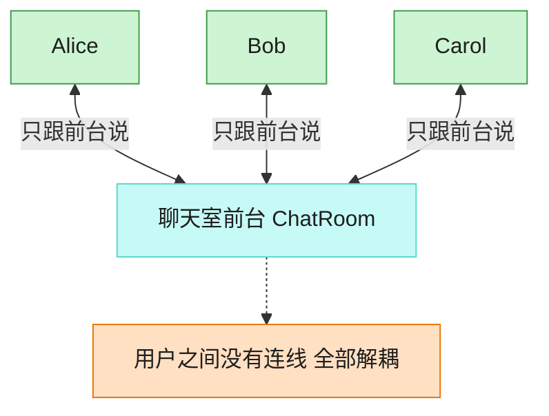

# Mediator 中介者模式（Python）

## 意图

用一个中介对象来封装一系列对象之间的交互，使各对象不需要显式地相互引用，
从而使其耦合松散，并且可以独立地改变它们之间的交互。

<!-- gof-architecture-diagram -->
## 架构图

> **生活类比**：聊天室前台：Alice、Bob、Carol 彼此不留电话，所有群消息和私信都交给前台转发。加人、禁言、改规则只改前台一处。



| 图中角色 | 本仓库示例 |
|---------|-----------|
| 前台 | ChatRoom 中介者 |
| 同事 | User，只持有中介引用 |
| 交互 | 广播 / 私信都经中介 |

23 张图的完整图鉴见 [`docs/README.md`](../../docs/README.md#mediator-中介者)。

## 适用场景

- 一组对象以复杂但明确定义的方式进行通信，产生的相互依赖关系混乱且难以理解
- 想复用某个对象，但它与太多其他对象纠缠在一起（紧耦合），难以单独复用
- 想通过一个中间对象来集中控制、集中修改多个对象间的交互逻辑

## 实现方式

`ChatMediator` 是抽象中介者；`ChatRoom` 是具体中介者，维护所有 `User` 的注册表，
负责广播消息和转发私信；`User` 是同事类，只持有中介者的引用，彼此之间没有
任何直接引用：

```python
class ChatRoom(ChatMediator):
    """具体中介者：聊天室，负责在用户之间转发消息，用户彼此并不直接引用"""

    def send(self, sender: User, message: str) -> None:
        for name, user in self._users.items():
            if name != sender.name:
                user.receive(sender.name, message, timestamp)


class User:
    """同事类：聊天室里的用户，只与中介者交互，不持有其他用户的引用"""

    def send(self, message: str) -> None:
        self._mediator.send(self, message)
```

## 文件说明

| 文件 | 说明 |
|------|------|
| `main.py` | `ChatMediator` 抽象中介者、`ChatRoom` 具体中介者、`User` 同事类、`main()` 演示群聊与私信 |

## 编译与运行

```bash
python main.py
```

## 输出示例

```
[系统 09:00:44] Alice 加入了聊天室「GoF 学习交流群」
[系统 09:00:44] Bob 加入了聊天室「GoF 学习交流群」
[系统 09:00:44] Carol 加入了聊天室「GoF 学习交流群」

Alice 说: 大家好，今天讲讲中介者模式吧
  [09:00:44] Bob 收到来自 Alice 的消息: 大家好，今天讲讲中介者模式吧
  [09:00:44] Carol 收到来自 Alice 的消息: 大家好，今天讲讲中介者模式吧

Bob 说: 好啊，我看完实现了，感觉和外观模式有点像
  [09:00:44] Alice 收到来自 Bob 的消息: 好啊，我看完实现了，感觉和外观模式有点像
  [09:00:44] Carol 收到来自 Bob 的消息: 好啊，我看完实现了，感觉和外观模式有点像

Carol 对 Alice 悄悄说: 群里的资料能单独发我一份吗？
  [09:00:44] Alice 收到来自 Carol（私信） 的消息: 群里的资料能单独发我一份吗？
```

（时间戳每次运行都会变化，属正常现象。）

## 要点

1. **用户之间零耦合** —— `User` 类中不存在任何指向其他 `User` 实例的字段，`Alice` 完全不知道 `Bob`、`Carol` 的存在，一切交互都经过 `ChatRoom`。
2. **交互逻辑集中管理** —— 广播规则（转发给除发送者外的所有人）、私信规则（查找目标用户）都集中写在 `ChatRoom` 里，修改交互规则不需要触碰 `User` 类。
3. **新增用户成本低** —— 新用户只需在构造时注册到 `ChatMediator`，不需要通知其他任何现有用户。
4. 与外观模式的区别：外观模式是"客户端 → 子系统"的单向简化调用；中介者是多个平等对象之间**双向、多对多**的交互协调。
