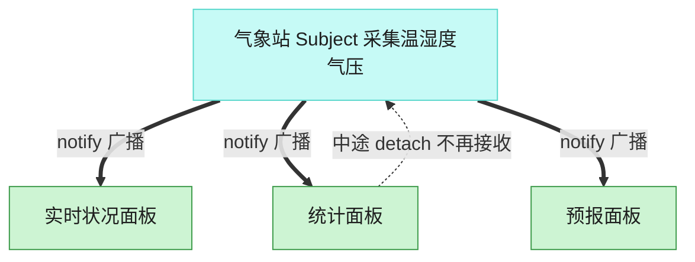

# Observer 观察者模式（Python）

## 意图

定义对象间一种一对多的依赖关系，当一个对象的状态发生改变时，所有依赖于它的
对象都得到通知并被自动更新。被观察者（Subject）与观察者（Observer）之间只
通过一个抽象接口耦合，彼此可以独立扩展。

<!-- gof-architecture-diagram -->
## 架构图

> **生活类比**：气象站一更新读数，所有挂着的面板自动刷新。统计面板中途拔掉天线，后面的广播就不再找它，其余面板不受影响。



| 图中角色 | 本仓库示例 |
|---------|-----------|
| 气象站 | WeatherStation 主题 |
| 面板 | 实时 / 统计 / 预报 观察者 |
| 订阅关系 | attach / detach / notify |

23 张图的完整图鉴见 [`docs/README.md`](../../docs/README.md#observer-观察者)。

## 适用场景

- 一个对象状态的改变需要同时联动更新其他若干个对象，且数量、种类不固定
- 一个对象需要在不知道具体有哪些对象需要通知的前提下，将变化广播出去
- 需要支持运行时动态订阅/退订，而不是在编译期写死依赖关系

## 实现方式

`Subject` 维护观察者列表并提供 `attach`/`detach`/`notify`；`WeatherStation` 是具体主题，
数据更新时调用 `notify()`；三个具体观察者各自关心不同的信息（实时值/统计值/预测）：

```python
class Subject(ABC):
    """抽象主题：维护观察者列表，提供订阅/退订/通知的通用能力"""

    def notify(self, data: WeatherData) -> None:
        for observer in self._observers:
            observer.update(data)


class WeatherStation(Subject):
    def set_measurements(self, temperature, humidity, pressure) -> None:
        self.notify(WeatherData(temperature, humidity, pressure))
```

## 文件说明

| 文件 | 说明 |
|------|------|
| `main.py` | `WeatherData`、`Observer`/`Subject` 抽象类、`WeatherStation` 具体主题、三个具体观察者、`main()` 演示 |

## 编译与运行

```bash
python main.py
```

## 输出示例

```
[气象站] 采集到新数据: 温度=26.5℃, 湿度=60%, 气压=1013hPa
  [实时状况面板] 当前温度 26.5℃，湿度 60%
  [统计面板] 最高 26.5℃ / 最低 26.5℃ / 平均 26.5℃
  [预报面板] 气压 1013hPa，预测: 天气转晴

[气象站] 采集到新数据: 温度=29.0℃, 湿度=55%, 气压=1009hPa
  [实时状况面板] 当前温度 29.0℃，湿度 55%
  [统计面板] 最高 29.0℃ / 最低 26.5℃ / 平均 27.8℃
  [预报面板] 气压 1009hPa，预测: 可能有雨

--- 统计面板临时下线（detach），其余面板继续接收通知 ---
[气象站] 采集到新数据: 温度=22.0℃, 湿度=70%, 气压=1015hPa
  [实时状况面板] 当前温度 22.0℃，湿度 70%
  [预报面板] 气压 1015hPa，预测: 天气转晴
```

## 要点

1. **一对多的松耦合通知** —— `WeatherStation` 只知道一组 `Observer`，完全不知道具体是哪几种面板、它们各自如何处理数据。
2. **可动态订阅/退订** —— 示例中途 `detach(statistics_display)`，之后的通知立即不再触达它，其余观察者不受影响。
3. **观察者各自维护私有状态** —— `StatisticsDisplay` 内部累积历史读数、`ForecastDisplay` 记录上一次气压，这些状态对 `WeatherStation` 完全透明。
4. Python 标准库/生态中，事件系统、`asyncio` 的回调、GUI 框架的事件绑定，本质上都是观察者模式的变体。
