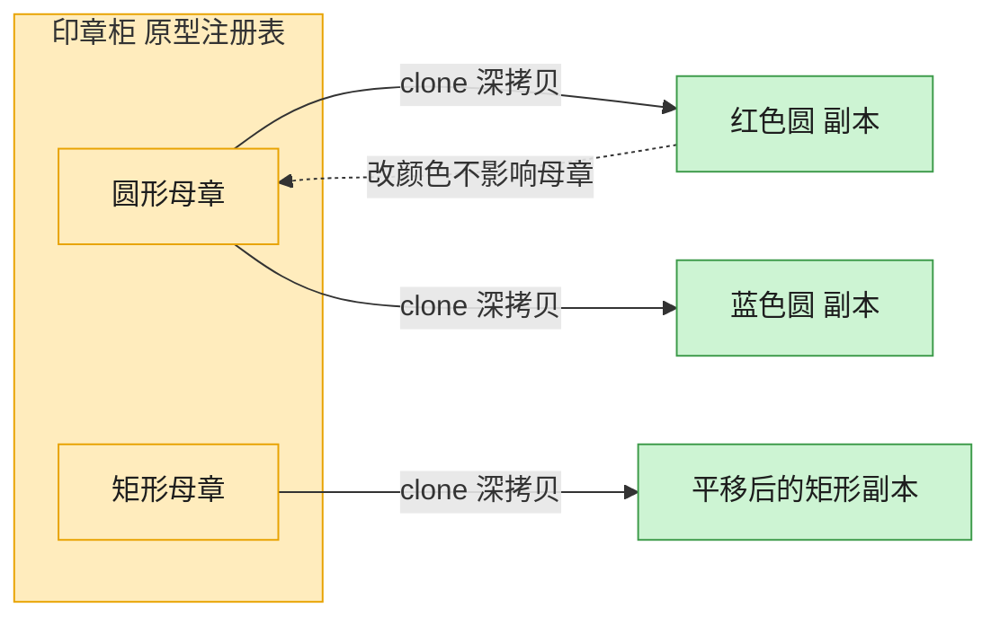

# Prototype 原型模式（Python）

## 意图

用原型实例指定创建对象的种类，并通过**拷贝这个原型**来创建新对象，而不是通过 `new`/
构造函数从零构建。适合创建成本较高，或者需要保留某个"活模板"当前状态的场景。

<!-- gof-architecture-diagram -->
## 架构图

> **生活类比**：印章柜里放着圆形、矩形两枚母章。要新图时不从零雕刻，盖一下（clone）就得到互不干扰的副本，改颜色也不脏了母章。



| 图中角色 | 本仓库示例 |
|---------|-----------|
| 母章 / 原型 | Shape.clone，默认 deepcopy |
| 印章柜 | 按名字取模板的原型注册表 |
| 盖出的副本 | 改颜色、位置、标签，不影响原件 |

23 张图的完整图鉴见 [`docs/README.md`](../../docs/README.md#prototype-原型)。

## 适用场景

- 创建对象的成本（初始化开销、依赖资源）比拷贝一个现成实例更高
- 需要避免创建与产品类层次平行的工厂类层次
- 系统需要动态指定要创建的对象类型，且实例数量相对有限，可枚举出"原型"
- 需要保留对象的当前状态，以此为基础产出多个变体（如注册表里的模板）

## 实现方式

抽象基类 `Shape` 提供统一的 `clone()` 方法，默认实现直接调用 `copy.deepcopy(self)`；
`Circle`、`Rectangle` 是具体原型（`dataclass`），克隆后修改副本的可变字段（颜色、位置、
标签列表）不会影响原对象：

```python
class Shape(ABC):
    """抽象原型：所有图形都能克隆自身"""

    def clone(self) -> Shape:
        """默认实现：深拷贝，子类一般无需重写"""
        return copy.deepcopy(self)
```

`main()` 额外演示了一个"原型注册表"（`registry: dict[str, Shape]`），按名字取出模板并
克隆出互不干扰的多个"印章"实例。

## 文件说明

| 文件 | 说明 |
|------|------|
| `main.py` | `Shape` 抽象原型、`Circle`/`Rectangle` 具体原型、注册表演示、`main()` 入口 |

## 编译与运行

```bash
python main.py
```

## 输出示例

```
原始圆形: Circle(半径=5, 颜色=红色, 位置=(10, 20), 标签=['主图层'])
克隆圆形: Circle(半径=5, 颜色=蓝色, 位置=(100, 20), 标签=['主图层', '副本'])
两者是否为同一对象: False
position 是否共享同一对象: False

原始矩形: Rectangle(宽=30, 高=15, 颜色=绿色, 位置=(0, 0), 标签=['按钮背景'])
克隆矩形: Rectangle(宽=60, 高=15, 颜色=绿色, 位置=(0, 0), 标签=['按钮背景', '放大版'])

--- 原型注册表（按需克隆预设模板） ---
模板本身: Circle(半径=2, 颜色=红色, 位置=(0, 0), 标签=[])
印章 1  : Circle(半径=2, 颜色=红色, 位置=(0, 0), 标签=[])
印章 2  : Circle(半径=2, 颜色=粉色, 位置=(0, 0), 标签=[])
```

## 要点

1. **深拷贝 vs 浅拷贝** —— `copy.deepcopy` 连同 `position`、`tags` 等嵌套可变对象一起复制，克隆体与原型互不影响（示例中特意打印 `position is` 对比验证）。
2. **省去平行的工厂类层次** —— 无需为每种图形单独写 `ShapeFactory`，`clone()` 是所有原型的通用入口。
3. **原型注册表** —— 把常用的"模板对象"集中存放在字典中，需要新对象时直接克隆，而非重新构造。
4. Python 的 `copy` 模块是标准库内建对原型模式最直接的支持，比手写逐字段拷贝构造函数更不易出错。
