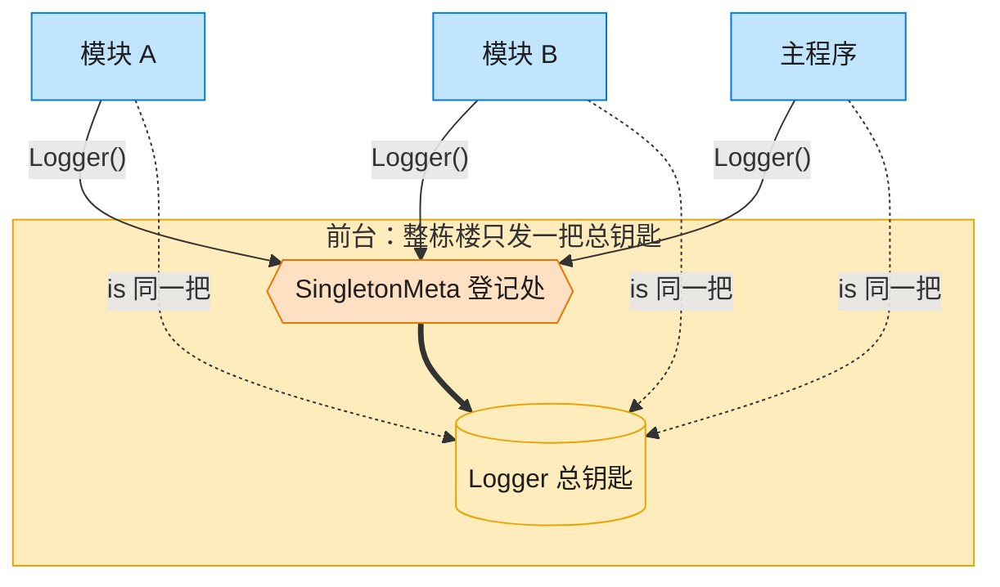

# Singleton 单例模式（Python）

## 意图

保证一个类在整个应用生命周期中只有一个实例，并提供一个全局访问点。

<!-- gof-architecture-diagram -->
## 架构图

> **生活类比**：整栋大楼只发一把总钥匙。模块 A、模块 B、主程序去前台领取，拿到的永远是同一把 —— 这就是单例。



| 图中角色 | 本仓库示例 |
|---------|-----------|
| 前台 / 总钥匙 | SingletonMeta + Logger 全局唯一实例 |
| 来领钥匙的部门 | ModuleA / ModuleB / 主程序 |

23 张图的完整图鉴见 [`docs/README.md`](../../docs/README.md#singleton-单例)。

## 适用场景

- 全局唯一的资源管理器：日志器、配置中心、连接池、线程池等
- 需要严格控制某个共享资源的访问入口，避免状态不一致
- 多处代码需要协作使用同一份状态，但又不想显式传递该对象引用

## 实现方式

用**元类（metaclass）**拦截类的实例化过程：重写 `SingletonMeta.__call__`，在类字典
`_instances` 中缓存已创建的实例，并用 `threading.Lock` 做双重检查锁定，保证多线程下也
只会创建一次：

```python
class SingletonMeta(type):
    """单例元类：拦截 Logger(...) 调用，保证全局仅创建一个实例"""

    _instances: dict[type, object] = {}
    _lock = threading.Lock()

    def __call__(cls, *args, **kwargs):
        if cls not in cls._instances:
            with cls._lock:
                if cls not in cls._instances:  # 双重检查
                    cls._instances[cls] = super().__call__(*args, **kwargs)
        return cls._instances[cls]


class Logger(metaclass=SingletonMeta):
    ...
```

`Logger` 使用 `enum.IntEnum` 定义日志级别，可直接比较大小来做过滤；`ModuleA`/`ModuleB`
模拟应用中不同模块各自调用 `Logger()`，验证拿到的都是同一实例。

## 文件说明

| 文件 | 说明 |
|------|------|
| `main.py` | `LogLevel` 枚举、`SingletonMeta` 元类、`Logger` 单例、`ModuleA`/`ModuleB` 演示、`main()` |

## 编译与运行

```bash
python main.py
```

## 输出示例

```
[08:51:11] [INFO] 主程序启动
[08:51:11] [DEBUG] 模块 A 初始化完成
[08:51:11] [INFO] 模块 A 开始处理任务
[08:51:11] [WARNING] 模块 B 检测到潜在问题
[08:51:11] [ERROR] 模块 B 处理失败

logger_ref1 is logger_ref2 : True
logger_ref1 id : 2014370309392
logger_ref2 id : 2014370309392
历史日志共 5 条
```

（时间戳与对象地址每次运行都会变化，属正常现象。）

## 要点

1. **元类拦截实例化** —— 比手写 `__new__` 判断更通用，任何继承该元类的类都自动获得单例行为。
2. **双重检查锁定** —— 第一次判断避免每次调用都加锁（性能），第二次判断避免多线程竞态下重复创建。
3. **`is` 验证唯一性** —— 示例中 `logger_ref1 is logger_ref2` 为 `True`，且 `id()` 相同，证明全局确实只有一份实例。
4. Python 中更"轻量"的替代方案还有：模块级单例（模块本身天然只加载一次）、`functools.lru_cache` 装饰的工厂函数；元类方案更贴近 GoF 原始 UML 意图，便于跨语言对比。
