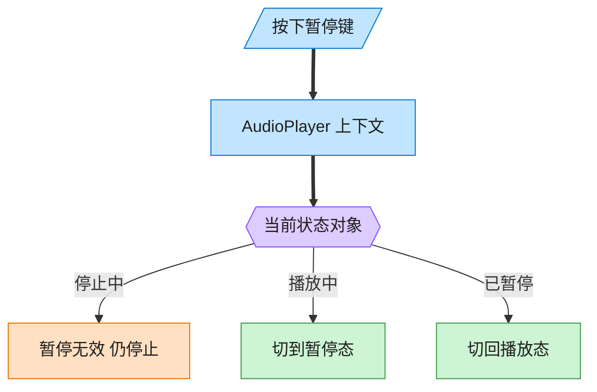
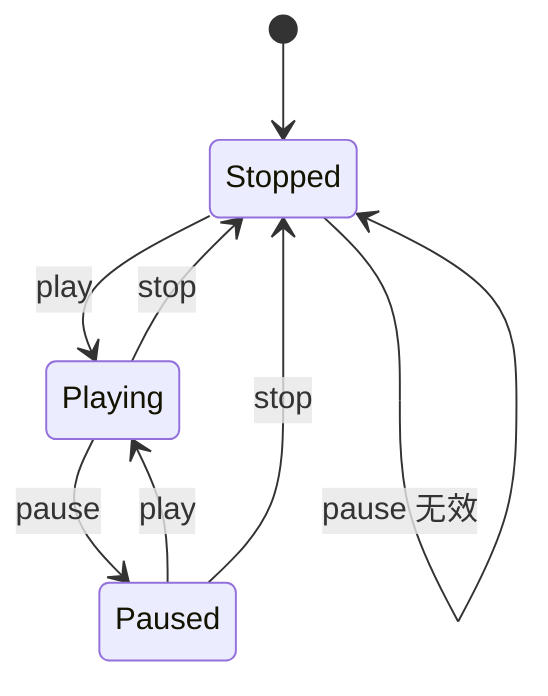

# State 状态模式（Python）

## 意图

允许一个对象在其内部状态改变时改变它的行为，从外部看起来该对象就像修改了
它的类一样。把"某个状态下该做什么"分散封装到各个状态类中，替代大量的
`if state == ... elif state == ...` 条件分支。

<!-- gof-architecture-diagram -->
## 架构图

> **生活类比**：同一颗暂停键：播放中按下就暂停，停止中按下则无效。播放器没有满屏 if-else，而是把「这个状态下该干什么」交给当前状态对象。





| 图中角色 | 本仓库示例 |
|---------|-----------|
| 播放器 | AudioPlayer 上下文，委托当前状态 |
| 三态 | Stopped / Playing / Paused |
| 转换 | 状态对象自己决定下一态 |

23 张图的完整图鉴见 [`docs/README.md`](../../docs/README.md#state-状态)。

## 适用场景

- 一个对象的行为取决于它的状态，且必须在运行时根据状态改变行为
- 代码中出现大量与对象状态有关的条件语句，且这些条件语句难以维护
- 状态之间的转换关系相对明确（如"停止→播放→暂停→播放→停止"）

## 实现方式

`PlayerState` 是抽象状态，声明 `play`/`pause`/`stop`；`StoppedState`/`PlayingState`/
`PausedState` 是具体状态，各自决定"在这个状态下收到某个操作该怎么响应，以及切换到
哪个新状态"；`AudioPlayer` 是上下文，把请求委托给 `self.state`：

```python
class PlayingState(PlayerState):
    """播放态：可以暂停或停止"""

    def pause(self, player: AudioPlayer) -> None:
        print(f"  暂停《{player.track}》")
        player.state = PausedState()  # 状态自己决定转换到哪个新状态


class AudioPlayer:
    """上下文：音频播放器，把请求委托给当前状态对象处理"""

    def press_pause(self) -> None:
        self.state.pause(self)
```

## 文件说明

| 文件 | 说明 |
|------|------|
| `main.py` | `PlayerState` 抽象状态、`StoppedState`/`PlayingState`/`PausedState`、`AudioPlayer` 上下文、`main()` 演示 |

## 编译与运行

```bash
python main.py
```

## 输出示例

```
[按下 暂停] (当前状态: 停止)
  已经是停止状态，无法暂停
[按下 播放] (当前状态: 停止)
  开始播放《夜曲》
[按下 播放] (当前状态: 播放中)
  《夜曲》正在播放中，无需重复播放
[按下 暂停] (当前状态: 播放中)
  暂停《夜曲》
[按下 暂停] (当前状态: 暂停)
  已经是暂停状态，无需重复暂停
[按下 播放] (当前状态: 暂停)
  恢复播放《夜曲》
[按下 停止] (当前状态: 播放中)
  停止播放《夜曲》
[按下 停止] (当前状态: 停止)
  已经是停止状态
```

## 要点

1. **状态转换的决定权在状态对象自己手中** —— `player.state = PausedState()` 这行代码写在 `PlayingState.pause()` 里，而不是写在 `AudioPlayer` 里，转换逻辑完全局部化。
2. **消除条件分支** —— `AudioPlayer.press_play/press_pause/press_stop` 里没有一处 `if isinstance(state, ...)`，全部委托给当前状态对象处理。
3. **新增状态成本低** —— 若要新增"快进态"，只需新增一个 `PlayerState` 子类，不需要改动已有状态类和 `AudioPlayer` 的框架代码。
4. 与策略模式结构相似（都持有一个可替换的对象），区别在于：策略由外部（客户端）选择并通常不变，状态由对象内部根据自身逻辑自动切换。
