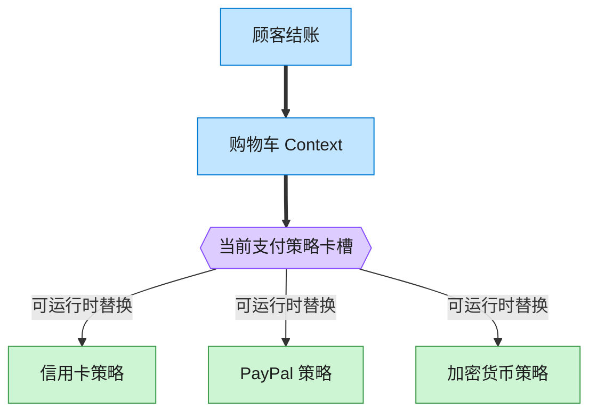

# Strategy 策略模式（Python）

## 意图

定义一系列算法，把它们各自封装起来，并使它们之间可以互相替换。策略模式使得
算法可以独立于使用它的客户端而变化，运行时可以自由切换某个具体算法实现。

<!-- gof-architecture-diagram -->
## 架构图

> **生活类比**：收银台插卡：购物车不关心怎么扣款，结账时插入信用卡、PayPal 或加密货币策略卡。用户在结算页改选，算法当场替换。



| 图中角色 | 本仓库示例 |
|---------|-----------|
| 购物车 | ShoppingCart 上下文 |
| 卡槽 | PaymentStrategy 可替换算法 |
| 策略卡 | CreditCard / PayPal / Crypto |

23 张图的完整图鉴见 [`docs/README.md`](../../docs/README.md#strategy-策略)。

## 适用场景

- 多个类只是行为（算法）不同，希望在运行时动态选择其中一种行为
- 需要避免使用大量条件语句来选择并执行某种算法
- 一个算法使用的数据不应该暴露给不需要了解它的客户端代码

## 实现方式

`PaymentStrategy` 用 `typing.Protocol` 定义为**结构化类型**——任何具备
`pay(amount) -> str` 方法的对象都自动满足该协议，不需要显式继承；
`CreditCardStrategy`/`PayPalStrategy`/`CryptoStrategy` 是具体策略；`ShoppingCart`
持有一个可替换的策略引用：

```python
class PaymentStrategy(Protocol):
    """策略接口：只要实现 pay(amount) -> str，就是一个合法的支付策略（无需继承）"""
    def pay(self, amount: float) -> str: ...


class ShoppingCart:
    def set_strategy(self, strategy: PaymentStrategy) -> None:
        """运行时切换策略——例如用户在结算页改选了另一种支付方式"""
        self.strategy = strategy

    def checkout(self) -> str:
        return self.strategy.pay(self.total)
```

## 文件说明

| 文件 | 说明 |
|------|------|
| `main.py` | `PaymentStrategy` 协议、三种具体策略、`ShoppingCart` 上下文、`main()` 演示运行时切换策略 |

## 编译与运行

```bash
python main.py
```

## 输出示例

```
购物车合计: 478.00 元

--- 使用信用卡结算 ---
信用卡(**** **** **** 1234) 支付 478.00 元

--- 切换为 PayPal 结算 ---
PayPal(buyer@example.com) 支付 478.00 元

--- 切换为加密货币结算 ---
加密钱包(1A2b3C...) 支付约 0.007170 BTC（等值 478.00 元）

--- 同一个策略列表，遍历比较不同支付方式的结果 ---
信用卡(**** **** **** 0000) 支付 478.00 元
PayPal(vip@example.com) 支付 478.00 元
加密钱包(bc1qxy...) 支付约 0.007170 BTC（等值 478.00 元）
```

## 要点

1. **结构化子类型（Protocol）代替显式继承** —— 三个策略类彼此没有公共基类，`ShoppingCart` 也不需要 `isinstance` 检查，只要"形状"对得上（有 `pay` 方法）就能用，这是比 ABC 更"鸭子类型"的写法。
2. **算法可在运行时自由替换** —— `set_strategy()` 让同一个购物车实例先后使用三种不同支付方式，`ShoppingCart` 本身代码不变。
3. **消除条件分支** —— 没有 `if payment_type == "credit_card": ... elif ...`，新增一种支付方式只需新增一个类。
4. Python 中函数是一等公民，更轻量的策略甚至可以直接传函数（`Callable[[float], str]`）；本例选择类是为了让每个策略携带自己的配置数据（卡号、邮箱、钱包地址等）。
