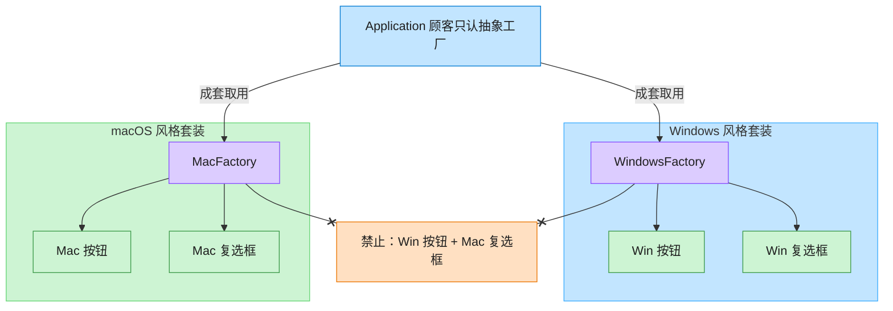

# Abstract Factory 抽象工厂模式（Rust）

## 意图
提供一个创建一系列相关或相互依赖对象的接口，而无需指定它们具体的类，保证同一“产品族”内的产品互相搭配一致（比如同一平台风格的 Button 和 Checkbox）。

<!-- gof-architecture-diagram -->
## 架构图

> **生活类比**：家具店一次卖「成套风格」。Windows 工厂成套出 Win 按钮+Win 复选框，Mac 工厂成套出 Mac 风格 —— 绝不混搭。



| 图中角色 | 本仓库示例 |
|---------|-----------|
| 顾客 / 应用 | Application，只依赖 GUIFactory |
| 成套工厂 | WindowsFactory / MacFactory |
| 成套产品 | Button + Checkbox 必须同一家族 |

23 张图的完整图鉴见 [`docs/README.md`](../../docs/README.md#abstract-factory-抽象工厂)。

## 适用场景
- 系统需要独立于其产品的创建、组合和表示方式
- 需要保证“一族”产品必须配套使用（不能 Windows 按钮配 macOS 复选框）
- 希望通过替换一个工厂对象就能切换整套产品实现（如换皮肤、换平台）

## 实现方式
`GuiFactory` trait 声明 `create_button`/`create_checkbox` 两个工厂方法；`WindowsFactory`
和 `MacFactory` 各自实现这两个方法，产出配套的具体产品。客户端函数 `render_ui` 只接受
`&dyn GuiFactory`，完全不知道运行的是哪个平台：

```rust
trait GuiFactory {
    fn create_button(&self) -> Box<dyn Button>;
    fn create_checkbox(&self) -> Box<dyn Checkbox>;
}

fn render_ui(factory: &dyn GuiFactory) {
    let button = factory.create_button();
    let checkbox = factory.create_checkbox();
    println!("按钮   -> {}", button.render());
    println!("复选框 -> {}", checkbox.render());
}
```

## 文件说明
| 文件 | 说明 |
|------|------|
| `main.rs` | `Button`/`Checkbox` 抽象产品、`WindowsFactory`/`MacFactory` 具体工厂、`render_ui` 客户端逻辑、`main()` 演示 |

## 编译与运行
```bash
rustc main.rs && ./main
```

## 输出示例
```
=== 抽象工厂模式：跨平台 GUI 演示 ===

-- 运行在 Windows 上 --
按钮   -> [ Windows 按钮 ]
复选框 -> [x] Windows 复选框

-- 运行在 macOS 上 --
按钮   -> (  macOS 按钮  )
复选框 -> (✓) macOS 复选框
```
（预期输出（本机未安装 Rust，未实机运行）。）

## 要点
1. **两级抽象** —— 抽象工厂（`GuiFactory`）生产抽象产品（`Button`/`Checkbox`），
   具体工厂与具体产品一一对应但各自独立扩展，新增平台只需新增一个工厂 + 一套控件实现。
2. **与工厂方法的区别** —— 工厂方法只关心一个产品等级结构，抽象工厂一次绑定
   多个产品等级结构（这里是 Button 和 Checkbox 两条产品线）。
3. **`&dyn GuiFactory` 而非泛型** —— 因为需要在运行时根据配置/环境决定用哪个工厂
   （而非编译期单态化），用 trait 对象比泛型参数更贴合“运行时选择实现”的场景。
