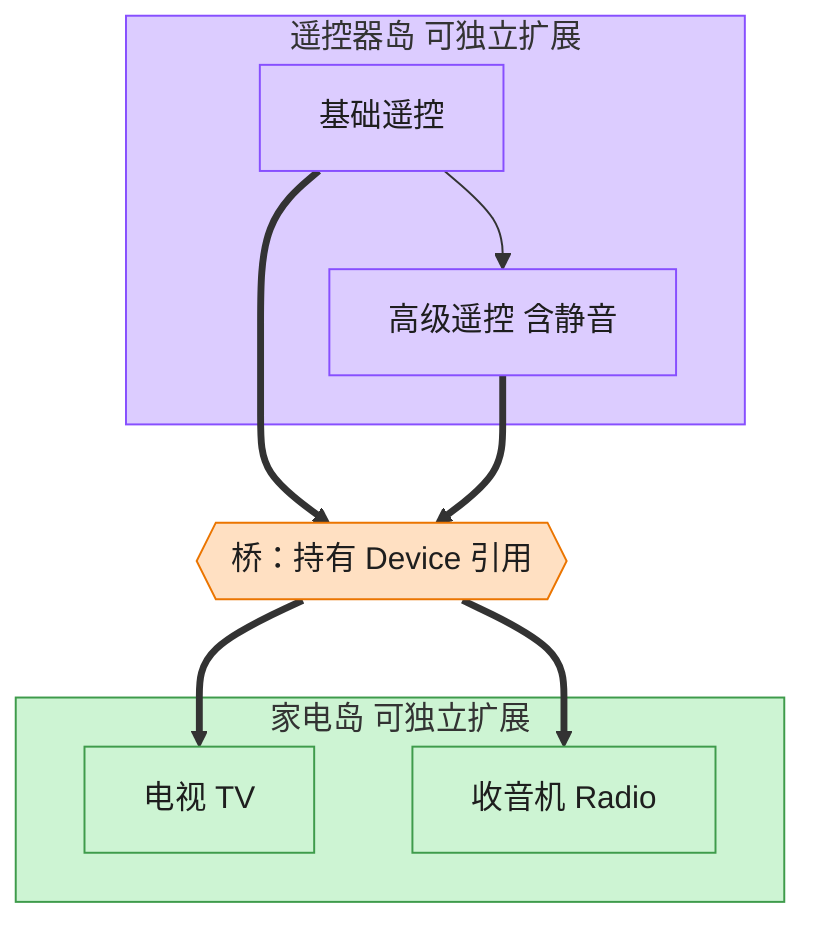

# Bridge 桥接模式（Rust）

## 意图
将抽象部分与实现部分分离，使二者可以独立变化，避免用继承把“抽象的多种变体 × 实现的多种变体”组合成指数级增长的类。

<!-- gof-architecture-diagram -->
## 架构图

> **生活类比**：遥控器和家电是两座岛。基础遥控 / 高级遥控是一座岛，电视 / 收音机是另一座岛。中间一座桥（组合引用）把它们连上，不必为每种组合造一个新类。



| 图中角色 | 本仓库示例 |
|---------|-----------|
| 遥控器岛 | RemoteControl / AdvancedRemoteControl 抽象 |
| 桥 | 抽象持有的 Device 引用 |
| 家电岛 | TV / Radio 实现 |

23 张图的完整图鉴见 [`docs/README.md`](../../docs/README.md#bridge-桥接)。

## 适用场景
- 一个抽象概念存在多个维度且都可能独立扩展（这里是“遥控器种类”和“设备种类”）
- 不希望抽象与实现在编译期被死死绑定，想在运行时自由搭配
- 继承会导致类爆炸：N 种遥控器 × M 种设备 = N×M 个子类，桥接后只需 N + M 个类型

## 实现方式
`Device` trait 是实现部分接口，`Tv`/`Radio` 是具体实现。`RemoteControl`（抽象部分）不关心
设备具体是什么，只持有一个 `Box<dyn Device>` 字段，通过它调用设备能力，这个字段就是连接两个
维度的“桥”：

```rust
struct RemoteControl {
    device: Box<dyn Device>,
}

impl RemoteControl {
    fn toggle_power(&mut self) {
        if self.device.is_enabled() {
            self.device.disable();
        } else {
            self.device.enable();
        }
    }
}
```

`AdvancedRemoteControl` 通过组合（持有一个 `RemoteControl`）扩展出“静音”功能，这一层扩展
同样不关心底层设备是电视还是收音机，验证了两个维度确实各自独立变化。

## 文件说明
| 文件 | 说明 |
|------|------|
| `main.rs` | `Device` 实现接口、`Tv`/`Radio` 具体实现、`RemoteControl`/`AdvancedRemoteControl` 抽象部分、`main()` 演示 |

## 编译与运行
```bash
rustc main.rs && ./main
```

## 输出示例
```
=== 桥接模式：遥控器与设备演示 ===

-- 基础遥控器 + 电视 --
电视: 打开电源
电视: 音量提升到 40
电视: 音量提升到 50
电视: 音量降低到 40

-- 高级遥控器 + 收音机 --
收音机: 打开电源
收音机: 已静音
收音机: 取消静音，恢复到 50
```
（预期输出（本机未安装 Rust，未实机运行）。）

## 要点
1. **组合优于继承** —— `RemoteControl` 通过持有 `Box<dyn Device>` 而非“遥控器继承设备”，
   让遥控器的种类扩展（基础/高级）和设备的种类扩展（电视/收音机）完全解耦。
2. **`AdvancedRemoteControl` 桥接“抽象的抽象”** —— 它内部再组合一个 `RemoteControl`，
   说明抽象这一侧也可以有自己的层次结构，与实现侧的层次结构相互独立。
3. **与适配器的区别** —— 适配器是事后补救两个不兼容接口，桥接是设计之初就主动
   把抽象和实现拆成两条独立的继承/实现体系。
