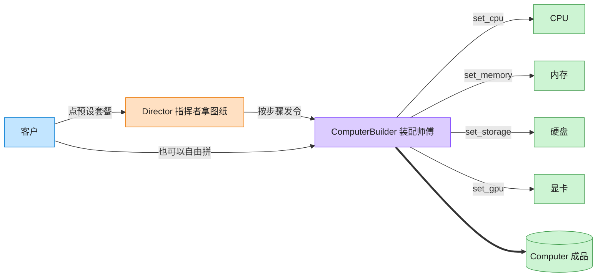

# Builder 建造者模式（Rust）

## 意图
将一个复杂对象的构建过程与其表示分离，使同样的构建步骤可以创建不同的表示；调用方按需分步设置参数，而不必使用一个字段超多的构造函数。

<!-- gof-architecture-diagram -->
## 架构图

> **生活类比**：装机店流水线：指挥者拿「办公机 / 游戏主机 / 工作站」图纸发令，装配师傅一步步装 CPU、内存、硬盘、显卡，最后交出一台电脑。客户也可以绕过图纸自由拼。



| 图中角色 | 本仓库示例 |
|---------|-----------|
| 指挥者 | ComputerDirector 预设装配顺序 |
| 装配师傅 | ComputerBuilder 链式分步接口 |
| 成品 | Computer |

23 张图的完整图鉴见 [`docs/README.md`](../../docs/README.md#builder-建造者)。

## 适用场景
- 对象需要很多可选参数，逐个通过构造函数传递会难以阅读（“参数地狱”）
- 需要按一定步骤组装对象，且希望同一组装过程能产出不同配置的结果
- 想把“怎么装”（Builder）和“装成什么样”（Director 的预设）分开

## 实现方式
`ComputerBuilder` 使用 Rust 惯用的**消费型建造者**：每个设置方法都以 `mut self` 取得所有权、
修改后再 `return self`，从而可以链式调用；`build(self)` 消费 builder 产出最终的 `Computer`。
`Director` 只是几个返回预设 `Computer` 的关联函数，调用方也可以完全绕开它自由拼装：

```rust
fn cpu(mut self, cpu: &str) -> Self {
    self.cpu = cpu.to_string();
    self
}
```

因为每一步都是按值传递 `self`（移动语义），不存在任何借用冲突：旧的 `self` 在函数返回新
`Self` 时已被消费，调用链天然满足借用检查器。

## 文件说明
| 文件 | 说明 |
|------|------|
| `main.rs` | `Computer` 产品、`ComputerBuilder` 建造者、`Director` 预设配置、`main()` 演示 |

## 编译与运行
```bash
rustc main.rs && ./main
```

## 输出示例
```
=== 建造者模式：Computer 组装演示 ===

[预设-游戏主机] CPU: Intel i9-14900K | 内存: 32GB | 存储: 2000GB | 显卡: NVIDIA RTX 4090
[预设-办公主机] CPU: Intel i5-13400 | 内存: 16GB | 存储: 512GB | 显卡: 集成显卡
[自定义主机] CPU: AMD Ryzen 9 7950X | 内存: 64GB | 存储: 4000GB | 显卡: AMD RX 7900 XTX
```
（预期输出（本机未安装 Rust，未实机运行）。）

## 要点
1. **消费型建造者是 Rust 的惯用写法** —— 相比“建造者内部用 `&mut self`”，按值传递 `self`
   能让链式调用在编译期就保证没有悬挂引用或重复借用问题。
2. **`Option<String>` 表达可选字段** —— `gpu` 未设置时为 `None`，展示时用
   `unwrap_or("集成显卡")` 给出默认值，避免用“空字符串”这种隐式约定。
3. **Director 与 Builder 解耦** —— `Director` 只依赖 `ComputerBuilder` 暴露的公共方法，
   新增一种预设配置不需要修改 `ComputerBuilder` 本身。
4. 若需要“必填字段编译期检查”，可以用类型状态（typestate）模式让不同阶段返回不同的
   Builder 类型；本例为保持示例直观，选择了更常见的“默认值 + 可选覆盖”写法。
