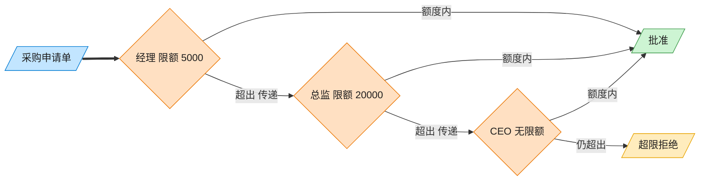

# Chain of Responsibility 责任链模式（Rust）

## 意图
使多个对象都有机会处理同一个请求，将这些对象连成一条链，请求沿链传递，直到有对象处理它为止，发送者无需知道链上究竟是谁处理了请求。

<!-- gof-architecture-diagram -->
## 架构图

> **生活类比**：采购单沿公章接力：经理能批 5000 就盖章，否则递给总监，再递给 CEO。提交人只把单子交给第一环，从不管最终谁批。



| 图中角色 | 本仓库示例 |
|---------|-----------|
| 采购单 | PurchaseRequest |
| 审批链 | Manager → Director → CEO |
| 提交人 | 只调用链头 handle |

23 张图的完整图鉴见 [`docs/README.md`](../../docs/README.md#chain-of-responsibility-责任链)。

## 适用场景
- 有多个处理者可以处理同一请求，具体由哪个处理取决于运行时条件（如金额上限）
- 希望在不明确指定接收者的情况下，向多个处理者之一提交请求
- 处理者集合及其顺序需要在运行时动态指定

## 实现方式
`Approver` 既是链上的一个节点，也通过 `next: Option<Box<Approver>>` 指向下一个节点，
构成一条单向链表。`chain()` 用消费型写法把节点接起来，`handle()` 判断金额是否在自己
的审批额度内，超出则递归转给 `next`：

```rust
fn handle(&mut self, request: &PurchaseRequest) {
    if request.amount <= self.limit {
        println!("{} 批准了...", self.role);
    } else {
        match &mut self.next {
            Some(next) => next.handle(request),
            None => println!("超出所有审批权限"),
        }
    }
}
```

三个角色（经理/总监/CEO）复用同一个 `Approver` 类型，只是构造时传入不同的 `role`/`limit`，
避免了为每个角色写一份几乎相同的代码。

## 文件说明
| 文件 | 说明 |
|------|------|
| `main.rs` | `PurchaseRequest` 请求、`Approver` 处理者节点（含 `chain`/`handle`）、`main()` 演示 |

## 编译与运行
```bash
rustc main.rs && ./main
```

## 输出示例
```
=== 责任链模式：采购审批演示 ===

经理（审批额度 5000 元以内）批准了采购申请: 3000 元 —— 办公用品
总监（审批额度 50000 元以内）批准了采购申请: 20000 元 —— 团队建设
CEO（审批额度 100000 元以内）批准了采购申请: 80000 元 —— 服务器采购
金额 500000 元超出所有审批权限（最高到 CEO），需要董事会特批 —— 并购项目
```
（预期输出（本机未安装 Rust，未实机运行）。）

## 要点
1. **用 `Option<Box<Self>>` 表达链表** —— 这是 Rust 里构建“节点拥有下一个节点”这类
   递归数据结构的标准做法，所有权关系清晰：链的头节点拥有整条链。
2. **数据驱动而非为每个角色单独建类型** —— 三个审批角色差异仅在于额度和名称，
   用同一个结构体承载即可，需要真正不同处理逻辑的场景才需要 trait + 多个实现。
3. **递归调用天然对应“转交给下一个处理者”** —— `next.handle(request)` 直接复用
   同一套逻辑处理链上的下一个节点，新增一级审批只需在构造链时多接一个 `Approver`。
4. **`&mut self.next` 配合 `match`** —— 每次只在当前节点上做一次可变借用再向下传递，
   不会出现同时持有链上多个节点可变引用的情况，借用检查器可以直接通过。
