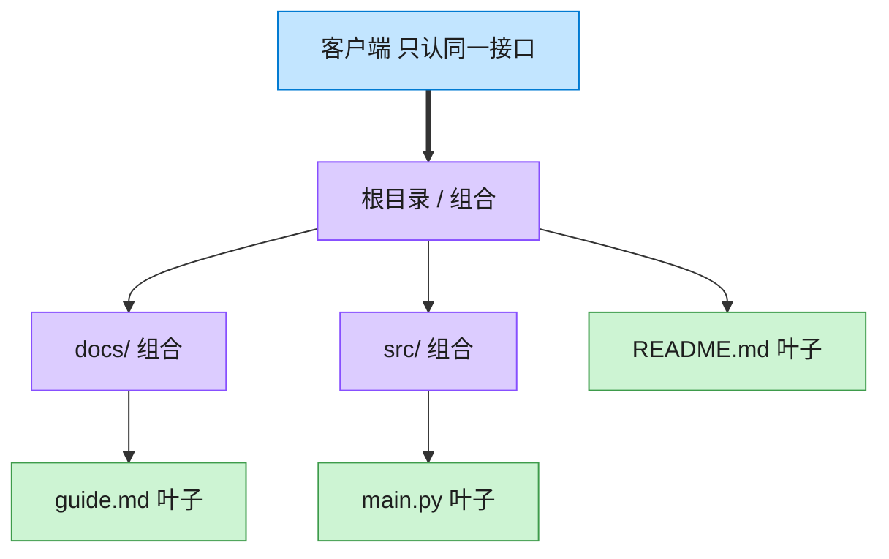

# Composite 组合模式（Rust）

## 意图
将对象组合成树形结构以表示“部分-整体”的层次关系，使客户端能用统一的方式处理单个对象（叶子）和对象组合（容器）。

<!-- gof-architecture-diagram -->
## 架构图

> **生活类比**：文件夹套娃：根目录装着子目录和文件。问「有多大」时，文件报自己的字节，目录把孩子们的大小加起来。客户端从不写 if 是文件还是目录。



| 图中角色 | 本仓库示例 |
|---------|-----------|
| 统一接口 | FileSystemNode.size / display |
| 叶子 | File |
| 容器 | Directory，递归包含子节点 |

23 张图的完整图鉴见 [`docs/README.md`](../../docs/README.md#composite-组合)。

## 适用场景
- 数据天然呈树状结构：文件系统、UI 组件树、组织架构图
- 希望客户端代码不必区分“这是一个叶子节点还是一个容器节点”
- 需要对整棵树递归执行同一种操作（求总和、渲染、统计）

## 实现方式
`FileSystemComponent` trait 同时被叶子节点 `File` 和容器节点 `Directory` 实现；
`Directory` 内部持有 `Vec<Box<dyn FileSystemComponent>>`，既可以装 `File` 也可以装
另一个 `Directory`，从而形成任意深度的树。`size()` 在 `Directory` 里递归累加所有子节点：

```rust
impl FileSystemComponent for Directory {
    fn size(&self) -> u64 {
        self.children.iter().map(|c| c.size()).sum()
    }
}
```

调用 `root.size()` / `root.print(0)` 时，代码完全不用关心某个子节点到底是文件还是子目录。

## 文件说明
| 文件 | 说明 |
|------|------|
| `main.rs` | `FileSystemComponent` 组件接口、`File` 叶子节点、`Directory` 容器节点、`main()` 演示 |

## 编译与运行
```bash
rustc main.rs && ./main
```

## 输出示例
```
=== 组合模式：文件系统演示 ===

+ root/ (共 2650 字节)
  + docs/ (共 250 字节)
    - 简历.pdf (200 字节)
    - 笔记.txt (50 字节)
  + src/ (共 2300 字节)
    - main.rs (1200 字节)
    - lib.rs (800 字节)
    + utils/ (共 300 字节)
      - helper.rs (300 字节)
  - README.md (100 字节)

总大小: 2650 字节
```
（预期输出（本机未安装 Rust，未实机运行）。）

## 要点
1. **`Box<dyn FileSystemComponent>` 统一存放叶子与容器** —— `Vec` 里的元素在类型层面
   完全一致，`Directory` 不需要区分子节点具体是 `File` 还是 `Directory`。
2. **递归通过 trait 方法自然表达** —— `size()`/`print()` 在 `Directory` 中调用每个
   子节点的同名方法，子节点是叶子就直接返回，是容器就继续向下递归，无需额外的类型判断。
3. **所有权链条清晰** —— 每个 `Directory` 通过 `Box` 独占拥有其子节点，树被销毁时
   Rust 自动递归释放所有节点，不存在悬挂指针或需要手动管理内存的问题。
