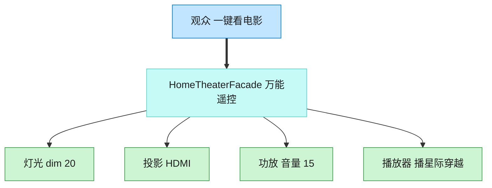

# Facade 外观模式（Rust）

## 意图
为子系统中的一组接口提供一个统一的高层接口，让子系统更容易使用，调用方不必了解也不必直接操作各个子系统的细节。

<!-- gof-architecture-diagram -->
## 架构图

> **生活类比**：家庭影院一键观影：观众只按「看电影」。外观对象按顺序关灯、开投影、调功放、按播放。高级玩家仍可绕过外观直接拨弄每个设备。



| 图中角色 | 本仓库示例 |
|---------|-----------|
| 观众 | 客户端，只调 watch_movie |
| 万能遥控 | HomeTheaterFacade |
| 子系统 | Lights / Projector / Amplifier / Player |

23 张图的完整图鉴见 [`docs/README.md`](../../docs/README.md#facade-外观)。

## 适用场景
- 子系统较为复杂，包含多个相互协作的对象，正确的调用顺序不易记忆
- 希望为外部提供一个简单的入口，同时不限制高级用户直接访问子系统
- 需要对遗留系统或第三方库做一层简化封装，降低客户端与其耦合度

## 实现方式
`Projector`/`Amplifier`/`Lights`/`StreamingPlayer` 是各自独立的子系统，都有自己的开关和
参数设置方法。`HomeTheaterFacade` 持有这四个子系统的实例，把“看电影”“看完关闭”这两套
固定的操作顺序封装成 `watch_movie`/`end_movie` 两个方法：

```rust
fn watch_movie(&self, movie: &str) {
    self.lights.dim(10);
    self.projector.on();
    self.projector.set_input("HDMI Streaming");
    self.amplifier.on();
    self.amplifier.set_volume(60);
    self.player.on();
    self.player.play(movie);
}
```

客户端只需要调用 `home_theater.watch_movie("盗梦空间")`，无需了解四个子系统各自的 API。

## 文件说明
| 文件 | 说明 |
|------|------|
| `main.rs` | `Projector`/`Amplifier`/`Lights`/`StreamingPlayer` 子系统、`HomeTheaterFacade` 外观、`main()` 演示 |

## 编译与运行
```bash
rustc main.rs && ./main
```

## 输出示例
```
=== 外观模式：家庭影院演示 ===

--- 准备观影：盗梦空间 ---
灯光：调暗到 10%
投影仪：开启
投影仪：切换输入到 HDMI Streaming
功放：开启
功放：音量设置为 60
播放器：开启
播放器：播放《盗梦空间》
--- 一切就绪，请欣赏 ---

--- 结束观影 ---
播放器：停止播放
播放器：关闭
功放：关闭
投影仪：关闭
灯光：恢复到 100%
```
（预期输出（本机未安装 Rust，未实机运行）。）

## 要点
1. **外观不是新增功能，而是重新编排调用顺序** —— `HomeTheaterFacade` 本身没有
   任何“投影”或“播放”的实现细节，只是按正确顺序调用子系统已有的方法。
2. **子系统依然可以被单独访问** —— 外观模式不会把子系统设为私有，高级用户仍可以
   直接使用 `Projector`/`Amplifier` 等类型，只是多数场景下没必要。
3. **降低客户端与子系统的耦合** —— 客户端代码只依赖 `HomeTheaterFacade` 的两个方法，
   子系统内部如何协作调整（比如换一个音响品牌）不会影响客户端代码。
