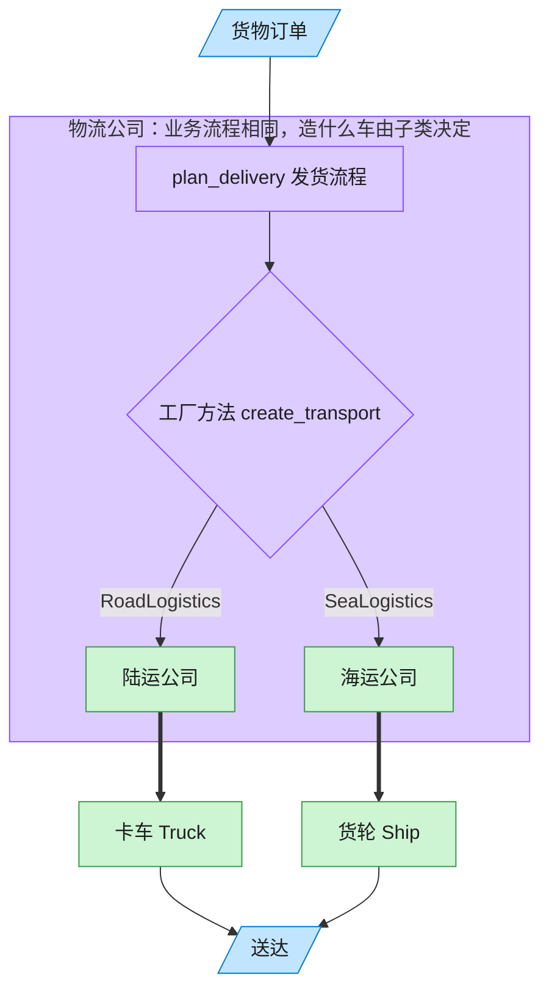

# Factory Method 工厂方法模式（Rust）

## 意图
定义一个用于创建对象的接口，让子类（或具体实现）决定实例化哪一个具体类，使创建逻辑与使用逻辑解耦。

<!-- gof-architecture-diagram -->
## 架构图

> **生活类比**：客户只说「把货送走」。陆运公司决定造卡车，海运公司决定造货轮 —— 子类决定实例化哪一个产品。



| 图中角色 | 本仓库示例 |
|---------|-----------|
| 客户下单 | 调用 plan_delivery 的客户端 |
| 物流公司 | Logistics 抽象创建者及其子类 |
| 运输工具 | Truck / Ship 具体产品 |

23 张图的完整图鉴见 [`docs/README.md`](../../docs/README.md#factory-method-工厂方法)。

## 适用场景
- 一个类无法预知它必须创建的对象的具体类型
- 希望将“创建产品”这一步骤延迟到具体实现中，便于扩展新产品而不改动已有代码
- 多个具体实现共享同一套业务流程，只是产出的产品不同

## 实现方式
`Logistics` trait 声明工厂方法 `create_transport`，并提供一个依赖该方法的默认方法
`plan_delivery`（骨架逻辑）；`RoadLogistics`/`SeaLogistics` 各自实现 `create_transport`，
返回不同的 `Box<dyn Transport>`：

```rust
trait Logistics {
    fn create_transport(&self) -> Box<dyn Transport>; // 工厂方法

    fn plan_delivery(&self) -> String {
        let transport = self.create_transport();
        format!("规划运输方案 -> {}", transport.deliver())
    }
}
```

客户端只持有 `Box<dyn Logistics>`，完全不知道背后是卡车还是轮船。

## 文件说明
| 文件 | 说明 |
|------|------|
| `main.rs` | `Transport`/`Logistics` 抽象、`Truck`/`Ship`、`RoadLogistics`/`SeaLogistics`、`main()` 演示 |

## 编译与运行
```bash
rustc main.rs && ./main
```

## 输出示例
```
=== 工厂方法模式：物流运输演示 ===

[陆路物流公司] 规划运输方案 -> 使用卡车经陆路运输货物
[海路物流公司] 规划运输方案 -> 使用轮船经海路运输货物
```
（预期输出（本机未安装 Rust，未实机运行）。）

## 要点
1. **trait 默认方法承载骨架逻辑** —— `plan_delivery` 写在 trait 里作为默认实现，
   具体类型只需要实现最小的 `create_transport`，减少重复代码。
2. **`Box<dyn Transport>` 隐藏具体产品类型** —— 调用方只依赖 `Transport` 接口，
   新增一种运输方式（如飞机）只需新增一个结构体和一个 `Logistics` 实现，符合开闭原则。
3. **与抽象工厂的区别** —— 工厂方法只生产“一个”产品等级结构（这里只有 `Transport`），
   而抽象工厂（见 `abstract-factory/`）会一次性生产一整套相关产品。
